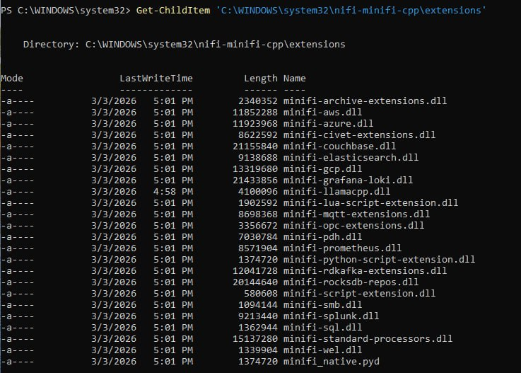

# Chapter 2: EFM Binaries & Staging Tree

EFM will happily show you a "Deploy Agent" button, generate a tidy install command, and hand your
edge device a `400 BAD_REQUEST` the moment you run it. Every time I hit that wall it came down to
the same thing: EFM is a binary vending machine, and the vending machine only dispenses what you
have physically stocked in the exact slot it expects. This chapter is the staging layout that
actually works — five agent binaries across C++ and Java, x86_64 and ARM64 and Windows — plus the
Windows traps (the MSI Python black hole, the missing Java processors) that snag the most installs.
Everything here is field-verified on a live EFM `2.3.1.0-2` running in minikube against
`nifi-minifi-cpp 1.26.02-b30` and CEM Java `2.24.08.0-19`.

> **⚠️ Version note** — the layout rules are version-independent; the filenames and processor
> counts are not. Exact versions here are `nifi-minifi-cpp 1.26.02-b30` and `CEM Java 2.24.08.0-19`
> against EFM `2.3.1.0-2`.

## EFM is a coordinate-addressed binary server

EFM evaluates every binary request against a strict three-level coordinate layout on disk:

```text
${agentType}/${osArch}/${agentVersion}
```

`agentType` is `cpp` or `java`. `osArch` is `linux`, `linuxaarch64`, or `windows`. `agentVersion`
is the full build string. Get any coordinate wrong — or leave a slot empty — and the deployer
fails. The whole game is stocking every slot you intend to deploy to, with exactly the right file,
named exactly what EFM expects.

Two validator rules bit me before I understood them, and they are the reason most first attempts 400:

1. **No hyphens in `osArch`.** EFM's UI validator rejects a hyphenated arch name. ARM64 is
   `linuxaarch64`, not `linux-arm64`. x86_64 is plain `linux`.
2. **Exactly one archive per `binaries` leaf.** The backend throws `400 BAD_REQUEST` if a
   `binaries/.../version/` directory holds more than one archive. Every extra `.tar.gz`, every
   extra-extensions bundle, every python-components zip must live in a separate `extensions` path,
   never alongside the base archive.

## The five leaves — all of them, or the deployer 400s

For a lab that serves Mac/Windows minikube pods, a native Windows desktop, WSL2 Ubuntu, and an
NVIDIA Jetson, I need five binary leaves present at once:

```text
binaries/cpp/linux/1.26.02/minifi.tar.gz
binaries/cpp/linuxaarch64/1.26.02/minifi.tar.gz
binaries/cpp/windows/1.26.02/minifi.msi
binaries/java/linux/2.24.08.0-19/minifi.tar.gz
binaries/java/windows/2.24.08.0-19/minifi.tar.gz
```

The one that surprises everyone is `java/windows`. The Java MiNiFi tarball is platform-agnostic —
it ships `minifi.exe`, `minifi.bat`, and `minifi.sh` all in one archive — so the instinct is that
`java/linux` covers everything. It does not. A PowerShell deployer call with `osArch=windows`
resolves `binaries/java/windows/...`, and with that leaf missing it returns
**400 Error during agent binary lookup**. The fix is to copy the *same bytes* into the windows
coordinate:

```bash
cp ~/efm-binaries/minifi-2.24.08.0-19-bin.tar.gz \
   ~/efm-binaries/staging/binaries/java/windows/2.24.08.0-19/minifi.tar.gz
```

Here is the mapping from download-site filenames to the coordinate each one lands in:

| Local file | agentType | osArch | Path | Final name |
|---|---|---|---|---|
| `...-bin-linux.tar.gz` | `cpp` | `linux` | `binaries` | `minifi.tar.gz` |
| `...-bin-linux-arm64.tar.gz` | `cpp` | `linuxaarch64` | `binaries` | `minifi.tar.gz` |
| `...-extra-extensions-linux.tar.gz` | `cpp` | `linux` | `extensions` | `extra-extensions.tar.gz` |
| `...-extra-extensions-linux-arm64.tar.gz` | `cpp` | `linuxaarch64` | `extensions` | `extra-extensions.tar.gz` |
| `...-extra-python-components.zip` | `cpp` | `linux` | `extensions` | `extra-python-components.zip` |
| `...-x64.msi` | `cpp` | `windows` | `binaries` | `minifi.msi` |
| `minifi-2.24.08.0-19-bin.tar.gz` | `java` | `linux` | `binaries` | `minifi.tar.gz` |
| `minifi-2.24.08.0-19-bin.tar.gz` (same file) | `java` | `windows` | `binaries` | `minifi.tar.gz` |

The `cpp/linux` base archive is not shipped as-is. The C++ agent's useful extensions (the `.so`
files) and Python components come in separate download bundles, and rule 2 forbids dropping them
next to the base archive. The base gets unpacked, the extensions injected into its tree, and the
whole thing repacked into a single `minifi.tar.gz`.

## Build the staging tree

I stage everything locally under `~/efm-binaries/staging/` first, then ship it. For C++ that means
unpack-inject-repack; for Windows MSI and Java it is a straight copy.

```bash
# 0. Clean slate + create every leaf
rm -rf ~/efm-binaries/staging/
mkdir -p ~/efm-binaries/staging/binaries/cpp/linux/1.26.02
mkdir -p ~/efm-binaries/staging/binaries/cpp/linuxaarch64/1.26.02
mkdir -p ~/efm-binaries/staging/binaries/cpp/windows/1.26.02
mkdir -p ~/efm-binaries/staging/binaries/java/linux/2.24.08.0-19
mkdir -p ~/efm-binaries/staging/binaries/java/windows/2.24.08.0-19

# 1. C++ LINUX x86_64 — unpack base, inject .so extensions + python, repack to ONE archive
tar -xf ~/efm-binaries/nifi-minifi-cpp-1.26.02-b30-bin-linux.tar.gz \
  -C ~/efm-binaries/staging/binaries/cpp/linux/1.26.02/
mkdir -p /tmp/efm-ext-linux
tar -xf ~/efm-binaries/nifi-minifi-cpp-1.26.02-b30-extra-extensions-linux.tar.gz -C /tmp/efm-ext-linux
find /tmp/efm-ext-linux -name "*.so" -exec cp {} \
  ~/efm-binaries/staging/binaries/cpp/linux/1.26.02/nifi-minifi-cpp-1.26.02/extensions/ \;
unzip -o ~/efm-binaries/nifi-minifi-cpp-1.26.02-b30-extra-python-components.zip \
  -d ~/efm-binaries/staging/binaries/cpp/linux/1.26.02/nifi-minifi-cpp-1.26.02/
cd ~/efm-binaries/staging/binaries/cpp/linux/1.26.02/
tar -czf minifi.tar.gz nifi-minifi-cpp-1.26.02/
rm -rf nifi-minifi-cpp-1.26.02/ /tmp/efm-ext-linux

# 2. C++ LINUX ARM64 — identical shape, aarch64 bundles
tar -xf ~/efm-binaries/nifi-minifi-cpp-1.26.02-b30-bin-linux-arm64.tar.gz \
  -C ~/efm-binaries/staging/binaries/cpp/linuxaarch64/1.26.02/
mkdir -p /tmp/efm-ext-arm64
tar -xf ~/efm-binaries/nifi-minifi-cpp-1.26.02-b30-extra-extensions-linux-arm64.tar.gz -C /tmp/efm-ext-arm64
find /tmp/efm-ext-arm64 -name "*.so" -exec cp {} \
  ~/efm-binaries/staging/binaries/cpp/linuxaarch64/1.26.02/nifi-minifi-cpp-1.26.02/extensions/ \;
unzip -o ~/efm-binaries/nifi-minifi-cpp-1.26.02-b30-extra-python-components.zip \
  -d ~/efm-binaries/staging/binaries/cpp/linuxaarch64/1.26.02/nifi-minifi-cpp-1.26.02/
cd ~/efm-binaries/staging/binaries/cpp/linuxaarch64/1.26.02/
tar -czf minifi.tar.gz nifi-minifi-cpp-1.26.02/
rm -rf nifi-minifi-cpp-1.26.02/ /tmp/efm-ext-arm64

# 3. C++ WINDOWS — the MSI goes in whole
cp ~/efm-binaries/nifi-minifi-cpp-1.26.02-b30-x64.msi \
   ~/efm-binaries/staging/binaries/cpp/windows/1.26.02/minifi.msi

# 4 + 5. JAVA — the same platform-agnostic tarball into BOTH linux and windows
cp ~/efm-binaries/minifi-2.24.08.0-19-bin.tar.gz \
   ~/efm-binaries/staging/binaries/java/linux/2.24.08.0-19/minifi.tar.gz
cp ~/efm-binaries/minifi-2.24.08.0-19-bin.tar.gz \
   ~/efm-binaries/staging/binaries/java/windows/2.24.08.0-19/minifi.tar.gz
```

> **⚠️ Persist `~/efm-binaries/staging/` on real disk, not just inside the EFM pod.** EFM's
> agent-binaries directory is a PVC, and a PVC rebuild wipes it. The `java/windows` leaf in
> particular got dropped on a rebuild and cost a repeat 400 hunt. Keep the staging tree as the
> source of truth and re-ship from it after any EFM redeploy.

## Ship it into the EFM pod with a tar pipe

EFM in Kubernetes stores the staging tree at `/opt/efm/efm-2.3.1.0-2/agent-deployer/`. The
cleanest way to get the whole `binaries/` tree in there is a tar pipe straight into the running
pod — no intermediate copy, no PVC juggling:

```bash
# Grab the current EFM pod
EFM_POD=$(kubectl get pod -n cld-streaming -l app=efm -o jsonpath='{.items[0].metadata.name}')

# Stream the staged tree directly into the deployer directory
cd ~/efm-binaries/staging/
tar -cf - binaries/ | kubectl exec -i $EFM_POD -n cld-streaming -- \
  tar -xf - -C /opt/efm/efm-2.3.1.0-2/agent-deployer/

# Restart so the Spring Boot context re-indexes the staged binaries
kubectl rollout restart deployment/efm -n cld-streaming
kubectl wait --for=condition=ready pod -l app=efm -n cld-streaming --timeout=180s
```

> **⚠️ Use `-i` with no `-t` on the `kubectl exec`.** A TTY corrupts the tar stream. After the
> restart the pod name changes and any `kubectl port-forward` you had to `svc/efm:10090` dies with
> the old pod; re-establish it before you deploy an agent.

Verify the exact tree — guessing is how you 400 later:

```bash
EFM_POD=$(kubectl get pod -n cld-streaming -l app=efm -o jsonpath='{.items[0].metadata.name}')
kubectl exec -i $EFM_POD -n cld-streaming -- \
  find /opt/efm/efm-2.3.1.0-2/agent-deployer/ -type f | grep -E "binaries" | sort
```

Output must be exactly these five leaves:

```text
/opt/efm/efm-2.3.1.0-2/agent-deployer/binaries/cpp/linux/1.26.02/minifi.tar.gz
/opt/efm/efm-2.3.1.0-2/agent-deployer/binaries/cpp/linuxaarch64/1.26.02/minifi.tar.gz
/opt/efm/efm-2.3.1.0-2/agent-deployer/binaries/cpp/windows/1.26.02/minifi.msi
/opt/efm/efm-2.3.1.0-2/agent-deployer/binaries/java/linux/2.24.08.0-19/minifi.tar.gz
/opt/efm/efm-2.3.1.0-2/agent-deployer/binaries/java/windows/2.24.08.0-19/minifi.tar.gz
```

Refresh the EFM UI and the deploy dropdown now cleanly offers `v1.26.02 - linux`,
`v1.26.02 - windows`, and `v2.24.08.0-19 - linux`.


## Deploy an agent

The deployer is a single POST to `/efm/api/agent-deployer/script` that returns a shell (or
PowerShell) script you pipe straight into your shell. The parameters are the coordinate plus the
agent's identity.

**Linux C++, x86_64:**

```bash
curl -L \
 -d agentClass=test \
 -d agentIdentifier=$(cat /proc/sys/kernel/random/uuid) \
 -d agentType=cpp \
 -d agentVersion=1.26.02 \
 -d autoConfigureSecurity=false \
 -d baseUrl=http%3A%2F%2F127.0.0.1%3A10090%2Fefm%2Fapi \
 -d hbPeriod=5000 \
 -d osArch=linux \
 -d serviceName=minifi \
 -d serviceUser=minifi \
 -d trustSelfSignedCertificates=false \
 http://127.0.0.1:10090/efm/api/agent-deployer/script | bash -
```

For the Jetson, change `osArch=linuxaarch64` and `agentClass=NvidiaNano`. For Java, use
`agentType=java` and `agentVersion=2.24.08.0-19`.

**Windows C++ (PowerShell):**

```powershell
Set-ExecutionPolicy Bypass -Scope Process -Force
Invoke-WebRequest `
 -Uri http://127.0.0.1:10090/efm/api/agent-deployer/script `
 -Method Post `
 -Body ("agentClass=test" +
       "&agentIdentifier=$([guid]::NewGuid())" +
       "&agentType=cpp&agentVersion=1.26.02" +
       "&autoConfigureSecurity=false" +
       "&baseUrl=http%3A%2F%2F127.0.0.1%3A10090%2Fefm%2Fapi" +
       "&hbPeriod=5000&osArch=windows" +
       "&serviceName=minifi&serviceUser=minifi" +
       "&trustSelfSignedCertificates=false") `
 -UseBasicParsing -ContentType "application/x-www-form-urlencoded" `
 | Invoke-Expression
```

> **⚠️ Deployer trap on Kubernetes pods.** Even when you pass `serviceUser=root`, the generated
> script calls `sudo` and dies with `ERROR: The following command is required, but not found: sudo`.
> A bare `ubuntu`/`debian` pod has no `sudo`. Run
> `apt-get install -y curl tar sudo openjdk-21-jre-headless` in the pod before the deployer curl.

## Windows C++: the MSI Python black hole

This is where I lost the most time. Deploy the C++ MSI the normal way, wire up an `ExecuteScript`
processor with `Script Engine: python`, and the agent log fills with this every 30 seconds:

```text
Failed to start processor ... (ExecuteScript):
Process Schedule Operation: Could not instantiate: PythonScriptExecutor.
Make sure that the python scripting extension is loaded
```

The diagnosis is simple: the EFM deployer runs
`msiexec.exe /i minifi.msi AUTOSTART=0 INSTALL_ROOT=$PWD /quiet`, which installs only the MSI's
**Feature Level 1** packages. The Python script extension (`CM_C_python_script_extension`) is
**Feature Level 2**. So `minifi-python-script-extension.dll` never lands in `extensions\`, and
neither does `minifi_native.pyd` — which is not a separate packaged file. The MSI creates it at
install time as a symlink (`mklink extensions\minifi_native.pyd minifi-python-script-extension.dll`
), and that CustomAction only runs when the Python feature is selected.

Two proven paths, both field-verified on the `WindowsDesktopCpp` class:

**Path A — no elevation (administrative extract).** When you cannot elevate, `msiexec /a` extracts
the full cab including Level 2 files, then you land the tree and create the `.pyd` by hand:

```powershell
New-Item C:\minifi -ItemType Directory -Force | Out-Null
Invoke-WebRequest "http://127.0.0.1:10090/efm/api/agent-deployer/binary?agentType=cpp&agentVersion=1.26.02&osArch=windows" `
  -OutFile C:\minifi\minifi.msi -UseBasicParsing

Start-Process msiexec -ArgumentList `
  "/a `"C:\minifi\minifi.msi`" TARGETDIR=`"C:\minifi\extract`" /quiet /L*v C:\minifi\msi_extract.log" -Wait

$src = "C:\minifi\extract\ApacheNiFiMiNiFi\nifi-minifi-cpp"
$dst = "C:\minifi\nifi-minifi-cpp"
Copy-Item $src $dst -Recurse -Force
# The .pyd the MSI would mklink — a copy is equivalent for process mode:
Copy-Item "$dst\extensions\minifi-python-script-extension.dll" "$dst\extensions\minifi_native.pyd" -Force
# Wire nifi.c2.agent.class=WindowsDesktopCpp + identifier + EFM base URLs in conf\minifi.properties
Start-Process C:\minifi\nifi-minifi-cpp\bin\minifi.exe -WorkingDirectory C:\minifi\nifi-minifi-cpp\bin
```

**Path B — elevated service install with `ADDLOCAL=ALL`.** When you have an elevated Admin
PowerShell, `ADDLOCAL=ALL` forces every optional feature at install time:

```powershell
cd C:\minifi   # NOT system32 — see What NOT to do
Start-Process msiexec.exe -ArgumentList `
  "/i `"C:\minifi\minifi.msi`" ADDLOCAL=ALL AUTOSTART=0 INSTALL_ROOT=`"C:\minifi`" INSTALLPYTHONDIR=`"C:\Python314`" /quiet /L*v C:\minifi\msi_install.log" `
  -PassThru -Wait
# Configure C2 on the installed tree, then: Start-Service "Apache NiFi MiNiFi"
```

Either way, both files must exist afterward:

```powershell
Test-Path "C:\minifi\nifi-minifi-cpp\extensions\minifi-python-script-extension.dll"
Test-Path "C:\minifi\nifi-minifi-cpp\extensions\minifi_native.pyd"
```

Both must return `True`. Then the `Could not instantiate: PythonScriptExecutor` line stops, the
processor moves from `SCHEDULED` to `RUNNING`, and a POST to the flow's `ListenHTTP` runs your
Python:

```powershell
Invoke-RestMethod -Uri "http://127.0.0.1:18080/contentListener" -Method Post `
  -ContentType "application/json" -Body '{"test":"hello from windows cpp"}'
```

Field-verified smoke: a trivial `onTrigger` that stamps `python.smoke=windows-cpp-executescript-ok`
showed up on `LogAttribute`. Python 3.14.4 x64 worked; the ABI mismatch was a theoretical risk
that did not fire for this smoke.

After the agent registers its first heartbeat, map the class to its manifest so the Designer can
see the full processor palette:

```bash
curl -X POST http://127.0.0.1:10090/efm/api/agent-class-manifest-config \
  -H 'Content-Type: application/json' \
  -d '{"agentClassName":"WindowsDesktopCpp","agentManifestId":"<id-from-GET-/agents/{id}>"}'
```



## Windows Java: it installs clean, then you find out what's missing

Java on Windows is the opposite experience — the install is boring and the *processor set* is the
trap. The prereq is **OpenJDK 21** on PATH (`C:\Program Files\Microsoft\jdk-21.0.11.10-hotspot` on
this array; the deployer rejects a class-file version below 21). The tarball is the same
platform-agnostic archive as Linux, so there is no MSI feature dance; you unpack, set `JAVA_HOME`,
and start with `run-minifi.bat`:

```powershell
$installRoot = 'C:\Users\tunas\minifi-java'
New-Item -ItemType Directory -Path $installRoot -Force | Out-Null
Set-Location $installRoot
$env:JAVA_HOME = 'C:\Program Files\Microsoft\jdk-21.0.11.10-hotspot'
$env:Path = "$env:JAVA_HOME\bin;" + [Environment]::GetEnvironmentVariable('Path','Machine')
# Then run the EFM Java deployer (agentType=java, agentVersion=2.24.08.0-19, osArch=windows)
```

`minifi.exe start` wants elevation to install a service; `run-minifi.bat` runs fine without
elevation as long as `JAVA_HOME`/`PATH` are set and the working directory is a real Windows path,
not a `\\wsl.localhost\...` UNC path.

The trap: the EFM-staged CEM Java tarball ships **114 processors, with no `ExecuteScript` and no
`PublishKafka`/`ConsumeKafka`**. This is not a bug and not a stale version — Cloudera's own
CEM 2.4.0 docs list the same out-of-the-box gap. The C++ agent has both (Kafka via
`libminifi-rdkafka-extensions.so`, scripting via the extra-extensions); the Java tarball simply
does not.

The obvious wrong fix — copying NARs from the full NiFi instance running next door (`mynifi`,
CFM `2.6.0.4.3.4.0-234`) — does not work. Their `META-INF/MANIFEST.MF` declares
`Nar-Dependency-Version: 2.6.0.4.3.4.0-234`, and the agent's framework NARs are all `2.24.08.0-19`.
NiFi's NAR loader matches dependencies by exact group+id+version string with no fallback. A
cross-build copy never resolves.

## Building the missing Java NARs from source

The fix that works is building the NARs from the exact-matching MiNiFi Java source, version-pinned
to the installed build:

```bash
tar -xzf ~/efm-binaries/nifi-minifi-java-2.0.0.2.24.08.0-19-source.tar.gz -C /some/scratch/dir
cd /some/scratch/dir/nifi-minifi-java-2.0.0.2.24.08.0-19

# Rewrite every module's version to match the installed agent framework —
# this is what makes the built NARs' Nar-Dependency-Version strings line up
./mvnw -q -N org.codehaus.mojo:versions-maven-plugin:2.17.1:set \
  -DnewVersion=2.24.08.0-19 -DgenerateBackupPoms=false -DprocessAllModules=true

# Build just the NARs needed (and reactor deps via -am)
./mvnw -pl nifi-extension-bundles/nifi-kafka-bundle/nifi-kafka-nar,nifi-extension-bundles/nifi-kafka-bundle/nifi-kafka-3-service-nar,nifi-extension-bundles/nifi-scripting-bundle/nifi-scripting-nar \
  -am -DskipTests -Dcheckstyle.skip=true -Drat.skip=true -Dlicense.skip=true -Dspotbugs.skip=true \
  clean install
```

About three minutes of build produces four NARs, all versioned `2.24.08.0-19`:

- `nifi-kafka-service-api-nar` — a dependency of the Kafka NAR, absent from the stock tarball entirely
- `nifi-kafka-nar` — `PublishKafka` / `ConsumeKafka`
- `nifi-kafka-3-service-nar` — `Kafka3ConnectionService`, the controller service `PublishKafka`
  requires. It is a **separate module** from `nifi-kafka-nar` — easy to miss
- `nifi-scripting-nar` — `ExecuteScript`, with Groovy 4.0.23 and Clojure 1.8.0 engines. **No
  Jython/Python** in this build, unlike C++

Built artifacts persisted to `~/efm-binaries/java-nar-drop-in-2.24.08.0-19/` on WindowsDesktop:

```text
nifi-kafka-service-api-nar-2.24.08.0-19.nar   (26 KB)
nifi-kafka-nar-2.24.08.0-19.nar               (752 KB)
nifi-kafka-3-service-nar-2.24.08.0-19.nar     (18.8 MB)
nifi-scripting-nar-2.24.08.0-19.nar           (21.2 MB)
```

Drop those four `.nar` files into the agent's `nifi.nar.library.autoload.directory` (which defaults
to `./extensions`) and the running agent's NAR Auto-Loader picks them up in 5–10 seconds with no
restart — `[0] skipped` in `minifi-app.log` for all three. The manifest goes from **114 to 122**
processors.

Field-verified on both `KubernetesPodJava` and the native `WindowsDesktop` Java agent:

- `ExecuteScript` ran a real Groovy transform — attribute `nar.groovy.smoke=windows-java-nar-drop-in-ok`
  showed up on every flowfile through the smoke flow.
- `PublishKafka` + `Kafka3ConnectionService` instantiated a real Kafka 3.9.0 transactional producer
  that negotiated a transaction coordinator against the in-cluster bootstrap
  (`my-cluster-kafka-bootstrap.cld-streaming.svc:9092`).

For the Windows native agent, the same four NARs were copied via the WSL2 `/mnt/c` mount directly
into `C:\Users\tunas\minifi-java\minifi-2.24.08.0-19\extensions\` — no `kubectl cp` needed,
native filesystem access.

## The class-manifest trap

EFM's Designer does not validate a flow against "whatever agent is online." It validates against
the **agent class → manifest mapping**. Put a Java agent on a class whose flow was authored for
C++ and the Designer rejects the processors:

```text
Processor is of type org.apache.nifi.minifi.processors.ListenHTTP,
but this is not a valid Processor type
```

and the inverse when the class is still mapped to the C++ manifest. The same trap fires when you
*add* NARs to a running agent — the new processors are invisible to the Designer until you
re-point the class mapping to the agent's new `agentManifestId`:

```bash
curl -X POST http://127.0.0.1:10090/efm/api/agent-class-manifest-config \
  -H 'Content-Type: application/json' \
  -d '{"agentClassName":"WindowsDesktop","agentManifestId":"<id-from-GET-/agents/{id}>"}'
```

One more Windows-specific gotcha: EFM's Designer has no disabled/inert state for a processor, so a
`/publish` returns `409` if *any* processor on the canvas fails validation — even orphaned,
disconnected ones. A `WindowsDesktop` canvas with two leftover `ExecuteStreamCommand`/`ExecuteProcess`
processors that were disconnected but never deleted blocked every publish until they were removed.

> **⚠️ Run mixed runtimes as parallel classes.** EFM classes can host mixed C++/Java agents, but
> the flow canvas cannot — the FQCNs differ. Keep `WindowsDesktopCpp` separate from the Java
> `WindowsDesktop`, and `KubernetesPodJava` separate from the C++ `KubernetesPod`, so a Java agent
> never lands on a C++ canvas and vice versa.

## Verify the C++ agent's extensions directory

After deploying a C++ agent, confirm the full extensions set — including Python — landed:

```bash
kubectl exec minifi-agent-k8s -n cld-streaming -- ls -al nifi-minifi-cpp-1.26.02/extensions
```

A correctly staged agent shows both Python-related files:

```text
-rwxr-xr-x  libminifi-python-lib-loader-extension.so
-rwxr-xr-x  libminifi-python-script-extension.so
-rwxr-xr-x  minifi_native.so
```

If those three are absent, the extra-python-components zip was not injected into the base archive
before repacking. Rebuild the `cpp/linux` or `cpp/linuxaarch64` leaf.

## Expose EFM and reach it from remote devices

EFM runs inside the `cld-streaming` namespace. For devices on the same LAN:

```bash
kubectl port-forward --address 0.0.0.0 service/efm 10090:10090 -n cld-streaming
```

For Windows access via minikube on Linux, `minikube service` opens a tunnel:

```bash
minikube service efm -n cld-streaming
```

It prints two tunnel URLs; use the first (port 10090 proxy), then append `/efm/ui/` to reach the
EFM UI. The port number changes on every tunnel restart — update the deployer `baseUrl` parameter
whenever you regenerate a deploy script from the UI.

## When the edge has no network: the offline three-file pattern

When an edge device cannot reach EFM to pull its binary — an air-gapped Jetson, for example —
skip EFM's networking entirely and commit the agent as three files: the binary tarball, a
`config.yml`, and an `install.sh`.

```text
/minifi-edge-agent
├── binaries
│   └── nifi-minifi-cpp-1.26.02-b30-bin-linux.tar.gz
├── config
│   └── config.yml
└── install.sh
```

```bash
#!/usr/bin/env bash
set -e
mkdir -p /opt/minifi
tar -xzf ./binaries/nifi-minifi-cpp-1.26.02-b30-bin-linux.tar.gz -C /opt/minifi --strip-components=1
cp ./config/config.yml /opt/minifi/conf/config.yml
chown -R minifi:minifi /opt/minifi
/opt/minifi/bin/minifi.sh start
```

The `config.yml` sets `nifi.c2.agent.heartbeat.reporter.url` to the EFM host's NodePort. The
agent starts and heartbeats when the network is alive, and logs `Connection Failed` when it
is not — either way it is installed and running.

> **⚠️ This is the fallback, not the default.** The tar-pipe + deployer flow above supersedes
> this for any device that can reach EFM. Use the three-file pattern only when the edge genuinely
> cannot pull from EFM.

## What NOT to do

- **Don't hyphenate `osArch`.** `linuxaarch64`, never `linux-arm64`. The UI validator rejects the hyphen and the deployer silently fails.
- **Don't put two archives in one `binaries` leaf.** Extensions and python-components go in an `extensions` path, or the backend 400s.
- **Don't skip the `java/windows` leaf.** Same bytes as `java/linux`, different coordinate — the PowerShell deployer needs it or returns 400.
- **Don't `kubectl exec -it` the tar pipe.** A TTY corrupts the stream. Use `-i` alone.
- **Don't expect the Windows C++ MSI to install Python by default.** It is a Feature Level 2 package — use `ADDLOCAL=ALL` or an administrative extract, never the deployer's default `msiexec /i`.
- **Don't run the Windows deployer from `C:\WINDOWS\system32`.** That is an elevated PowerShell's default `$PWD` and it lands the install in a protected directory that fights you on every upgrade. `cd` to a clean root first.
- **Don't hand-copy a Linux `.so` onto Windows.** The Windows Python DLL is MSVC-compiled against a specific Python; you cannot rename a `.so`.
- **Don't copy NiFi's NARs into the Java MiNiFi agent.** The `Nar-Dependency-Version` will not match; build from the exact-version source instead.
- **Don't forget to remap the agent class after adding NARs.** The Designer still rejects the new processors as "not an available Processor type" until you POST the agent's new `agentManifestId` to `/efm/api/agent-class-manifest-config`.

## Related chapters

- Ch4 — [MiNiFi Java Processor Catalog](ch04-java-processor-catalog.md): what the Java tarball ships and the class-manifest trap.
- Ch5 — [ExecuteScript Availability](ch05-executescript-availability.md): the C++ Windows Python paths and the four ways to add scripting.
- Ch8 — [MiNiFi Java Setup](ch08-minifi-java-setup.md): the Kafka + scripting NAR drop-in and the Jetson Java deploy.
