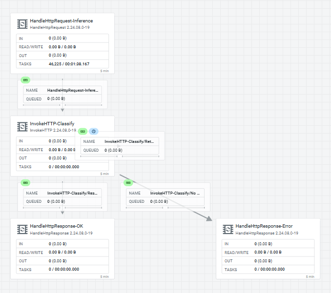

# Chapter 8: MiNiFi Java Setup

This chapter documents getting MiNiFi Java `2.24.08.0-19` running under EFM management — on native
Windows (`WindowsDesktop`) and as a Kubernetes pod (`KubernetesPodJava`) — with both agents ONLINE
and publishing flows. Every step here is field-verified, including the Kafka/scripting NAR
drop-in. The C++ side of this setup lives in Chapter 7 and the binary staging
mechanics live in Chapter 2 — this chapter is the Java-specific install, enrollment, and flow
authoring story.

## What this scenario proves

Java MiNiFi and C++ MiNiFi coexist in the same EFM instance with no interference, provided each
runtime gets its own **agent class**. The same-class split prevents C++-shaped flows from reaching
Java agents (and vice versa) and is the pattern this whole array now uses: `WindowsDesktop` (java)
alongside `WindowsDesktopCpp` (cpp), `KubernetesPodJava` alongside `KubernetesPod` (cpp) in the
same cluster. You use Java when you need real Java FQCNs, the `HandleHttpRequest`/`HandleHttpResponse`
early-ack pair, or the controller service layer — not because you're replacing C++.

## Prerequisites

### EFM binary staging: add the `java/windows` leaf

EFM's deployer resolves binaries by a strict three-part coordinate: `${agentType}/${osArch}/${agentVersion}`.
The initial binary staging tree (Chapter 2) may only have `java/linux`. Without a `java/windows`
leaf, the PowerShell deployer returns:

```
400 Error during agent binary lookup
```

The Java tarball is platform-agnostic — it includes both `minifi.exe`/`minifi.bat` (Windows) and
`minifi.sh` (Linux). Stage the same archive under both coordinates:

```bash
EFM_POD=$(kubectl get pod -n cld-streaming -l app=efm -o jsonpath='{.items[0].metadata.name}')
mkdir -p /tmp/java-win/binaries/java/windows/2.24.08.0-19
cp ~/efm-binaries/minifi-2.24.08.0-19-bin.tar.gz \
  /tmp/java-win/binaries/java/windows/2.24.08.0-19/minifi.tar.gz
cd /tmp/java-win
tar -cf - binaries/ | kubectl exec -i $EFM_POD -n cld-streaming -- \
  tar -xf - -C /opt/efm/efm-2.3.1.0-2/agent-deployer/
kubectl rollout restart deployment/efm -n cld-streaming
kubectl wait --for=condition=ready pod -l app=efm -n cld-streaming --timeout=180s
```

> **⚠️ Port-forwards die with the pod.** After the EFM rollout, your LAN and Tailscale
> port-forwards to `svc/efm:10090` become stale. Re-establish them before trying to reach the
> deployer or UI.

Final binary tree after the add:

```text
binaries/cpp/linux/1.26.02/minifi.tar.gz
binaries/cpp/linuxaarch64/1.26.02/minifi.tar.gz
binaries/cpp/windows/1.26.02/minifi.msi
binaries/java/linux/2.24.08.0-19/minifi.tar.gz
binaries/java/windows/2.24.08.0-19/minifi.tar.gz   ← new
```

### WindowsDesktop prereqs

- **OpenJDK 21** — `C:\Program Files\Microsoft\jdk-21.0.11.10-hotspot` (class-file version 65;
  the deployer rejects anything below 21)
- **EFM reachable** from Windows at `http://127.0.0.1:10090` (mirrored networking or active
  port-forward)
- **A user-writable install root** — never run the deployer from `C:\WINDOWS\system32` or a
  `\\wsl.localhost\...` UNC path; `run-minifi.bat` can't find `java` from those working directories

## Windows install

Generate the deployer script from the EFM UI (choose `agentType=java`, `agentVersion=2.24.08.0-19`,
`osArch=windows`) or build the `Invoke-WebRequest` call by hand. Run from a user-writable directory
with `JAVA_HOME` and `PATH` set:

```powershell
$agentId = [guid]::NewGuid().ToString()
$installRoot = 'C:\Users\tunas\minifi-java'
New-Item -ItemType Directory -Path $installRoot -Force | Out-Null
Set-Location $installRoot

$env:JAVA_HOME = 'C:\Program Files\Microsoft\jdk-21.0.11.10-hotspot'
$env:Path = "$env:JAVA_HOME\bin;" + [Environment]::GetEnvironmentVariable('Path','Machine')

# Fetch and execute the deployer script from EFM
# (substitute your EFM base URL, agentClass, and agentIdentifier)
Invoke-WebRequest `
  -Uri 'http://127.0.0.1:10090/efm/api/agent-deployer/script' `
  -Method POST `
  -Body ("agentClass=WindowsDesktop" +
        "&agentIdentifier=$agentId" +
        "&agentType=java" +
        "&agentVersion=2.24.08.0-19" +
        "&autoConfigureSecurity=false" +
        "&baseUrl=http%3A%2F%2F127.0.0.1%3A10090%2Fefm%2Fapi" +
        "&hbPeriod=5000" +
        "&osArch=windows" +
        "&serviceName=minifi" +
        "&serviceUser=tunas" +
        "&trustSelfSignedCertificates=false") `
  -UseBasicParsing `
  -ContentType "application/x-www-form-urlencoded" `
  | Invoke-Expression
```

The agent lands at `C:\Users\tunas\minifi-java\minifi-2.24.08.0-19\`. The bootstrap C2 block in
`conf/bootstrap.conf` will look like:

```properties
c2.agent.class=WindowsDesktop
c2.agent.identifier=<the guid you passed>
c2.rest.path.base=http://127.0.0.1:10090/efm/api
c2.runtime.type=minifi-java
```

**Starting the agent.** `minifi.exe start` triggers a service install and wants elevation.
`run-minifi.bat` works without elevation, provided `JAVA_HOME`/`PATH` are set and the working
directory is a real Windows path (not a UNC WSL path):

```powershell
Set-Location 'C:\Users\tunas\minifi-java\minifi-2.24.08.0-19'
.\bin\run-minifi.bat
```

The `minifi-app.log` appears under `logs/` in the install root. Watch it for the initial
heartbeat and class registration lines.

## Kubernetes pod install

The `KubernetesPodJava` class runs alongside the existing `KubernetesPod` C++ class — they share
the same cluster and the same EFM instance, pointing at separate agent classes so their designer
flows never collide.

```yaml
# shape only — substitute your own agentIdentifier UUID
command: ["/bin/bash","-c"]
args:
- |
  apt-get update && apt-get install -y curl tar openjdk-21-jre-headless ca-certificates sudo
  curl -L \
   -d agentClass=KubernetesPodJava \
   -d agentIdentifier=32a44ee7-02ea-4b50-8913-11bdf66cb894 \
   -d agentType=java \
   -d agentVersion=2.24.08.0-19 \
   -d autoConfigureSecurity=false \
   -d baseUrl=http%3A%2F%2Fefm.cld-streaming.svc%3A10090%2Fefm%2Fapi \
   -d hbPeriod=5000 \
   -d osArch=linux \
   -d serviceName=minifi \
   -d serviceUser=root \
   -d trustSelfSignedCertificates=false \
   http://efm.cld-streaming.svc:10090/efm/api/agent-deployer/script | bash -
  tail -f /dev/null
```

> **⚠️ `sudo` required even when running as root.** The deployer script calls `sudo` internally.
> If `sudo` is not installed in the pod image, the deployer exits immediately with:
>
> ```
> -- ERROR: The following command is required, but not found: sudo
> -- ERROR: Installation has failed.
> ```
>
> The fix is `apt-get install -y sudo` before the deployer curl — exactly as shown above.

Sizing: `768Mi request / 1536Mi limit` is the field-measured baseline for this agent. The main JVM
process RSS sits around 378–424 MB; the bootstrap-watcher JVM adds another 83–86 MB — combined
roughly 500 MB, measured on both the K8s pod and a native `docker run`.

## Processor catalog — field-verified stock set

The EFM-staged CEM Java tarball `minifi-2.24.08.0-19-bin.tar.gz` ships **114 processors**. Full
list: `files/efm/java-minifi-2.24.08.0-19-processors.txt`.

### Present in the stock binary

| Capability | Class name in flows |
|---|---|
| `ListenHTTP` | `org.apache.nifi.processors.standard.ListenHTTP` |
| `HandleHttpRequest` / `HandleHttpResponse` | `org.apache.nifi.processors.standard.HandleHttpRequest` etc. |
| `StandardHttpContextMap` (controller service) | Required companion for the Handle pair |
| `GenerateFlowFile`, `LogAttribute`, `InvokeHTTP` | Yes |
| `ExecuteProcess`, `ExecuteStreamCommand` | Yes — shell, not script engines |
| `UpdateAttribute`, Record processors (`ConvertRecord`, `SplitRecord`, …) | Yes |
| Controller services (SSL, DBCP, record readers/writers, …) | Yes — **45 services** in the manifest |

### Critical difference from C++: use full Java FQCNs

C++ flows use short class names (`ListenHTTP`, `PublishKafka`). Java flows use fully-qualified
class names:

```
org.apache.nifi.processors.standard.ListenHTTP
org.apache.nifi.processors.standard.GenerateFlowFile
org.apache.nifi.processors.standard.LogAttribute
```

Sending a C++-class flow to a Java agent produces ghost processors and validation 409s. The EFM
designer enforces this at the class level — see *The class-manifest trap* below.

## Smoke flow: verifying enrollment

After the agent comes ONLINE in EFM, build and publish a smoke flow on its class in the designer:

```
GenerateFlowFile (schedule: 5 sec, Custom Text: hello-from-windows-java)
  → LogAttribute (Log Payload: true)
```

Confirm delivery in `minifi-app.log` (Windows) or `kubectl logs <pod>` (K8s):

```
LogAttribute[...] logging for flow file ...
Key: 'Custom Text'
Value: 'hello-from-windows-java'
```

A `flowVersion 3` (or higher) smoke delivery confirms the agent is enrolled, pulling from EFM,
and executing processors.

## The class-manifest trap

EFM's designer validates processor types against the **agent class → manifest mapping**, not against
whatever agent happens to be online. A class that registered against a C++ manifest will reject
Java FQCNs, and a class that was just mapped to a Java manifest will reject C++ short names.

Symptom when a Java agent receives a C++-class flow:

```
Processor is of type org.apache.nifi.minifi.processors.ListenHTTP, but this is not a valid Processor type
```

Symptom when the class is still mapped to the C++ manifest after switching to Java:

```
Processor is of type org.apache.nifi.processors.standard.GenerateFlowFile, but this is not an available Processor type
```

Fix: remap the class to the correct agent manifest ID. Get the manifest ID from the live agent's
`GET /efm/api/agents/{agentId}` response, then:

```bash
curl -X POST http://127.0.0.1:10090/efm/api/agent-class-manifest-config \
  -H 'Content-Type: application/json' \
  -d '{"agentClassName":"WindowsDesktop","agentManifestId":"<id-from-agent-GET>"}'
```

> **⚠️ This trap fires on NAR autoloads too.** After adding NARs to a live agent (see the
> next section), the agent re-registers with a new `agentManifestId` that includes the new
> processors. The designer palette still shows the old manifest until you re-POST the
> class-manifest-config with the updated ID. This is the same fix, applied to the same-runtime
> case of "I just added NARs."

## Stock gaps: no Kafka NAR, no scripting NAR out of the box

The stock `2.24.08.0-19` tarball ships neither `PublishKafka`/`ConsumeKafka` nor `ExecuteScript`.
This is confirmed in the field and agrees with Cloudera's own CEM 2.4.0 release notes
(`docs.cloudera.com/cem/2.4.0/release-notes-minifi-java/topics/cem-java-agent-processors.html`),
which document the out-of-the-box set with no Kafka and no scripting, and reference adding them
via a NAR drop-in into `<MINIFI_AGENT_HOME>/extensions`.

### Adding the NARs — field-verified

The NARs cannot be copied from a full NiFi install. NiFi's NAR loader matches by **exact**
group+id+version string. A `mynifi` instance running CFM `2.6.0.4.3.4.0-234` carries NARs whose
`Nar-Dependency-Version` is `2.6.0.4.3.4.0-234` — they will not resolve against the agent's
`2.24.08.0-19` framework NARs.

The working method is to build the NARs from the exact-matching source tarball
(`nifi-minifi-java-2.0.0.2.24.08.0-19-source.tar.gz`), rewriting every module's version to
`2.24.08.0-19` before building:

```bash
tar -xzf ~/efm-binaries/nifi-minifi-java-2.0.0.2.24.08.0-19-source.tar.gz -C /tmp/nar-build
cd /tmp/nar-build/nifi-minifi-java-2.0.0.2.24.08.0-19

# Rewrite every module version to match the installed agent framework
./mvnw -q -N org.codehaus.mojo:versions-maven-plugin:2.17.1:set \
  -DnewVersion=2.24.08.0-19 -DgenerateBackupPoms=false -DprocessAllModules=true

# Build just the 3 NARs needed (and their reactor deps, via -am)
./mvnw \
  -pl nifi-extension-bundles/nifi-kafka-bundle/nifi-kafka-nar,\
nifi-extension-bundles/nifi-kafka-bundle/nifi-kafka-3-service-nar,\
nifi-extension-bundles/nifi-scripting-bundle/nifi-scripting-nar \
  -am -DskipTests -Dcheckstyle.skip=true -Drat.skip=true \
  -Dlicense.skip=true -Dspotbugs.skip=true \
  clean install
```

Build runs about 3 minutes. Four NARs come out, all versioned `2.24.08.0-19`:

```
nifi-kafka-service-api-nar-2.24.08.0-19.nar   (26 KB)
nifi-kafka-nar-2.24.08.0-19.nar               (752 KB)
nifi-kafka-3-service-nar-2.24.08.0-19.nar     (18.8 MB)   ← don't miss this one
nifi-scripting-nar-2.24.08.0-19.nar           (21.2 MB)
```

> **⚠️ `nifi-kafka-3-service-nar` is a separate module and is easy to miss.** `PublishKafka`
> requires a `Kafka3ConnectionService` controller — that lives in `nifi-kafka-3-service-nar`,
> not in `nifi-kafka-nar`. Drop in both, or the processor instantiates without a usable
> controller service.

Drop the NARs into the agent's autoload directory. The `nifi.nar.library.autoload.directory=./extensions`
property is set in `conf/minifi.properties` and is watched continuously — no agent restart needed:

```bash
# For KubernetesPodJava:
kubectl cp nifi-kafka-service-api-nar-2.24.08.0-19.nar \
  cld-streaming/minifi-agent-k8s-java:/minifi-2.24.08.0-19/extensions/
kubectl cp nifi-kafka-nar-2.24.08.0-19.nar \
  cld-streaming/minifi-agent-k8s-java:/minifi-2.24.08.0-19/extensions/
kubectl cp nifi-kafka-3-service-nar-2.24.08.0-19.nar \
  cld-streaming/minifi-agent-k8s-java:/minifi-2.24.08.0-19/extensions/
kubectl cp nifi-scripting-nar-2.24.08.0-19.nar \
  cld-streaming/minifi-agent-k8s-java:/minifi-2.24.08.0-19/extensions/
```

For WindowsDesktop, copy via the WSL2 `/mnt/c` mount directly to
`C:\Users\tunas\minifi-java\minifi-2.24.08.0-19\extensions\`.

Watch `minifi-app.log` for the `NAR Auto-Loader` pickup lines (`[0] skipped` = clean). The
manifest goes **114 → 122 processors**. After autoload, re-map the class manifest ID (see *The
class-manifest trap* above) — the new manifest ID appears in the agent's next heartbeat.

### Field certification — what actually ran

**`KubernetesPodJava`:**
- `ExecuteScript` (Groovy 4.0.23): a Groovy script set a custom attribute that appeared on every
  flowfile reaching `LogAttribute` — not just class-loaded, actually executed.
- `PublishKafka` + `Kafka3ConnectionService` wired to `my-cluster-kafka-bootstrap.cld-streaming.svc:9092`:
  log shows a real Kafka 3.9.0 client connecting, discovering the cluster ID, negotiating a
  transaction coordinator, and receiving a producer ID. The only remaining event was
  `UNKNOWN_TOPIC_OR_PARTITION` because the test topic wasn't pre-created — expected, not a NAR
  problem.

**`WindowsDesktop` native agent:**
- Same 4 NARs, autoloaded clean.
- `ExecuteScript` Groovy confirmed: attribute `nar.groovy.smoke=windows-java-nar-drop-in-ok`
  appeared on every flowfile.
- `PublishKafka` instantiated a real Kafka 3.9.0 transactional producer, attempted a real TCP
  connect to the LAN broker, and failed with `TimeoutException: Timeout expired after 5000ms while
  awaiting InitProducerId` — the same hairpin-NAT limitation that hits the C++ agent. This is a
  network topology issue, not a processor-availability failure.

Pre-built artifacts live at `~/efm-binaries/java-nar-drop-in-2.24.08.0-19/` on WindowsDesktop —
copy anywhere without rebuilding.

### Scripting engine note

`nifi-scripting-nar` for this build ships **Groovy 4.0.23 and Clojure 1.8.0**. There is no
Jython/Python in this NAR (unlike the C++ `ExecuteScript` extension, which runs Python via the C++
Python bridge). If you need Python execution in a Java MiNiFi agent, the path is the py4j framework
(`nifi.python.command` in `minifi.properties`) — but that route is currently
blocked because `nifi.python.command` cannot be set durably on an EFM-managed agent (the agent
regenerates `minifi.properties` from EFM's stored config on every boot, and C2 `UPDATE_PROPERTIES`
for this key is on the server-side denylist).

## HandleHttpRequest / HandleHttpResponse — early-ack wiring

Both processors and their `StandardHttpContextMap` controller service ship in the stock binary
(no NAR drop-in needed). The early-ack pattern wires `HandleHttpResponse` immediately after
`HandleHttpRequest` so the HTTP caller gets a response before the rest of the flow finishes:

```
HandleHttpRequest (:8085) → HandleHttpResponse (200) → LogAttribute
```

Field-verified on a `docker run` of `container.repo.cloudera.com/cloudera/nifi-minifi-java:latest`:

- `curl -X POST` returned a real `200` in ~84 ms
- The flowfile reached `LogAttribute` independently afterward — proof the response flushes without
  waiting on downstream processors

Cost: ~507 MB combined RSS (main JVM ~424 MB + bootstrap-watcher JVM ~83 MB). On the Jetson's
7.3 GB RAM, that is roughly 7% of total memory for the agent alone — real, but not prohibitive.
The existing K8s deployment sizing of `768Mi request / 1536Mi limit` is consistent with this
measurement.

## Java MiNiFi on the NVIDIA Jetson (NvidiaNano)

A Java MiNiFi agent on an aarch64 device uses the same `java/linux` tarball (the `osArch=linux`
coordinate covers both x86_64 and aarch64 for the Java binary, since it is a JVM artifact). The
only additional requirement is a JRE 21 for aarch64.

Field-verified:

- **JRE**: Eclipse Temurin 21.0.12+8 aarch64, portable tarball extracted to `~/jdk21/` — no
  `apt`/`sudo` required, fully user-space.
- **Class**: `NvidiaNanoJava` (kept separate from the C++ `NvidiaNano`/`NvidiaNanoAI` classes).
- **Deployer tip**: pass `serviceUser=<your-ssh-user>` (e.g., `tunastreet`) in the deployer form.
  The default `serviceUser=minifi` triggers `useradd` which needs root. With your real username the
  deployer's fallback path runs MiNiFi as a plain background process (`bin/minifi.sh start`) and
  skips the systemd service install — no manual intervention.
- **Confirmed ONLINE**: EFM server log shows `Registering new agent` with `agentType=minifi-java`,
  real heartbeat every 5 s.
- **Real footprint**: 454 MB combined RSS (main JVM 378 MB + bootstrap-watcher 86 MB) / 577 MB on
  disk (419 MB agent + 158 MB JRE).
- Both `NvidiaNano` (C++) and `NvidiaNanoJava` (Java) agents run concurrently — no conflict.

### The `HandleHttpRequest` flow built on `NvidiaNanoJava`

`NvidiaNanoJava` carries three synchronous `HandleHttpRequest → InvokeHTTP → HandleHttpResponse`
legs, each proxying to a resident local daemon on the Jetson and returning a real response (200,
or 502 on a downstream failure) rather than a fire-and-forget ack:

- **`/classify`** — proxies to a resident TensorRT inference daemon.
- **`/streamChatListener`** — the Twitch `!load` screen-control front door.
- **`/matrixListener`** — the Twitch `!matrix` screensaver front door.




## What NOT to do

**Put a Java agent on a class whose designer flow still uses C++ FQCNs.** Ghost processors,
validation 409s, and empty flows after "successful" reloads. Always create a new class (e.g.,
`WindowsDesktopCpp` vs. `WindowsDesktop`) when you run both runtimes on the same host.

**Assume Java MiNiFi CEM = full NiFi processor set.** The field-verified stock count is
**114** — not "200+". Both the Kafka and scripting NARs are absent in the tarball. They can be
built from the matching source and dropped in to reach 122 (field-verified) — but
don't assume they're simply unavailable either.

**Copy NARs from a full NiFi instance.** `Nar-Dependency-Version` mismatches cause silent
load failures. The NAR loader resolves by exact group+id+version — no fallback.

**Replace the `KubernetesPod` C++ pod with a Java pod** if gaming or stream flows still depend on
C++ `ExecuteScript` assets. Run a parallel class and pod.

**Run the Windows deployer from `C:\WINDOWS\system32` or a UNC WSL path.** The install root
becomes unusable; `run-minifi.bat` fails to find `java`.

**Skip the `java/windows` staging step.** The Java tarball is platform-agnostic, but EFM's
deployer coordinate is platform-specific. Without the `java/windows` leaf, the PowerShell
deployer returns 400 — same bytes, different EFM path.

**Have orphaned processors on the designer canvas when publishing.** EFM has no inert/disabled
state. Every processor on the canvas must pass validation, connected or not. A 409 on `/publish`
that references processors you're not actively working on usually means there are disconnected
processors left over from a previous session — delete them before publishing.

## Known final gap: no Kafka NAR parity out of the box

The stock Java MiNiFi image (`container.repo.cloudera.com/cloudera/nifi-minifi-java:latest`) and
the EFM-staged CEM tarball (`minifi-2.24.08.0-19-bin.tar.gz`) both ship **without a Kafka NAR**.
`PublishKafka` and `ConsumeKafka` are absent from the factory binary. This is not an open question
— it is a confirmed, final gap in the stock distribution, documented by Cloudera's own CEM 2.4.0
release notes and field-verified twice on different agents.

The NAR drop-in described in this chapter resolves the gap for agents where you control the
filesystem and have the matching source tarball. For agents that are auto-provisioned by EFM
without a post-install step, the gap remains.

Kafka NAR parity — getting `PublishKafka` into a stock Java MiNiFi deployment without a manual
build — remains a separate open item. It is **not** a blocker for the flows in this chapter; the
NAR drop-in is the working path today.

## Related chapters

- Ch2 — [EFM Binaries](ch02-efm-binaries.md): binary staging mechanics and the Java NAR build recipe.
- Ch4 — [MiNiFi Java Processor Catalog](ch04-java-processor-catalog.md): the full processor/controller-service set. Full processor list: `files/efm/java-minifi-2.24.08.0-19-processors.txt`.
