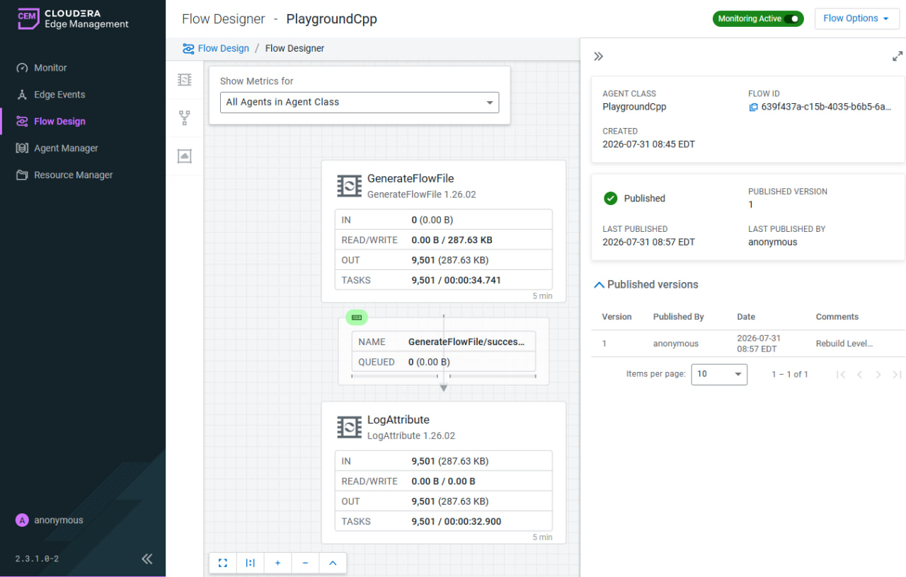
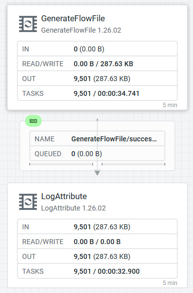
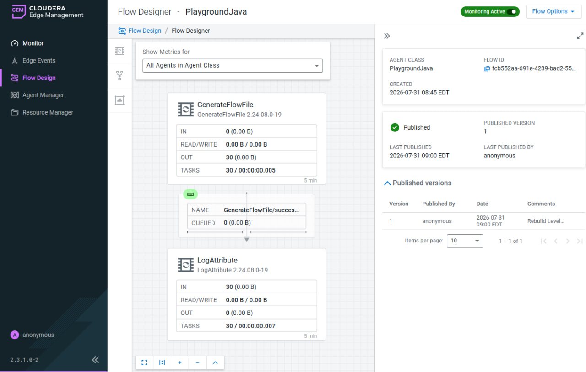
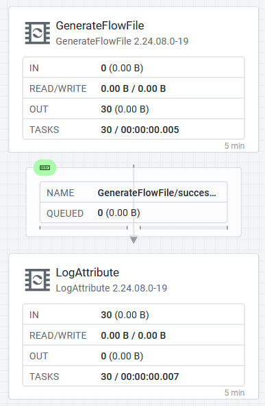

# Chapter 9: Introduce EFM into the Playground

This chapter brings EFM into the `MiNiFi-Kubernetes-Playground` repo alongside the Level 1 standalone pods from Chapters 7 and 8 — without touching any Level 1 file. Two new bare pods, two new EFM agent classes, a smoke flow on each, verified live. This is `Level 2`: EFM-managed, additive, proof that the same agent-deployer bootstrap pattern used in the main `cld-streaming` cluster works just as well in the `default` namespace.

## What Level 2 is and isn't

Level 1 (`minifi-test.yaml`, `minifi-test-java.yaml`) is Docker-baked config — `config.yml` / `config-java.yml` copied at build time, no EFM. Level 2 adds two new pods, two new EFM agent classes (`PlaygroundCpp`, `PlaygroundJava`), and a managed flow on each. None of the original six files (`Dockerfile`, `Dockerfile.java`, `config.yml`, `config-java.yml`, `minifi-test.yaml`, `minifi-test-java.yaml`) were touched.

Level 2 is a smoke test, not a production routing flow. The goal is to prove the EFM C2 wiring works end-to-end from a bare pod in the `default` namespace. A real routing target — what these agents should actually route data to — is a separate question outside this chapter's scope.

## Cluster topology

Both Level 2 pods run in the same `minikube` cluster as the Level 1 pods, `default` namespace. EFM runs in `cld-streaming` namespace on the same cluster. Because it's the same cluster, the agent-deployer curl reaches EFM via ordinary cluster-internal DNS — no cross-cluster networking needed:

```
efm.cld-streaming.svc:10090
```

The Level 1 pods live in `default` too — `serviceAccountName: minifi-controller` appears in those manifests, but the running pods actually use the `default` SA regardless (checked against the live Level 1 Java pod). Not investigated further; out of scope for this chapter.

## Pod manifests

Both manifests follow the same bare-pod bootstrap pattern proven by `minifi-agent-k8s-gaming` (`KubernetesPod`) and `minifi-agent-k8s-java` (`KubernetesPodJava`) in the `cld-streaming` cluster. No custom Docker image — a plain `ubuntu:22.04` base installs prerequisites and then runs EFM's own `agent-deployer/script` at startup:

`minifi-test-efm-cpp.yaml` — pod `minifi-test-efm-cpp`, EFM class `PlaygroundCpp`:

```yaml
apiVersion: v1
kind: Pod
metadata:
  name: minifi-test-efm-cpp
  namespace: default
spec:
  containers:
  - name: minifi-efm-cpp
    image: ubuntu:22.04
    command: ["/bin/bash", "-c"]
    args:
    - |
      apt-get update -qq && apt-get install -y curl ca-certificates
      # EFM cold-start health-poll — one-shot curl can race EFM's ~2min Jetty bind
      until curl -sf http://efm.cld-streaming.svc:10090/efm/actuator/health | grep -q '"status":"UP"'; do
        echo "waiting for EFM..." && sleep 10
      done
      curl -sf "http://efm.cld-streaming.svc:10090/efm/api/agent-deployer/script?class=PlaygroundCpp&agentType=minifi-cpp" | bash
      tail -f /dev/null
```

`minifi-test-efm-java.yaml` — pod `minifi-test-efm-java`, EFM class `PlaygroundJava`:

```yaml
apiVersion: v1
kind: Pod
metadata:
  name: minifi-test-efm-java
  namespace: default
spec:
  containers:
  - name: minifi-efm-java
    image: ubuntu:22.04
    command: ["/bin/bash", "-c"]
    args:
    - |
      apt-get update -qq && apt-get install -y curl ca-certificates openjdk-11-jre-headless
      until curl -sf http://efm.cld-streaming.svc:10090/efm/actuator/health | grep -q '"status":"UP"'; do
        echo "waiting for EFM..." && sleep 10
      done
      curl -sf "http://efm.cld-streaming.svc:10090/efm/api/agent-deployer/script?class=PlaygroundJava&agentType=minifi-java" | bash
      tail -f /dev/null
```

The health-poll before the deployer curl matters. On a cold-start EFM takes up to two minutes to bind its Jetty listener. A one-shot curl without the poll will fail and the agent never enrolls. See `skills/nifi-and-ai/references/minifi-efm.md` §3.

## Creating the EFM agent classes

Before applying the manifests, create the two agent classes in EFM:

```bash
curl -s -X POST "http://efm.cld-streaming.svc:10090/efm/api/agent-classes" \
  -H "Content-Type: application/json" \
  -d '{"name": "PlaygroundCpp"}'

curl -s -X POST "http://efm.cld-streaming.svc:10090/efm/api/agent-classes" \
  -H "Content-Type: application/json" \
  -d '{"name": "PlaygroundJava"}'
```

Then apply the manifests:

```bash
kubectl apply -f minifi-test-efm-cpp.yaml
kubectl apply -f minifi-test-efm-java.yaml
```

Both agents come `ONLINE` in EFM within approximately two minutes of `kubectl apply` (the C++ tarball is ~39 MB, Java ~204 MB). The agent-deployer re-registers the class automatically on the first heartbeat even after a full teardown and redeploy.

## Building the flow via the EFM API

The smoke flow on each class is `GenerateFlowFile (10 sec, Custom Text)` → `LogAttribute`. Built programmatically using the same processor-creation API contract reverse-engineered from EFM's Angular UI bundle.

### Step 1 — Get the flowId for the agent class

```bash
curl -s "http://efm.cld-streaming.svc:10090/efm/api/designer/flows/summaries" \
  | jq '.elements[] | select(.agentClass=="PlaygroundCpp") | {flowId: .id, pgId: .flowContent.rootGroup.id}'
```

This returns two IDs you need for every subsequent call:

- `flowId` — the top-level flow object ID
- `pgId` — the root process group ID inside that flow

### Step 2 — Create processors

> **⚠️ Both `flowId` and `pgId` are required in the path.** The create-processor endpoint is `POST /efm/api/designer/flows/{flowId}/process-groups/{pgId}/processors`. Using only `pgId` (i.e., a path like `/efm/api/designer/flows/{pgId}/processors`) returns a generic Spring "No static resource" 404 that looks like an auth or routing problem — it is not. Both IDs must be in the path every time. The same applies to `/connections`.

```bash
# GenerateFlowFile at (0, 0)
curl -s -X POST \
  "http://efm.cld-streaming.svc:10090/efm/api/designer/flows/${FLOW_ID}/process-groups/${PG_ID}/processors" \
  -H "Content-Type: application/json" \
  -d '{
    "componentDefinition": {"type": "GenerateFlowFile"},
    "position": {"x": 0, "y": 0},
    "config": {
      "schedulingPeriod": "10 sec",
      "properties": {
        "Custom Text": "PlaygroundCpp Level 2 heartbeat"
      }
    }
  }'

# LogAttribute at (0, 300)  — row pitch 300, vertical chain per layout.md
curl -s -X POST \
  "http://efm.cld-streaming.svc:10090/efm/api/designer/flows/${FLOW_ID}/process-groups/${PG_ID}/processors" \
  -H "Content-Type: application/json" \
  -d '{
    "componentDefinition": {"type": "LogAttribute"},
    "position": {"x": 0, "y": 300}
  }'
```

### Step 3 — Create the connection

```bash
curl -s -X POST \
  "http://efm.cld-streaming.svc:10090/efm/api/designer/flows/${FLOW_ID}/process-groups/${PG_ID}/connections" \
  -H "Content-Type: application/json" \
  -d '{
    "source": {"id": "<GenerateFlowFile-processor-id>", "type": "PROCESSOR"},
    "destination": {"id": "<LogAttribute-processor-id>", "type": "PROCESSOR"},
    "selectedRelationships": ["success"]
  }'
```

Capture the processor IDs from the responses in Step 2.

### Step 4 — Publish

```bash
curl -s -X POST \
  "http://efm.cld-streaming.svc:10090/efm/api/designer/flows/${FLOW_ID}/publish" \
  -H "Content-Type: application/json" \
  -d '{"comments": "PlaygroundCpp smoke flow — ch09"}'
```

A successful publish returns the flow version with `"validationErrors": []`. If `validationErrors` is non-empty, the connection or a required property is missing.

Repeat Steps 1–4 for `PlaygroundJava` with `FLOW_ID` and `PG_ID` for that class, and `Custom Text: "PlaygroundJava Level 2 heartbeat"`.

## Layout: always use the EFM-Designer pitch

Place `GenerateFlowFile` at `(0, 0)` and `LogAttribute` at `(0, 300)`. The row pitch for the EFM Designer is 300, not 200. A `(0,0)→(400,0)` horizontal layout or a 200-pitch vertical layout passes `validationErrors: []` but fails visual QA in the Designer canvas. Decide the pitch before the first programmatic build, not after the canvas reads cramped.

Verify positions after publish, not just after create:

```bash
curl -s "http://efm.cld-streaming.svc:10090/efm/api/designer/flows/${FLOW_ID}" \
  | jq '.flowContent.rootGroup.processors[] | {name: .name, x: .position.x, y: .position.y}'
```

Expected output for both flavors:

```json
{ "name": "GenerateFlowFile", "x": 0, "y": 0 }
{ "name": "LogAttribute",     "x": 0, "y": 300 }
```

## Verifying the agents

Check EFM Monitor → Agents after `kubectl apply`. Both should reach `ONLINE` status within ~2 minutes.










Verify from the pod itself:

```bash
kubectl logs minifi-test-efm-cpp -n default | grep LogAttribute
kubectl logs minifi-test-efm-java -n default | grep LogAttribute
```

Both pods' `minifi-app.log` should show real, repeating `LogAttribute` output on the ~10-second schedule:

```
LogAttribute -- filename: <uuid>, content: PlaygroundCpp Level 2 heartbeat
LogAttribute -- filename: <uuid>, content: PlaygroundJava Level 2 heartbeat
```

## Exporting the flow JSON

EFM Designer flows do not have a separate "download" endpoint the way the NiFi REST API does. Export via `GET`:

```bash
curl -s "http://efm.cld-streaming.svc:10090/efm/api/designer/flows/${FLOW_ID}" \
  > PlaygroundCpp.json
```

The EFM UI's own **Export** feature produces a richer envelope — `flowContent` + `agentManifest` + `parameterContexts` — which is the better export to keep. Exported copies live in `files/efm/PlaygroundCpp.json` and `files/efm/PlaygroundJava.json`. Check for credential leakage before committing: search for `sensitive`/`password` hits in the output. The ones you'll find are property *descriptor* metadata from the processor catalog — not live credential values. Parameter contexts in this flow have zero actual parameters.

## Teardown

When the validation work is done, tear down in this order to avoid orphaned EFM records:

```bash
# 1. Delete pods first to stop heartbeats
kubectl delete pod minifi-test-efm-cpp minifi-test-efm-java -n default

# 2. Delete agent records (get IDs from GET /efm/api/agents)
curl -s -X DELETE "http://efm.cld-streaming.svc:10090/efm/api/agents/<cpp-agent-id>"
curl -s -X DELETE "http://efm.cld-streaming.svc:10090/efm/api/agents/<java-agent-id>"

# 3. Delete agent classes
curl -s -X DELETE "http://efm.cld-streaming.svc:10090/efm/api/agent-classes/PlaygroundCpp"
curl -s -X DELETE "http://efm.cld-streaming.svc:10090/efm/api/agent-classes/PlaygroundJava"

# 4. Confirm clean
curl -s "http://efm.cld-streaming.svc:10090/efm/api/agent-classes" | jq '.[].name'
curl -s "http://efm.cld-streaming.svc:10090/efm/api/designer/flows/summaries" | jq '.elements[].agentClass'
```

Neither PlaygroundCpp nor PlaygroundJava should appear in either response. The pod manifests (`minifi-test-efm-cpp.yaml`, `minifi-test-efm-java.yaml`) stay in the playground repo — they're the bootstrap, reusable for a future rebuild.

## What NOT to do

**Build the flow without reading `layout.md` first.** The first build of this chapter used `(0,0)→(400,0)`. It passed every functional check — `validationErrors: []`, `LogAttribute` output on schedule — and was still rolled back for the layout defect. `layout.md` exists precisely because this shape has been built twice wrong. Read it before any programmatic EFM Designer build.

**Use only `pgId` in the processor-create path.** `POST /efm/api/designer/flows/{pgId}/processors` returns a Spring "No static resource" 404. That error message looks like an auth or routing misconfiguration. It is not — the correct path requires both `flowId` and `pgId`: `POST /efm/api/designer/flows/{flowId}/process-groups/{pgId}/processors`.

**Skip the EFM health-poll before the deployer curl.** On a cold-start EFM, the Jetty listener takes up to two minutes to bind. A one-shot curl races that window and returns an error; the agent startup script fails and the pod never enrolls. Both manifests here poll `/efm/actuator/health` in a loop before calling the deployer.

**Export flow JSON after class deletion.** Deleting the agent class removes the Designer flow definition. Export (`GET /efm/api/designer/flows/{id}` or the UI Export button) before teardown, not after.

## Related chapters

- Ch7 — [Standalone MiNiFi C++ on Kubernetes](ch07-standalone-minifi-cpp-on-k8s.md): the Level 1 C++ pod this builds alongside.
- Ch8 — [MiNiFi Java Setup](ch08-minifi-java-setup.md): the Level 1 Java pod this builds alongside.

Flow exports are committed at `files/efm/PlaygroundCpp.json` and `files/efm/PlaygroundJava.json`.
