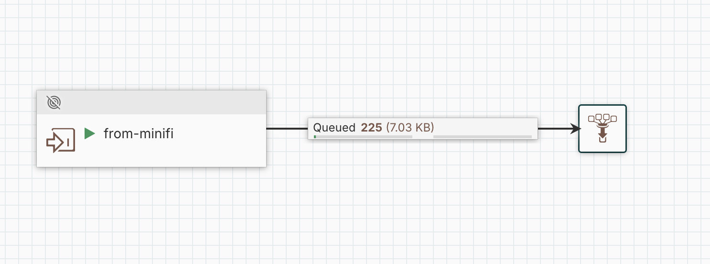

# Chapter 11: Site-to-Site, MiNiFi to NiFi on Kubernetes

Site-to-Site (S2S) is how FlowFiles move between a MiNiFi agent and NiFi. Everything up to here has kept data on the agent, a flow that ingests, transforms, and lands locally. S2S is the leg that ships it. An agent transmits its FlowFiles into a NiFi instance over a mutually-authenticated, transactional channel, and NiFi picks up where the edge left off. On Kubernetes that means a MiNiFi pod streaming into a CFM-operator-managed NiFi in the same cluster.

This chapter covers both source runtimes, MiNiFi C++ and MiNiFi Java, into the same NiFi target. The NiFi side is identical for both. What differs is where each runtime keeps its client SSL configuration, and that difference is the whole game.

## Why Site-To-Site, and Why HTTP Transport

S2S exists because the alternatives are worse. You could POST to a NiFi `ListenHTTP`, but then you own retry, backpressure, and delivery guarantees yourself. S2S gives you a transactional protocol. The agent negotiates with NiFi, transmits a batch, and only commits once NiFi has durably received it, so an agent-side "successfully sent" already means NiFi has the data. It also carries backpressure back to the agent automatically when NiFi's receiving queue fills.

NiFi S2S offers two transports.

| Transport | How it rides | On Kubernetes |
|---|---|---|
| RAW | A dedicated socket on `nifi.remote.input.socket.port` | Needs its own exposed port on top of NiFi's pod-IP binding, and the operator does not expose it |
| HTTP | S2S tunnelled over the existing HTTPS port | Rides the `8443` NiFi already serves, so the Remote Process Group's target is the NiFi web URL |

Use HTTP on Kubernetes. Set `nifi.remote.input.http.enabled=true` and there is no extra socket to expose.

```text
targetUris        = https://nifi-web.<ns>.svc.cluster.local:8443
transportProtocol = HTTP
```

## NiFi Side, the S2S Target (Shared by Both Runtimes)

Three things have to be true before any agent can transmit, and they are the same whether the source is C++ or Java.

**1. S2S input is enabled on the NiFi CR** (`configOverride.nifiProperties.upsert`).

```yaml
nifi.remote.input.host: nifi-web.<ns>.svc.cluster.local
nifi.remote.input.secure: "true"
nifi.remote.input.http.enabled: "true"
```

The operator rolls the pod to apply.

**2. An input port exists and is RUNNING.** On the root canvas, add an input port `from-minifi`, wire it to a downstream funnel (an input port with no outgoing connection is invalid and will not start), and start it. Note its UUID. The RPG addresses the port by ID.

> Keep the receiving side inside its own named Process Group instead of wiring the port straight onto the root canvas, then export that PG to `files/` and commit it. The committed JSON is the source of truth. To stand the receiver up in a fresh environment you re-import it through the process-group upload API and skip the hand-rebuild of the port and its downstream wiring. Only the port UUID is environment-specific. Regenerate the RPG's port binding after import.

**3. The agent's identity is authorized, declaratively.** This is the one idea that shapes everything on a CFM-operator NiFi. You do not POST authorization policies, you declare them. The operator owns the authorizer. Hand-POSTing a policy as the seeded admin returns `500 Unable to save Authorizations` because you are writing to a store the operator manages. Declare the peer with a `User` CR whose identity matches the agent's client-cert SAN.

```yaml
apiVersion: cfm.cloudera.com/v1alpha1
kind: User
metadata: { name: minifi-s2s, namespace: <ns> }
spec:
  identity: "minifi-s2s"                 # the cert's MAPPED identity (SAN), not its DN
  instanceTarget: { kind: Nifi, name: <nifi>, namespace: <ns> }
  accessPolicies:
    - { actions: [write], resources: [/data-transfer/input-ports/<from-minifi-uuid>] }
    - { actions: [read],  resources: [/site-to-site] }
```

The operator writes those policies into NiFi as the true policy owner, the exact grant a REST POST cannot persist. Identity maps by cert SAN, not subject DN. The client `Certificate` (a cert-manager cert signed by the operator's CA) must carry `SAN = the agent identity`.

> **⚠️ The `nifi-web` service is not created for you.** The operator only creates the headless `nifi` service. The `nifi-web` service on `8443` must be created by hand, or every operator reconcile against `https://nifi-web…:8443/nifi-api/…` fails with `no such host` and the users and policies never land. That hostname is in the node cert's SAN, so TLS validates as soon as the service exists.

## C++ Leg, Client SSL Lives in `minifi.properties`

Build the agent flow through the EFM Flow Designer. `GenerateFlowFile → RemoteProcessGroup → from-minifi`. The RPG targets the NiFi web URL over HTTPS with HTTP transport. The connection's destination is a `REMOTE_INPUT_PORT` whose id is the `from-minifi` UUID. Validate (`/validate` returns `[]`) before publishing.

The C++-specific catch. A MiNiFi C++ RemoteProcessGroup has no SSL-context-service field. Secure S2S uses the agent's global client identity instead, set in `minifi.properties`.

```properties
nifi.remote.input.secure=true
nifi.security.client.certificate=/path/to/minifi-s2s.crt
nifi.security.client.private.key=/path/to/minifi-s2s.key
nifi.security.client.ca.certificate=/path/to/ca.crt
```

Mount the agent's cert (SAN `minifi-s2s`, signed by NiFi's CA) and bake those keys into the boot script so a restart keeps them. When it works, the agent log shows the transaction.

```
[SiteToSiteClient] Site to Site transaction <uuid> sent flow 1 flow records, with total size 32
[SiteToSiteClient] Site2Site transaction <uuid> peer finished transaction
```



> Hand-authoring the C++ `config.yml` without the Designer? The strict-YAML parser needs an explicit UUID `id` on every component, and the `Remote Processing Groups:` key must be present even when empty. Upstream examples spell it inconsistently (`Remote Process Groups` vs `Remote Processing Groups`). Pin the exact key against your agent version.

## Java Leg, Client SSL Lives in `bootstrap.conf`

The NiFi side is unchanged. The MiNiFi Java flow is the same trivial shape (`GenerateFlowFile → Remote Process Group → from-minifi`), and the C++ YAML quirks do not apply. MiNiFi Java carries its flow as a `flow.json.gz`/`flow.json.raw` pair, not YAML.

The one detail that decides whether the handshake completes. Get the flow perfect and it still fails like this.

```
o.a.n.r.client.PeerSelector Unable to refresh remote group peers due to:
  (certificate_unknown) PKIX path building failed:
  unable to find valid certification path to requested target
```

**Symptom.** The RPG's first S2S call throws `PKIX path building failed` on the client side. MiNiFi is validating NiFi's server cert and failing to build a trust path. Not "the server rejected my client cert." The client cannot even trust the server.

**Diagnosis.** The keystore and truststore are correct, but the S2S client is not loading them. It is falling back to the JVM's default `cacerts`, which has never heard of a private CA. The reason is a MiNiFi Java trait that trips everyone once. MiNiFi Java regenerates `conf/minifi.properties` from `conf/bootstrap.conf` on every start. Edit `minifi.properties` directly and your change is gone on the next restart. The stock `bootstrap.conf` ships the S2S SSL keys empty and `use.parent.ssl=false`.

**Fix.** Set the client SSL config in `bootstrap.conf`, the source of truth the regeneration reads, and turn on parent SSL so the RPG uses that framework context.

```properties
nifi.minifi.security.keystore=/certs-ks/keystore.p12
nifi.minifi.security.keystoreType=PKCS12
nifi.minifi.security.keystorePasswd=changeit
nifi.minifi.security.keyPasswd=changeit
nifi.minifi.security.truststore=/opt/minifi/conf/truststore-ks.p12
nifi.minifi.security.truststoreType=PKCS12
nifi.minifi.security.truststorePasswd=changeit
# Ignore per-processor SSL controller services and use the parent MiNiFi SSL context
nifi.minifi.flow.use.parent.ssl=true
```

Restart, and the regenerated `minifi.properties` carries `nifi.security.*` plus `use.parent.ssl=true`. The RPG picks up the framework SSL context, the handshake completes, and FlowFiles transit.

### Running the Java Agent Unmanaged, a Self-Contained Image

Running the Java agent under the EFM deployer has a catch. The deployer rewrites `bootstrap.conf` on every pod boot, so the SSL fix survives a MiNiFi-process restart but not a pod restart. The durable answer is a small image that bakes the fixed config and runs the agent directly, with no deployer in the boot path.

```dockerfile
FROM eclipse-temurin:21-jre
ADD minifi.tar.gz /                                        # auto-extracts to /minifi-<version>
COPY bootstrap.conf    /minifi-<version>/conf/bootstrap.conf
COPY flow.json.raw     /minifi-<version>/conf/flow.json.raw
COPY flow.json.gz      /minifi-<version>/conf/flow.json.gz
COPY flow-identifier   /minifi-<version>/conf/flow-identifier
COPY truststore-ks.p12 /minifi-<version>/conf/truststore-ks.p12
WORKDIR /minifi-<version>
ENTRYPOINT ["bin/minifi.sh", "run"]
```

Two things separate a working image from a crashing one.

- `flow.json.raw` is authoritative in MiNiFi Java. `flow.json.gz` is derived from it. Bake only the `.gz` and MiNiFi regenerates an empty default flow, recompresses over your `.gz`, and starts zero processors. Bake `flow.json.raw` and `flow-identifier` too.
- The client keystore holds a private key. Do not bake it into the image. Mount it at runtime from the Kubernetes secret and point `bootstrap.conf` at the mount (`/certs-ks/keystore.p12`). The CA-only truststore is public and safe to bake.

Set `c2.enable=false` in the baked `bootstrap.conf`. With the flow already on disk there is no reason to phone EFM home.

## Check It

S2S is transactional, so an agent-side "successfully sent" already means NiFi received and committed the FlowFile. On the Java agent the RPG refreshes peers (the handshake) and reports each send.

```
o.a.n.remote.StandardRemoteProcessGroup Successfully refreshed Flow Contents for
  RemoteProcessGroup[https://nifi-web.<ns>.svc.cluster.local:8443]
o.a.nifi.remote.StandardRemoteGroupPort RemoteGroupPort[name=from-minifi,...]
  Successfully sent [...] (32 bytes) to .../nifi-api in 14 milliseconds
```

On the NiFi side the receive count climbs and FlowFiles queue on the funnel behind the input port.

```bash
curl -s --cert /certs/tls.crt --key /certs/tls.key --cacert /certs/ca.crt \
  "https://nifi-web.<ns>.svc.cluster.local:8443/nifi-api/flow/process-groups/root/status?recursive=true" \
  | grep -oE '"(flowFilesReceived|queued)":("[^"]*"|[0-9]+)'
```

```
"flowFilesReceived":176
"queued":"176 (5.5 KB)"
```

## What NOT to Do

- Don't POST authorization policies to a CFM-operator NiFi. Declare them with `User`/`UserGroup`/`AccessPolicyProfile` CRs. A `403 No applicable policies` / `500 Unable to save Authorizations` is the operator telling you to declare, not POST.
- Don't set an identity by its subject DN. Identity maps by cert SAN. Give the peer cert `SAN: DNS:minifi-s2s` and set `User.spec.identity: minifi-s2s`.
- Don't reference the port policy before the port exists. `/data-transfer/input-ports/<id>` is per-port. Create `from-minifi` first, then declare the peer User with its UUID.
- Don't edit `minifi.properties` to fix Java client SSL. MiNiFi Java rewrites it from `bootstrap.conf` on every start. Set `nifi.minifi.security.*` and `nifi.minifi.flow.use.parent.ssl` in `bootstrap.conf`.
- Don't bake only `flow.json.gz` into a Java image. Without `flow.json.raw`, MiNiFi starts 0 processors. Bake both plus `flow-identifier`.
- Don't read `PKIX path building failed` as "the server rejected my client cert." When the stack is client-side, it is your truststore that is not loaded. Chase the SSL context wiring, not the authorization policy.
- Don't let the EFM deployer's own MiNiFi hold the lock (C++). The deployer starts a MiNiFi during install, and a second `exec` dies on `Could not acquire LOCK`. `pkill` the deployer's instance and remove the stale `LOCK` before setting the security props and `exec`ing.
- Don't redeploy NiFi mid-transfer. Restarting the target NiFi during an active S2S transfer drops in-flight FlowFiles with `unexpected end of stream`. Drain transfers before any redeploy.

## Related Chapters

- [MiNiFi C++ and Java as Kubernetes Pods](ch10-minifi-on-k8s.md) (Ch10): deploying the source agents this chapter transmits from.
- [Introduce EFM into the Playground](ch09-efm-in-the-playground.md) (Ch9): building the agent flows in the EFM Designer.
