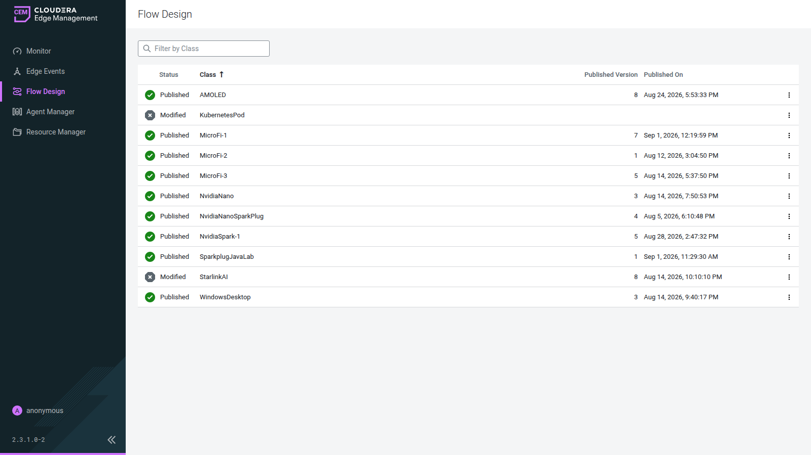
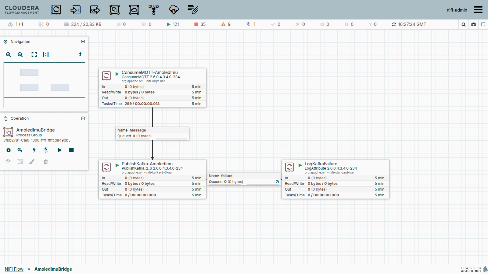
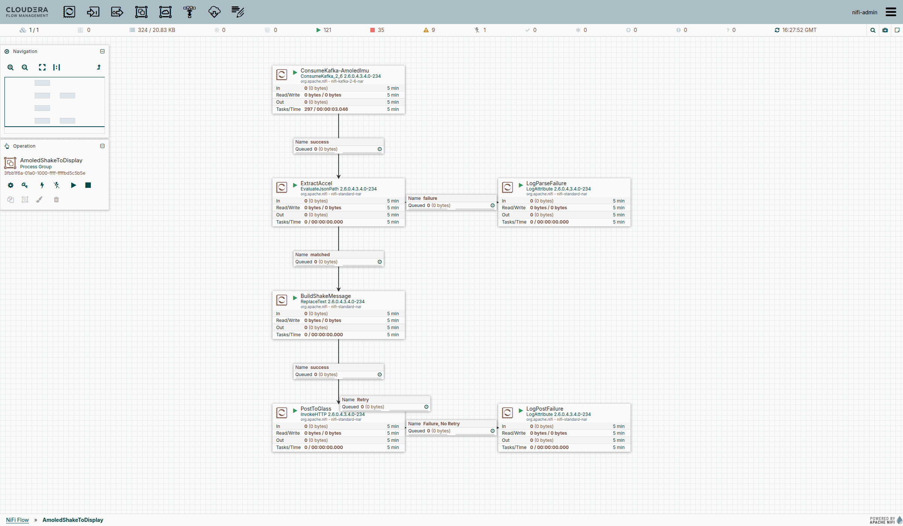

# Chapter 12: EFM and MicroFi

MicroFi is a clean-room implementation of the MiNiFi C2 contracts, written in C++ against ESP-IDF for the Seeed XIAO ESP32-S3: FlowFile semantics, C2 heartbeat and acknowledge, flow-definition apply. It is not a fork of `nifi-minifi-cpp` and it does not behave like one once you are inside it. This chapter is how a microcontroller becomes a first-class EFM agent class: identify the board, enroll it, verify its manifest, push a flow, build processors into its compile-time registry, and run a fleet of them. It ends with the fleet as it stands: three XIAO units running one flow type each, and a Waveshare AMOLED touchscreen whose display, touch, IMU, and microphone are EFM processors.

The Sparkplug B payload side and the JSON-telemetry-to-Kafka pipeline live in [Chapter 13](ch13-efm-and-sparkplug-mqtt.md) and [Chapter 20](ch20-sparkplug-demo.md). This chapter owns the agent side only: enrollment, manifest, flow push, and extending the firmware itself.

## Scope — Read This First

**This chapter is about MicroFi, the custom C2 agent.** It is not about MiNiFi C++, and the two should not be conflated:

| | MiNiFi C++ (the real agent) | MicroFi (this chapter) |
|---|---|---|
| Binary size / RAM | ~3.2 MB idling at ~5 MB RAM; Raspberry-Pi-class | ~1.1 MB firmware image, a 2 MB app slot |
| Processor loading | `dlopen` plugin loading at runtime | Compile-time static registry, resolved by name |
| Storage | Heap-centric, RocksDB repositories | LittleFS with watermark eviction |
| Python | Full CPython via `libminifi-python-script-extension.so` | None; processors are C++ compiled into the registry |
| Target | Linux/ARM64, Jetson-class, k8s pods | Seeed XIAO ESP32-S3 (and C3), microcontroller-class |
| Processors | Dozens, catalog in [Chapter 3](ch03-cpp-processor-catalog.md) | 9 in the XIAO registry, 11 on the AMOLED |

The rationale for building something new rather than porting MiNiFi C++ down is in the repo's own `docs/MICROFI_ASSESSMENT.md`: a heap-centric, RocksDB-backed, `dlopen`-loading design does not shrink to a microcontroller. MicroFi resolves processors by name against a static registry instead, and keeps the property names MiNiFi-C++-compatible (`File Size` / `Batch Size` / `Data Format` on `GenerateFlowFile`, `Log Level` / `Log Payload` / `Log prefix` / `Attributes to Log` on `LogAttribute`) so an EFM flow definition written against MiNiFi C++ resolves against MicroFi unchanged. Every processor in this chapter respects that compatibility bet.

The repo's `docs/Processor-Inventory-And-Roadmap.md` lists 48 proposed processors, including a WiFi-CSI sensing cluster that is the project's research thesis. None of that is built. Treat the roadmap as a plan, not an inventory.

## Hardware — Confirm the Silicon and the Physical Flash, Separately

The XIAO's USB descriptor (`303a:1001`, "USB JTAG/serial debug unit") is the same across the ESP32-S3, C3, and C6, so it tells you nothing. Two checks before the first build:

**1. Silicon family and PSRAM:**

```bash
python -m esptool --port COM5 chip-id
```

```
Chip type:          ESP32-S3 (QFN56) (revision v0.2)
Features:           Wi-Fi, BT 5 (LE), Dual Core + LP Core, 240MHz, Embedded PSRAM 8MB (AP_3v3)
MAC:                e0:72:a1:fb:fd:04
```

Embedded PSRAM means S3. A C6 is a hard stop; MicroFi has no environment for it.

**2. Physical flash size.** `chip-id` does not report it. The upload step does, as a warning you must not ignore:

```
Warning! Flash memory size mismatch detected. Expected 4MB, found 2MB!
```

> **⚠️ A partition table larger than the chip is not a clean failure.** SPI NOR flash aliases addresses past the physical boundary back to low addresses. A LittleFS partition declared past the end of the chip can put a flow-definition write (`/littlefs/.flowdef`) on top of the bootloader or the app image. Match the PlatformIO environment to the flash the board actually has before pushing any flow to it.

The fleet units are XIAO ESP32-S3 **Sense** boards (camera, microphone, and a push-type microSD slot on the back of the camera board) with 8 MB flash (GigaDevice GD25Q64, JEDEC-verified per unit) and 8 MB PSRAM. They build with an OTA-preserving 8 MB layout, `partitions_8mb.csv`: nvs, otadata, phy_init, two 2 MB app slots, and about 3.9 MB of LittleFS. The full registry compiles to roughly 52–59% of an app slot.

## EFM and Config

The array runs EFM `2.3.1.0-2`. MicroFi's config lives in `sdkconfig.defaults.local`, gitignored, copied from `.example`:

```
CONFIG_MICROFI_WIFI_SSID="..."
CONFIG_MICROFI_WIFI_PASSWORD="..."
CONFIG_MICROFI_C2_HEARTBEAT_URL="http://192.168.1.121:10090/efm/api/c2-protocol/heartbeat"
CONFIG_MICROFI_C2_ACK_URL="http://192.168.1.121:10090/efm/api/c2-protocol/acknowledge"
CONFIG_MICROFI_AGENT_CLASS="MicroFi-1"
```

Those are the same two URLs the real C++ and Java agents set as `nifi.c2.rest.url` / `nifi.c2.rest.url.ack`. `localhost` in the default heartbeat URL cannot work from a board; give it a routable address. The boards join the same WiFi AP as the host running EFM and talk to it LAN-direct on `192.168.1.121`.

**`CONFIG_MICROFI_AGENT_CLASS` must not name a class an existing live agent already uses.** EFM auto-creates the class on the first heartbeat, and a flow push aimed at a class lands on every agent in it. The shipped default is `"ESP32"`; the fleet uses one class per unit (`MicroFi-1`, `MicroFi-2`, `MicroFi-3`, `AMOLED`). Agent identifiers are MAC-derived, so they are unique by construction.

**One firmware image, per-device overlays.** A single build serves every unit. Only a per-device `sdkconfig.defaults.microfiN` overlay differs, setting the agent class. Overlays must live in the `sdkconfig.defaults.*` namespace: PlatformIO writes each environment's generated config to `sdkconfig.<env-name>` and will clobber, then ignore, an overlay named that way.

## Toolchain — Native Windows, Not WSL2

The board enumerates on the Windows side as a `COM` port. WSL2 has no native USB passthrough, so every build, flash, and monitor command is a native-Windows PlatformIO CLI command; WSL2 is for editing.

```powershell
pip install esptool platformio
pio run -e esp32s3-8mb -t upload -t monitor
```

Chain `upload` and `monitor` in one invocation. A separate `monitor` attached after the upload misses the boot sequence.

Two toolchain facts that cost a build each:

- PlatformIO's `espressif32` platform resolves to ESP-IDF 6.0.1, which no longer bundles `mqtt` in-tree. Add `espressif/mqtt: "*"` to `src/idf_component.yml` (the registry package is `espressif/mqtt`, not `espressif/esp-mqtt`).
- A plain `serial.Serial('COMx')` open asserts DTR and RTS and trips the auto-reset circuit, silently rebooting the unit you meant to watch. Construct the port unopened, clear both lines, then open.

## Enroll and Verify

The sequence below takes a freshly flashed unit to a persisted flow. Every step has a check.

**1. Boot and first heartbeat.** WiFi associates in a few seconds; the first heartbeat carries the full manifest inline (about 4 KB), later ones only its hash:

```
I (7575) microfi.c2: heartbeat #0 -> 200 (sent 5677 bytes, manifest=yes, recv 28 bytes)
```

**2. The class exists.** `GET /efm/api/agent-classes` lists the new class with a manifest id. If another agent shares the host (StarlinkAI's MiNiFi agent, in this array), confirm its class still shows its own manifest id.

**3. The manifest is exactly what is compiled in.** `GET /efm/api/agent-manifests/{id}` returns the registry's processors with full property descriptors, no more and no less. MicroFi advertises only what it can run.

**4. Pin the manifest to the class.** The Designer palette resolves a class through `agent-class-manifest-config`, not through the latest heartbeat. Without the pin it keeps offering the first manifest it ever saw for the class, and `GET /efm/api/agent-classes/{class}/manifest-diff` reports `newManifestAvailable: true` forever:

```bash
curl -X POST http://192.168.1.121:10090/efm/api/agent-class-manifest-config \
  -H 'Content-Type: application/json' \
  -d '{"agentClassName": "MicroFi-1", "agentManifestId": "<manifest-id>"}'
```

`POST` refuses to overwrite an existing mapping and `PUT` returns 500; on a re-pin, `DELETE` the mapping first, then `POST`. EFM content-hashes manifests and dedupes identical builds across classes, so units on the same image share one manifest id.

**5. Push a flow through the Designer API.** Build `GenerateFlowFile → LogAttribute` with the per-component calls:

```bash
GET  .../designer/client-identifier                         # the write clientId
POST .../designer/flows/{flowId}/process-groups/{pgId}/processors     # one per processor
POST .../designer/flows/{flowId}/process-groups/{pgId}/connections
GET  .../designer/flows/{flowId}/validate                   # want {"validationErrors":[]}
POST .../designer/flows/{flowId}/publish
```

The create envelope is `{"revision":{"version":0,"clientId":…},"componentConfiguration":{…},"requestId":…}`. `revision.version` is `0` on every create; it tracks the component, not the flow. A flat body, or one wrapped in `component`, fails with `"Component details must be specified."`, and that message does not say which of the two mistakes you made. Every MicroFi processor advertises a `success` relationship, sinks included, so auto-terminate `success` on `LogAttribute` or validation fails.

**6. The agent applied it and acknowledged.** `GET /efm/api/agents/{agentId}` shows `state: ONLINE`, `flowId` equal to the published flow, and each processor `running: true`. MicroFi acknowledges explicitly: after every configuration apply it POSTs to `/efm/api/c2-protocol/acknowledge` with `{"operationId": …, "operationState": {"state": "FULLY_APPLIED"}}` (or `NOT_APPLIED`), and EFM marks the operation DONE. EFM 2.3.1 times out an operation that is never acknowledged and marks it FAILED; a heartbeat whose `flowId` matches is not an acknowledgement. The ack body deliberately omits `agentInfo`, `deviceInfo`, and `flowInfo`; include any of them and EFM also processes the ack as a heartbeat.

**7. It survives a reboot.** The flow persists to LittleFS. Re-flashing identical firmware leaves that partition untouched and the upload's RTS hard-reset is a full reboot, which makes `pio run -t upload -t monitor` the reliable way to capture the boot line (a physical unplug drops the serial capture across the disconnect gap):

```
microfi.flowstore: flow def loaded: 2872 bytes from /littlefs/.flowdef
microfi.flowstore: flow_id loaded: e9aac4e6-4124-45a6-92d3-ce09505974d1
```

**Re-applying a flow.** Publishing a new version re-applies the graph in place. The engine calls an `on_stop` hook on the outgoing graph before every rebuild: `ListenHTTP` releases its httpd port, MQTT-owning processors stop and destroy their esp-mqtt clients. Back-to-back republishes need no power-cycle. (A hot swap on a build without that hook can strand a bound socket; Chapter 20's trap list covers it.)

> **⚠️ `GET /efm/api/agents/{id}` can freeze on a stale snapshot** across real heartbeats and a real reboot. When the REST view and the device disagree, the device's serial log, or EFM's Postgres directly, is the source.

## Processors — the Registry and Its Constraints

Two synthetic processors ship with MicroFi: `GenerateFlowFile` fabricates content and `LogAttribute` writes it to serial. That proves registration, acknowledgement, and persistence, and nothing about moving data. The registry the fleet runs today is nine processors, all C++, all compile-time:

| Processor | Kind | The one thing to know |
|---|---|---|
| `GenerateFlowFile` | source | MiNiFi-C++-compatible property names |
| `LogAttribute` | sink | first-light proof for every new source |
| `PublishMQTT` | sink | Broker URI / Client ID / Topic / QoS / Username / Password, no TLS; connects lazily on its first FlowFile |
| `UpdateAttribute` | mid | four literal slots (`Attribute N Name` / `Attribute N Value`), no dynamic properties |
| `GetGPIO` | source | read-only, BOOT/GPIO0 |
| `SetGPIO` | sink | `Pin Level = from-content` parses `1/0/on/off/high/low/toggle`; `Invert` for active-low LEDs |
| `ListenHTTP` | ingress | `Listening Port` / `Base Path`; fire-and-forget, no request/response pair |
| `CaptureImage` | source | OV2640 JPEG published broker-direct, metadata JSON as the FlowFile |
| `PublishSparkplug` | sink | real `NBIRTH`/`NDATA` via the vendored `EmbeddedSparkplugNode`/nanopb stack; Chapter 13 and 20's edge publisher |

Adding a processor means a rebuild and a reflash, every time. The constraints every one of them was built under, and every flow has to respect:

- **Compile-time registry, resolved by name.** No `dlopen`, no runtime plugin load. The manifest advertises exactly the compiled set.
- **Title-Case, MiNiFi-C++-compatible property names**, so a flow designed against the C++ catalog resolves unchanged.
- **FlowFile content is a 256-byte inline buffer.** Binary payloads never ride the chain. A media processor publishes bytes broker-direct on its own MQTT client and emits a metadata FlowFile; `CaptureImage` set the pattern and `CaptureAudio` follows it.
- **`kMaxFlowNodes = 4`.** A published flow with more than four processors silently drops the extras with only a `WARN` on serial. Count nodes before publishing; "publish succeeded" does not mean every processor was applied. An override to 8 for the AMOLED (whose queues ride PSRAM; XIAO DRAM is why the cap is 4), with the over-cap case made a hard error, is designed and not yet built.
- **One consumer per relationship.** `Session::transfer()` delivers to the first binding that matches a relationship name and returns, so a fan-out of two connections on `success` starves the second. Accepted as platform behavior and designed around: a fleet flow never binds two connections to one relationship.
- **No Expression Language.** There is no evaluator, so `RouteOnAttribute` stays out of the registry. Branching is a separate flow or a property on the source (the AMOLED's `Motion Threshold` below is that pattern), and `UpdateAttribute` writes literals only. EFM's flow validation rejects any property not in a processor's declared list, which is why `UpdateAttribute` declares four fixed slots instead of accepting dynamic properties.
- **Every MQTT-owning processor on one unit needs its own Client ID.** esp-mqtt's default id is MAC-derived; two clients on one board collide and the broker kicks the older session on every connect (`microfi2-cam` / `microfi2-meta` on the camera unit).
- **A sink gets no idle tick.** The engine calls a node with an incoming connection only when a FlowFile is queued for it. A processor that defers work to "the next tick" never runs; do the whole job inside one `on_trigger`.
- **Changed properties under an unchanged name don't refresh.** EFM keys manifest registration off the set of processor names a class has already seen. New descriptors for an existing name are ignored even on a new manifest hash; temporarily rename the processor, register, verify, rename back.
- **`ListenHTTP` bridges tasks through a queue.** The httpd server runs on its own FreeRTOS task and must not touch engine state; the URI handler pushes a fixed-size item onto a small FreeRTOS queue that `on_trigger` drains on the engine task, the same cross-task shape `FlowEngine::apply()` uses for C2.
- Builds carry `CONFIG_FREERTOS_CHECK_STACKOVERFLOW_CANARY` and `CONFIG_COMPILER_STACK_CHECK_MODE_STRONG`; keep them on when linking a new ESP-IDF component such as `driver`.

**Real data movement, checked from outside the device.** A `GenerateFlowFile → PublishMQTT` flow proves the egress path when an independent subscriber (a laptop `mosquitto_sub`, a Node `mqtt` client, anything that is not the firmware's own log) receives the messages. `ListenHTTP` proves ingress the same way:

```bash
curl -X POST http://192.168.1.198:8095/test -d "hello from windowsdesktop"
# 200, and LogAttribute on the board prints  payload: hello from windowsdesktop
```

## Can the XIAO Run Custom Python Processors? No

Three layers, evaluated against the real MiNiFi C++ Python machinery:

1. **The MiNiFi C++ Python extension can't run on an ESP32.** It embeds a full CPython interpreter: dynamic `libpython` linking, a system Python install, `.so` extension loading. None of that exists on ESP-IDF, and CPython plus its stdlib is many megabytes.
2. **MicroFi's architecture rules out the delivery model, not just the size.** The point of a NiFi or MiNiFi Python processor is *ship a script in the flow definition, no rebuild*. MicroFi is the opposite by design. Even if CPython fit, the property you would reach for isn't there.
3. **What is possible:** custom processors in C++ against the static registry, which is this whole chapter, and in principle an `ExecuteMicroPython` processor embedding a MicroPython VM. That would restore push-logic-without-reflash at the cost of a reduced stdlib and a property contract that breaks the MiNiFi-C++ compatibility bet. Scoped as an idea, not built.

Same shape as the `RouteOnAttribute` deferral: the tiny runtime has no embedded interpreter, and every "just run a script" feature hits that wall until one is deliberately embedded.

## The Fleet — One Flow Type per Unit

Three physical XIAO ESP32-S3 Sense units, each its own EFM agent class. With a compile-time registry and a four-node ceiling, each device is realistically its own small track rather than one flow reused three ways:

| Unit | Class | Track | Live flow | Export |
|---|---|---|---|---|
| #1 | `MicroFi-1` | JSON telemetry emit | `GenerateFlowFile({"device_id":"MicroFi-1"}) → PublishMQTT(test/sensor/data)`, plus an unconnected `ListenHTTP :8095` | [`files/microfi/microfi-1-telemetry.json`](files/microfi/microfi-1-telemetry.json) |
| #2 | `MicroFi-2` | Camera | `CaptureImage(VGA JPEG, broker-direct microfi2/camera/jpg) → PublishMQTT(microfi2/camera/meta)` | [`files/microfi/microfi-2-camera.json`](files/microfi/microfi-2-camera.json) |
| #3 | `MicroFi-3` | Sparkplug B emit | `GenerateFlowFile-SpbTick → PublishSparkplug` (`NBIRTH`/`NDATA` on `spBv1.0/MicroFi/…/MicroFi-3`) | [`files/microfi/microfi-3-sparkplug.json`](files/microfi/microfi-3-sparkplug.json) |



A fourth shape, the LED actuation flow `ListenHTTP(/led :8095) → SetGPIO(pin 21)`, is kept at [`files/microfi/microfi-3-led-flow-backup.json`](files/microfi/microfi-3-led-flow-backup.json) and gets published to whichever unit is playing the actuation target; Chapter 20 runs it on MicroFi-1 and Chapter 18's Entry 12 is its card. The NiFi-side bridge for the camera unit is [`files/microfi/MicroFi2CameraBridge.json`](files/microfi/MicroFi2CameraBridge.json) (camera topics → Kafka `microfi2.camera.*`); the AMOLED's two bridges are below.

**Fleet-class EFM mechanics, for every MicroFi class:**

- **No deployer command.** Class and identity are compile-time; EFM auto-creates the class on the first heartbeat. The `generateCommand` rule is for real MiNiFi C++ and Java installs, not MicroFi.
- **Every new or changed manifest needs the palette pin** (step 4 above), and a Designer node created *before* the pin lands stays "not an available Processor type" even after the palette lists it. Delete and recreate it after the pin.
- **Re-publishing is safe** on current firmware thanks to the teardown hook; no reset after publish.

## The AMOLED — a MicroFi Host With Senses

The fourth MicroFi host breaks the mold: a Waveshare ESP32-S3 AMOLED 1.8" V2 touchscreen running the Brookesia launcher, with a display, capacitive touch, an IMU, a power-management IC, and an ES8311 mic/speaker codec. The MicroFi agent runs inside that firmware as a guest, and the board's senses are EFM processors: a flow can read the panel's motion and touch, put text on its screen, play a clip through its speaker, and record its microphone. This is the capstone demo of what the MicroFi architecture is for.

**The framework fact that makes it tractable:** Brookesia doesn't hand-roll drivers. Every peripheral is declared in the board port and realized by `esp_board_manager`, which exposes public by-name accessors (`esp_board_periph_get_handle("i2c_master", …)`, `esp_board_device_get_handle(…)`). "Adopt existing" is the framework's normal access path: the agent shares the I2C bus the way the board's own drivers do, and subscribes to Brookesia services (display gestures, audio) rather than re-owning hardware. Each sense `.cpp` is wrapped whole in a `MICROFI_BOARD_*` compile define, so the XIAO builds compile them to empty translation units and `pio run -e esp32s3-8mb` stays the regression gate.

### The five senses (manifest: 11 processors, the XIAO set plus these)

- **`GetIMU`** (QMI8658, source). Nothing in Brookesia touches the IMU, so the processor owns it outright over the shared bus. A polled source shaped like `GetGPIO`: `Read Interval`, `Output Format` (JSON or attributes), full-scale ranges, and `Motion Threshold (g)`. Shake-as-trigger is a property on the source, not a router, because there is no Expression Language. The driver's "g" mode is really milli-g (scaled in-processor), the gyro range set is 32–4096 dps, and `ts` is microseconds since boot; the RTC is an un-adopted sense.
- **`GetTouch`** (CST820, source). Does not read the touch controller. It subscribes to the Display service's gesture signal, which the shell already runs, and emits one FlowFile per completed gesture: `tap`, `hold`, `swipe_up|down|left|right`, with coordinates, duration, distance, and speed. The first Brookesia service dependency in the agent.
- **`PlayAudio`** (ES8311, sink). Plays a URL (`http(s)://` or `file://littlefs/…`), never audio bytes: a FlowFile carries 256 bytes, so the board pulls the clip through the `AudioPlayback` service, whose mixer arbitrates with the live wake-word pipeline. The V2 amplifier path is quiet; `Volume: 100` on the node is what makes it audible.
- **`CaptureAudio`** (ES8311 mic, source). Taps Brookesia `AudioEncoder0`'s raw recorder-data signal (16 kHz stereo; channel 0 is the mic), records N-second clips into heap PSRAM (never the agent's static mapping, which is excluded from ISR/DMA use), publishes a complete WAV broker-direct on its own MQTT client, and emits the capture event as a JSON FlowFile: the `CaptureImage` pattern exactly. Clips transcribe through the cluster's Whisper service. Whisper hallucinates on silent clips, so put an RMS gate before any transcription step. `AudioEncoder0` is initialized but not started at boot; `CaptureAudio` holds its own service binding and starts the encoder if idle, leaving it alone if another session runs it.
- **`DisplayMessage`** (CO5300 display, sink). Brookesia has no public notification API, so the processor writes a spinlock-guarded single-slot mailbox that the native agent status tile renders. `INPUT_REQUIRED`, one property (`Message`; blank means the FlowFile content is the text).

`GetPower` (AXP2101) stays unbuilt: the board is USB-tethered with no battery, so power telemetry would be rails and temperature.

### The round trip — shake the panel, the glass answers

The capstone flow closes a full loop with no Sparkplug framing:

```
AMOLED GetIMU (Motion Threshold 0.3 g; silent at rest)
  → PublishMQTT (microfi/amoled/imu)
    → NiFi AmoledImuBridge PG:   ConsumeMQTT → PublishKafka (amoled.imu)
      → NiFi AmoledShakeToDisplay PG:  ConsumeKafka → EvaluateJsonPath → ReplaceText
        → InvokeHTTP POST http://<board>:8095/message
          → AMOLED ListenHTTP → DisplayMessage (mailbox → status tile)
```





A resting panel produces zero messages (|accel| ≈ 1.014 g). A bump crosses the threshold, one to three samples land on `amoled.imu` per shake at the 1 s sample clock, each comes back to the board as an `InvokeHTTP` 200, and the board's serial shows `DisplayMessage` writing the mailbox. Exports: [`files/microfi/AmoledImuBridge.json`](files/microfi/AmoledImuBridge.json), [`files/microfi/AmoledShakeToDisplay.json`](files/microfi/AmoledShakeToDisplay.json), class flow [`files/microfi/amoled-class-flow-imu-shake-displaymessage.json`](files/microfi/amoled-class-flow-imu-shake-displaymessage.json).

**`kMaxFlowNodes = 4` shapes this board most of all.** Four senses cannot share one class flow, so the published flow rotates between four-node shapes: the IMU/DisplayMessage pair above, touch and playback (`GetTouch → PublishMQTT` plus `ListenHTTP /play → PlayAudio`), and the record shape (`GetTouch → CaptureAudio ← ListenHTTP /record`, `CaptureAudio → PublishMQTT` for the capture events). All shapes are exported under [`files/microfi/`](files/microfi/), and [`files/microfi/amoled-class-flow.py`](files/microfi/amoled-class-flow.py) rebuilds any of them through the EFM Designer API (`clear` / `build <spec>` / `publish`), a worked example of driving the Designer programmatically for any MicroFi class.

### Still open

1. **`kMaxFlowNodes = 4`.** The override-to-8 for the AMOLED (XIAOs keep 4) is designed, not built; the silent drop should become an error at the same time.
2. **`DisplayMessage` has no visible surface today.** The native status tile that renders the mailbox has been hidden since the launcher cleanup, so a flow-sent string reaches the board but not a screen you can open. Two routes: flip the tile visible, or route the text through the board's app backend into the runtime agent app.
3. **LAN-HTTP audio clips stop at the Windows host firewall.** `file://littlefs/sounds/…` is the working playback path; an `http://` clip served off the array needs its own per-port firewall rule, and `:8095` risks a collision with a separately proposed app-store server.

## What NOT to Do

- **Don't push to `Christopheraburns/MicroFi`.** The fork token allows it; the work doesn't. Every dev branch lives on `steven-matison/MicroFi`.
- **Don't register MicroFi under an agent class an existing live agent already uses.** A shared class means a flow push aimed at one device reaches both. One class per unit, and check the neighbor's manifest id after the first heartbeat.
- **Don't try to flash from WSL2.** No native USB passthrough; run PlatformIO natively on Windows. `usbipd-win` is a workaround, not the path.
- **Don't flash a PlatformIO environment onto a XIAO without confirming the physical flash size.** `chip-id` gives the silicon family; the upload-step warning gives the flash. They are separate facts and a shipped partition table can exceed the chip.
- **Don't commit `sdkconfig.defaults.local`.** It holds the WiFi passphrase. Gitignored upstream; keep it that way in any clone.
- **Don't treat the 48-processor roadmap as available.** Nine processors on the XIAO builds, eleven on the AMOLED; everything else is a plan.
- **Don't fan a single relationship out to two connections.** The first binding wins and the second starves.
- **Don't push a flow with more than four processors without counting.** The extras drop silently.
- **Don't build a sink that defers work to "the next tick."** Sinks get no idle tick.
- **Don't give two MQTT-owning processors on one board the same or default Client ID.** The broker kicks the older session on every connect.
- **Don't open a serial port with default DTR/RTS to "just watch" a unit.** It reboots the unit.
- **Don't create a Designer node for a brand-new processor before the class-manifest re-pin has landed.** Delete and recreate after the pin.
- **Don't expect a manifest hash bump alone to refresh a changed processor's properties.** Pin the class to the new manifest, and if the properties changed under an unchanged name, use the temporary-rename workaround.
- **Don't trust `GET /efm/api/agents/{id}` as proof a flow push landed.** It freezes on stale snapshots. Serial output or Postgres is the source.
- **Don't include `agentInfo`, `deviceInfo`, or `flowInfo` in the acknowledge body.** EFM processes an ack carrying them as a heartbeat too.

## Related Chapters

- [Chapter 3 — C++ Processor Catalog](ch03-cpp-processor-catalog.md): the real MiNiFi C++ processor set MicroFi's property naming mirrors.
- [Chapter 6 — MiNiFi Custom Python Processors](ch06-minifi-custom-python-processors.md): the `dlopen`/CPython delivery model that MicroFi's compile-time registry replaces, and the same manifest-pin trap on a real agent.
- [Chapter 13 — EFM and SparkPlug MQTT](ch13-efm-and-sparkplug-mqtt.md): the Sparkplug B payload and MQTT-topology side of the same hardware.
- [Chapter 18 — Sample Gallery](ch18-sample-gallery.md): Entries 10 and 12 are this fleet's two-leg ingest and LED actuation flows as runnable cards.
- [Chapter 19 — EFM and NVIDIA Jetson](ch19-efm-and-nvidia-jetson.md): a second real-hardware agent-class chapter, the same enrollment/manifest/flow-push pattern on a very different device.
- [Chapter 20 — SparkPlug Demo](ch20-sparkplug-demo.md): the assembled demo this fleet feeds, XIAO → Mosquitto → NiFi → Kafka, plus the LED round trip.
