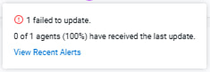

# Chapter 14: The NiFi and AI Skill — EFM Portion

Every flow in this Part — NiFi + Python (Ch15), MiNiFi AI at the edge (Ch16), the StarlinkAI
router (Ch17) — was built the same way: not by hand-dragging processors around a canvas, but by
driving NiFi, MiNiFi, and EFM programmatically, with an AI agent holding a written playbook of what
breaks and how. That playbook is a Claude Code skill called [`nifi-and-ai`](https://github.com/cldr-steven-matison/NiFiandAi), published as its own repo you can clone into `~/.claude/skills/nifi-and-ai/`. This chapter exposes it
in full, then goes deep on the part that matters most for this guide: the **EFM portion** — the
machinery of managing agents from a central manager, which is exactly the undocumented territory the
rest of the guide lives in.

> **Why a chapter about a tool, in a guide about EFM?** Because the tool *is* how the EFM work got
> done, and everything it knows about EFM was learned the expensive way — one silent-drop,
> corrupted-credential, empty-install-dir bug at a time. Reading the skill is reading the
> post-mortems without paying for them. The rest of Part VI then puts it to work.

Everything here is field-verified against a live EFM `2.3.1.0-2`, MiNiFi C++ `1.26.02`, and MiNiFi
Java `2.24.08.0-19`.

---

## What the Skill Actually Is

`nifi-and-ai` is a Claude Code skill — a `SKILL.md` and eight reference files that install into
`~/.claude/skills/` and load on demand when a session touches NiFi, MiNiFi, or EFM. It is not
documentation *about* NiFi; the Apache docs already exist. It is the distilled residue of building
this array: each rule is one bug that cost real time, written down so the next session doesn't pay
for it again.

The skill is organized as a small always-loaded core plus reference files loaded only when the task
calls for one:

| File | What it covers |
|---|---|
| `SKILL.md` | The 10 rules, the three deployment shapes, and the map to everything else. Always loaded. |
| `references/flow-api.md` | Deploying and editing flows via the **NiFi** REST API — auth, uploading a Process Group JSON, re-exporting to keep a checked-in copy current, safe live edits. |
| `references/minifi-efm.md` | **The edge side.** Staging agent binaries, EFM persistence, the deployer curl, Windows+Python, the undocumented EFM Designer API, and recovering an agent whose heartbeat has gone dark. This is the EFM portion. |
| `references/custom-processors.md` | Writing custom Python/Java processors, the mixed-template EL trap, and rebuild→redeploy discipline. |
| `references/patterns.md` | Flow patterns that ship: NiFi-as-HTTP-API, the MiNiFi fire-and-forget router, ingest→Kafka→transform→sink (RAG), and the GUI-less edge→host bridge. |
| `references/debugging.md` | Cross-cutting wire-up gotchas and a 10-step debugging checklist. |
| `references/layout.md` | Canvas layout: the coordinate model, spacing constants, direction & sprawl rules (route/add down never up, new work right of existing canvas, one test funnel, per-branch terminal logs), per-shape placement rules, a worked example — and the running list of what a programmatic build still needs a human pass on. |
| `references/flow-registry.md` | Add/update a Process Group **without ever reading the root `flow.json`** — the committed export is the registry: PG upload/upsert via the API, Parameter Context pre-create from k8s Secrets, a complete k8s Job template, and the secret-manager options. |
| `references/site-to-site.md` | Site-to-Site and secure-cluster rollout on the CFM operator: `userCertAuth` at CR creation, identity = cert SAN, the one-CA issuer chain, peers as `User` CRs, transport keys, and the symptom→cause→fix traps table. |

### The 10 Rules

The core of the skill is ten rules you read before touching any live flow. They aren't NiFi
trivia — they're the ones that, ignored, cost an afternoon each:

1. **Live UI / `flow.json` is truth. Docs and memory lag.** Dump the running flow before editing;
   never edit from a remembered description.
2. **Never GET-then-PUT a processor with sensitive properties.** NiFi returns `"********"` on GET;
   PUT it back and you write that literal over the real credential. Bind secrets to a Parameter
   Context, or use a narrow-scope endpoint like `/run-status`.
3. **Don't hand-patch a live Process Group while it's actively posting/queueing.** Route the change
   through the API, or rebuild → redeploy.
4. **Keep changes scoped.** Make the change asked for, not the adjacent "obvious improvement."
5. **Every flow change gets exported + committed.** A running canvas that isn't in version control
   is one restart from gone.
6. **`ListenHTTP` on MiNiFi C++ is fire-and-forget; MiNiFi Java is not.** C++ has no
   `HandleHttpRequest`/`HandleHttpResponse` pair — the caller gets an empty `200` ack and the real
   reply must exit over Kafka keyed on a `request_id`. Java ships both processors and
   `StandardHttpContextMap`. This single fact decides C++ vs Java for any HTTP-fronted inference
   proxy (Ch16, Ch17).
7. **`Retry` is not `Failure`.** Auto-terminating `InvokeHTTP`'s `Retry` silently drops every
   transient 5xx/429. Self-loop `Retry` with a bounded `FlowFile Expiration`.
8. **Build new logic in its own new, finite Process Group — never inline inside a live one.**
9. **Decompose into a FlowFile chain of small native processors — don't put timers, state, and
   branching inside one custom Python processor.** A leaked internal-timer thread once kept
   re-logging stale state after a restart; a stock-processor chain can't, because NiFi owns all
   scheduling.
10. **Never read `flow.json.gz` to add a component.** The committed JSON export in git is the
   source of truth — POST it to the parent PG's `upload` endpoint and only the new PG is touched;
   the rest of the canvas is never read or modified. The full registry pattern lives in
   `references/flow-registry.md`.

Rules 1, 2, 5, and 6 are the ones that bite hardest at the edge, and they carry through the whole
of Part VI.

### The Three Deployment Shapes

The skill frames every flow by where it runs, because auth and lifecycle differ by shape:

| Shape | Where it lives | Auth | When |
|---|---|---|---|
| **Operator-managed on Kubernetes** | A `Nifi` CR → StatefulSet pod | Operator-issued mTLS user cert, or Single-User Auth via a k8s secret | In-cluster flows |
| **Host-native NiFi** | A tarball install, `bin/nifi.sh start` | Single-user login | A single VM / public host |
| **MiNiFi C++/Java agent (EFM-deployed)** | Windows service, Linux `minifi.service`, or a K8s pod | Unauthenticated agent→EFM heartbeat by default | Edge / desktop flows driven from EFM |

The canonical AI array runs all three at once: **EFM + MiNiFi agents on the edge + Kafka in the
middle + NiFi doing the heavier lift.**

---

## EFM-Directed vs Direct-on-Agent: The Two Ways to Drive an Edge Flow

The single most useful distinction the skill draws is *how* a change reaches a running agent. There
are two paths, and confusing them is how work gets silently lost.

**EFM-directed** — you change the flow in EFM (Designer API or UI), validate, and `publish`. EFM
pushes the new flow to the agent on its next heartbeat. This is authoritative: a `publish`
overwrites even a hand-edited agent-local `config.yml` on the next heartbeat. Resources (scripts,
JARs) travel the same way — uploaded to EFM's Resource Manager, assigned to the agent class, synced
to the agent over the C2 asset-sync command. This is the production path, it's restart-durable
(given the right PVCs), and it's tracked.

**Direct-on-agent** — you bypass EFM entirely: `kubectl cp` a script onto the pod, edit `config.yml`
by hand, or `kill` and relaunch the `minifi` process inside the container. This is fast for
iterating — a running C++ agent's `ExecuteScript` re-reads its script from disk on every trigger, so
a raw `kubectl cp` takes effect on the next call with no republish — but it's invisible to EFM,
won't survive a pod restart, and gets **overwritten the instant anyone does an EFM-directed
publish**.

> **The trap:** a hand-edited local config is never authoritative once you use the real API. If you
> iterate direct-on-agent and someone (or a later session) publishes from EFM, your changes are gone
> with no error. Use direct-on-agent for a tight edit loop; promote to EFM-directed the moment the
> change is worth keeping.

The rest of this chapter is the EFM-directed machinery, because that's the part with no OpenAPI
spec, no Swagger UI, and nothing else written down.

---

## Staging Agent Binaries into EFM

EFM deploys agents from a binaries tree with a **strict** validator: it rejects hyphens in `osArch`
and more than one archive per leaf directory. Layout for the common four:

```text
binaries/cpp/linux/<ver>/minifi.tar.gz            # x86_64 Linux
binaries/cpp/linuxaarch64/<ver>/minifi.tar.gz     # ARM64 Linux
binaries/cpp/windows/<ver>/minifi.msi             # Windows
binaries/java/linux/<ver>/minifi.tar.gz           # Java MiNiFi
```

Inject any Linux `.so` extra-extensions and extra-python-components **inside** the tarball's
`extensions/` dir before re-tarring, then tar-pipe into the EFM pod:

```bash
EFM_POD=$(kubectl get pod -n $NS -l app=efm -o jsonpath='{.items[0].metadata.name}')
tar -cf - binaries/ | kubectl exec -i $EFM_POD -n $NS -- tar -xf - -C /opt/efm/<efm-dir>/agent-deployer/
kubectl rollout restart deployment/efm -n $NS
```

The full staging tree — including the Windows MSI Python black hole and the missing Java
scripting NAR — is Chapter 2 (EFM Binaries). If your `Deploy Agent` button returns `400`, that's the
chapter, not this one.

## EFM Persistence — Three Layers, or a Restart Wipes State

1. **Postgres** — metadata: `agent_class`, `flow`, `flow_content`, `agent`, `agent_manifest`,
   `asset`, `resource_metadata`.
2. **A binaries PVC** → the agent archives from above.
3. **A resources PVC** → uploaded Resources (Python scripts, JARs). The DB tracks the metadata; the
   file *bytes* live here.

Skip layer 3 and every uploaded script vanishes on pod restart even though the DB rows survive — a
confusing failure where the resource "exists" but has no content.

## The Agent Pod Boot Race

A MiNiFi agent pod downloads the deployer script from EFM at startup. EFM's Jetty takes ~2 minutes
to bind its port on a cold start. A one-shot `curl` races that and exits silently — the pod stays
`Running 1/1`, but the MiNiFi install dir is empty, with a single `curl: (7) Failed to connect` at
the top of the pod log and nothing after.

**Fix:** health-poll `/efm/actuator/health` (e.g. 120 × 5s = a 10-minute ceiling) *before* running
the deployer. Diagnose with `kubectl exec <agent-pod> -- ls /nifi-minifi-cpp-<ver>/` — empty means
the deployer never ran.

## The Deployer Command — Get It From EFM, Never Hand-Build It

**The only sanctioned way to obtain a deployer command is EFM's own Deploy Agent CLI screen, or its
backing API, `POST /efm/api/agent-deployer/generateCommand`.** Both return a full, ready-to-run
command carrying a **server-minted `agentIdentifier`**. Do not hand-construct the `curl` /
`Invoke-WebRequest`, and do not copy a previous deployment's command and tweak the fields for a new
enrollment — that is exactly how a stale identifier gets reused and two pods collide on one EFM
identity.

```bash
curl -s -X POST http://<efm-host>:10090/efm/api/agent-deployer/generateCommand \
 -H 'Content-Type: application/json' \
 -d '{
   "agentClass": "MyClass",
   "agentType": "cpp",
   "agentVersion": "<ver>",
   "osArch": "linuxaarch64",
   "baseUrl": "http://127.0.0.1:<port>/efm/api",
   "hbPeriod": 5000,
   "serviceUser": "minifi",
   "serviceName": "minifi",
   "autoConfigureSecurity": false,
   "trustSelfSignedCertificates": false
 }'
```

Omit `agentIdentifier` from that body — the server generates a fresh, collision-free one. The
returned command has the same shape as any deployer curl (`agentClass`, `agentType`, `osArch`, and so
on, piped into `bash -` on Linux or `Invoke-Expression` on Windows), but its `agentIdentifier` field
is server-supplied, not something to pick or copy.

> **A real incident made this rule load-bearing.** Consolidating two classes of the same physical
> agent into one, a session re-enrolled the Java agent with a **hand-built** deployer command that
> **reused the retired class's `agentIdentifier`**. The EFM C2 `UPDATE` pushing the flow to the
> re-enrolled agent failed repeatedly, and the class's dashboard status turned red — two identities
> claiming one agent record. Re-enrolling through `generateCommand` with its own fresh identifier
> fixed it outright. **The one place reusing an identifier is correct is restoring the exact same
> bare pod that was never de-registered** (see the dark-agent recovery below) — a *new* enrollment or
> a class migration is never that case; always mint a fresh identifier.

On **Windows** run the *generated* command via `Invoke-WebRequest ... | Invoke-Expression` from
PowerShell **as Administrator**, and `cd` to a clean dir first — the deployer installs to `$PWD`, and
running it from `C:\WINDOWS\system32` is a permission nightmare.

---

## The EFM Designer API — No OpenAPI, Recover It from the UI Bundle

EFM exposes **no** OpenAPI/Swagger doc for its flow-editing REST API — `/efm/api-docs`,
`/v3/api-docs`, and `/efm/swagger-ui` all `404`. Guessing at body shapes produces generic `500`s or,
worse, silent no-ops: Jackson deserializes an unrecognized shape into a default/empty DTO without
erroring, so a `200 OK` does **not** mean the call did anything.

The way in is EFM's own Angular UI. It ships an OpenAPI-generated TypeScript client, so the compiled
JS has every operation name, URL, and body shape verbatim — even minified:

```bash
curl -s http://<efm-host>:10090/efm/ui/ | grep -oE 'src="[^"]*main[^"]*\.js"'   # find the hashed bundle
curl -s http://<efm-host>:10090/efm/ui/main.<hash>.js -o /tmp/efm_main.js
grep -oE '"[A-Za-z]+Service\.[a-zA-Z]+"' /tmp/efm_main.js | sort -u            # every real operation
```

The confirmed working contract, recovered this way and proven against the live array:

- `GET /efm/api/designer/client-identifier` → `{"clientId": "<uuid>"}` — required in every write's
  `revision.clientId`.
- `GET /efm/api/designer/flows/summaries` → one entry per agent class with `identifier` /
  `rootProcessGroupIdentifier`; `GET .../flows/{id}` for the full live flow doc. **Read this before
  editing — it is ground truth over any doc or memory (rule 1).**
- `POST .../process-groups/{pgId}/processors` — create one processor. Properties and
  `autoTerminatedRelationships` can be set in this one call; the server assigns the real
  `identifier`.
- `POST .../connections` — wire one connection, referencing the server-assigned processor ids.
- `PUT .../processors/{id}` — update one processor; `revision.version` must match current.
- `GET .../flows/{id}/validate` → must return `{"validationErrors":[]}` before publishing.
- `POST .../flows/{id}/publish` — **the real push-to-agent step.** This is what overwrites a
  hand-edited local `config.yml` on the next heartbeat.
- `DELETE /efm/api/agents/{id}` — removes a stale/`MISSING` agent record EFM never garbage-collects.

> **There is no whole-flow-document `PUT`. Don't guess one.** `PUT /efm/api/designer/flows/{flowId}`
> with the full modified `flowContent` fails at the routing layer
> (`HttpRequestMethodNotSupportedException: Request method 'PUT' is not supported` — a `500` before
> any business logic, nothing written). The only write path is one `POST` per processor and one
> `POST` per connection, each returning the identifier you use to wire the next. There is no
> batch/bulk create. This is the same contract Ch16 and Ch17 build against.

**The Designer validates against the agent class → manifest mapping, not against whatever agent is
online.** Put a Java agent on a class whose flow was authored for C++ and the processors are rejected
because the FQCNs differ (`org.apache.nifi.minifi.processors.ListenHTTP` vs the Java equivalent).
Keep mixed runtimes as parallel classes — `WindowsDesktopCpp` separate from `WindowsDesktop`,
`KubernetesPodJava` separate from `KubernetesPod` — so a Java agent never lands on a C++ canvas.

### Layout at the Designer Pitch

Building via the API means you also place every processor by `position:{x,y}` — there is no
auto-layout. On an EFM Designer build the row pitch is **300** (not the NiFi canvas's 200), branch/
column pitch is **~600–900** (not ~300–480), and a linear chain runs **vertical** (constant `x`,
`y += 300`). A `(0,0)→(400,0)` sideways pair is the flagged-bad shape that reads cramped. Decide your
intended shape and pitch *before* the first `POST .../processors`, not after the build reads cramped.

---

## The Resource Manager API — Getting Scripts and Assets onto an Agent

The tracked, restart-durable way to put a script or asset on an agent (vs `kubectl cp`-ing it
directly):

- `POST /efm/api/resource-manager/resources/file` — multipart; query params `name` /
  `resourceType` (`ASSET`|`EXTENSION`) / `relativePathOnAgent` / `notes`, field `file`. Returns a
  SHA-512 `digest` — diff it against local `sha512sum` to confirm no drift.
- `PUT /efm/api/agent-class-resource-manager/{agentClass}/save` — body **must** be exactly
  `{"resourceIdsToBeAssigned":[...],"resourceIdsToBeUnassigned":[...]}`. A bare array or
  `{"resourceIds":[...]}` is silently swallowed (`200 OK`, nothing assigned).
- **No in-place asset update exists** (API or UI). Changing an assigned script's content is:
  unassign → delete the old resource → upload as new → reassign. A same-named re-upload does not
  overwrite the old bytes.

This is the EFM-directed half of the two-paths distinction above. The direct-on-agent shortcut —
`kubectl cp` onto the `ExecuteScript` path, which re-reads on every trigger — is faster for
iteration but bypasses all of this tracking and dies with the pod.

---

## Status Is in Postgres, Not the REST Heuristics

EFM's `operation` table has no automatic retention. A crash-looping agent can flood it — thousands of
rows in hours — which hangs `/efm/api/operations` entirely and breaks anything reconstructing "which
agents are online" from it, **including EFM's own UI.** For reliable online/offline status, query
Postgres directly: `agent`(`agent_class`, `agent_state`, `last_seen`) joined to `device`
(`ip_address`, `hostname`) is the durable source of truth.

And **an agent-class name is not guaranteed to map to one physical machine.** A single class can have
multiple separately-registered deployments — e.g. one GPU host and one CPU host running a stub with
the same output schema. Don't call a hardware/script mismatch in an exported flow a bug without
checking which agent identifier — which physical machine — you're actually looking at.

---

## When a `KubernetesPod`-class Agent Goes Silently Dark

A real incident, and the sharpest EFM-portion lesson: a pod's MiNiFi agent (`KubernetesPod` class)
had **not heartbeated to EFM in 6 days** — `last_seen` in Postgres was stale — but the pod showed
`Running 1/1`, 0 restarts, and its already-deployed flow kept working the whole time. That's the key
fact: **MiNiFi C++ doesn't need EFM once a flow is deployed.** Only *new* pushes need a live
heartbeat channel. So a `200` from the resource-manager or flow-publish API only means EFM accepted
the write — not that any agent received it. Check `agent.last_seen` before assuming a push will land.

**Recovering a bare pod isn't a one-line restart.** If the pod has no `Deployment`/`StatefulSet`/
`ReplicaSet` owner (`kubectl get pod ... -o jsonpath='{.metadata.ownerReferences}'` returns empty),
`kubectl delete` does *not* get it rescheduled. Before deleting, save the exact original manifest
from the `kubectl.kubernetes.io/last-applied-configuration` annotation — that's the full
`kubectl apply`-able JSON, deployer-curl args (including the agent's `agentIdentifier`) and all, so
`apply` brings it back as the *same* EFM agent record rather than a new one.

And a fresh boot doesn't guarantee the flow's resources land on disk in time. Even with a correct
`config.yml`, the assigned asset *files* can still be missing (`/nifi-minifi-cpp-<ver>/asset/` empty,
`.state` shows `{"digest":"","assets":{}}`) — every `ExecuteScript` referencing them fails to start,
retries a **fixed 3 times, 30s apart, then gives up** (not an infinite loop). Fix: `kubectl cp` the
asset file(s) onto the pod, then restart just the `minifi` process inside the container (find its
PID, `kill` it, relaunch `./bin/minifi &`) — much cheaper than another full pod delete, and it
re-reads the already-correct `config.yml` cleanly now that the files exist.

Finally, **a bare pod's IP changes on every restart** (no stable `Service` in front of it). Any NiFi
processor with that IP hardcoded in an `HTTP URL` breaks silently until updated — grep for the old IP
across the flow, or budget for a real `Service` if the pod will restart more than once.

---

## Orphaned Resources, and Why the "Updated Agents" Badge Lies

A second, distinct incident produced the exact same visible symptom as the deployer-command mistake
above — a class showing red on the dashboard — from a completely unrelated cause. Worth separating
the two clearly, because the fix for one does nothing for the other.

An agent class had migrated from a C++ agent to a Java one, but a handful of Python `ExecuteScript`
assets from the old C++ agent stayed **assigned** to the class in the Resource Manager. Java
`ExecuteScript` cannot run Python at all, so those assets were dead weight the moment the migration
happened — and every heartbeat cycle, the live agent's `SYNC RESOURCE` operation failed with an HTTP
500 fetching resource content that, functionally, nothing needed anymore.

**Unassigning the stale resources through the documented Resource Manager API was necessary but not
sufficient.** Every read endpoint confirmed the unassignment landed correctly — the resource no
longer showed as assigned to the class, and its own reverse lookup showed no class association at
all. But the very next `SYNC RESOURCE` operation dispatched to the agent still carried the
byte-identical resource list and hash digest as every failure before the fix. EFM was caching the
per-class resource digest it uses to build that operation somewhere the assign/unassign API call
doesn't reach — the read path was honest, the operation-generation path wasn't.

**The actual fix was restarting the EFM pod itself** (`kubectl rollout restart deployment/efm`) —
not the agent, not the class, just EFM's own process, to force it to drop its in-memory cache and
reload from Postgres. Nothing is lost doing this: EFM's persistent state lives in Postgres and its
PVCs, not in the pod's memory (see "EFM Persistence" above). The very next sync after the restart
succeeded cleanly.

**Here's the part that actually explains the confusion in the field:** even with the underlying sync
now succeeding on every individual operation, **the dashboard's "Updated Agents" badge stayed red.**
That badge is not a live health indicator — it reflects the class's *most recent bulk operation*, a
different, coarser record that's only created by a class-wide action like publishing a flow. Routine
per-agent sync retries never touch it. So a class can have every individual operation succeeding and
still show red indefinitely, simply because nothing has run a fresh bulk action since the last one
failed. Conversely, don't read a green badge as proof of health either — check the underlying
per-agent operations directly.


Clicking through the warning surfaces the coarser bulk-operation record itself, not the live
per-agent state:



**Clearing the badge for real turned out to be cheap: republish the flow, even with zero content
changes.** EFM's publish endpoint accepts a republish of an already-current, non-dirty flow, bumps
its version number anyway, and pushes a fresh configuration update to every agent in the class. That
alone was enough to create a new, successful bulk operation and flip the badge to green — no
delete-and-recreate needed, and the live agent's own identity and running processors were completely
unaffected.

**If a plain republish doesn't clear it**, the class is more deeply broken than a stale badge and the
fallback is delete-agent → delete-class → recreate. The trap in that fallback: **don't point the
freshly recreated class at the old, retired class's flow definition.** That flow belongs to a
identity that's gone; reusing it either fails outright or drags forward whatever made the original
class unhealthy. Build the new class's flow fresh, and — combined with the deployer-command rule
above — always mint a fresh `agentIdentifier` too. A class recreation that reuses either the old flow
or the old identifier is liable to reproduce the exact failure it was meant to fix.

---

## What NOT to Do

- **Don't iterate direct-on-agent and assume it sticks.** A hand-edited `config.yml` or a
  `kubectl cp`'d script is overwritten by the next EFM `publish`, with no error. Promote real changes
  to EFM-directed.
- **Don't trust a `200` from a Designer or Resource Manager write.** Jackson swallows an unrecognized
  body into an empty DTO and returns `200` having done nothing. Verify: re-`GET` the flow, diff the
  SHA-512 digest, or check `validationErrors`.
- **Don't `PUT` a whole flow to the Designer.** There is no whole-flow PUT (`405`) — build component
  by component.
- **Don't reconstruct agent online/offline status from `/efm/api/operations`.** It has no retention
  and a crash-looper hangs it. Query the `agent` table.
- **Don't GET-then-PUT a processor with sensitive properties.** The `********` mask writes back as a
  literal and destroys the credential (rule 2).
- **Don't hand-build an agent-deployer command, or reuse an `agentIdentifier` for a new enrollment.**
  Get it from `generateCommand` every time; a stale identifier collides two pods on one EFM identity.
- **Don't assume unassigning a stale Resource actually stops EFM syncing it.** The read endpoints can
  be honest while the operation-generation cache stays stale — verify the next sync actually succeeds,
  and restart the EFM pod if it doesn't.
- **Don't trust the "Updated Agents" dashboard badge either way.** It tracks the class's last bulk
  operation, not live per-agent health — query the underlying operations directly before concluding a
  class is broken or fixed.
- **Don't `kubectl delete` a bare agent pod without first saving its
  `last-applied-configuration`.** It won't reschedule, and you'll have lost the manifest that
  re-registers it as the same agent.
- **Don't assume an agent-class name is one machine.** Check the agent identifier before calling a
  mismatch a bug.

---

## Related Chapters

- Ch2 — [EFM Binaries](ch02-efm-binaries.md): the full binary-staging tree, Windows MSI Python, and
  the missing Java scripting NAR.
- Ch5 — [ExecuteScript Availability](ch05-executescript-availability.md): which runtimes ship the
  Python engine.
- Ch16 — [How to AI with MiNiFi](ch16-how-to-ai-with-minifi.md): what you make agents *do* once this
  machinery is in place; builds against the same Designer contract.

The `nifi-and-ai` skill is published at
[cldr-steven-matison/NiFiandAi](https://github.com/cldr-steven-matison/NiFiandAi) — install it with

```bash
git clone https://github.com/cldr-steven-matison/NiFiandAi ~/.claude/skills/nifi-and-ai
```

and the next Claude Code session that touches NiFi, MiNiFi, or EFM loads it automatically. That repo is the working toolkit this chapter documents.
