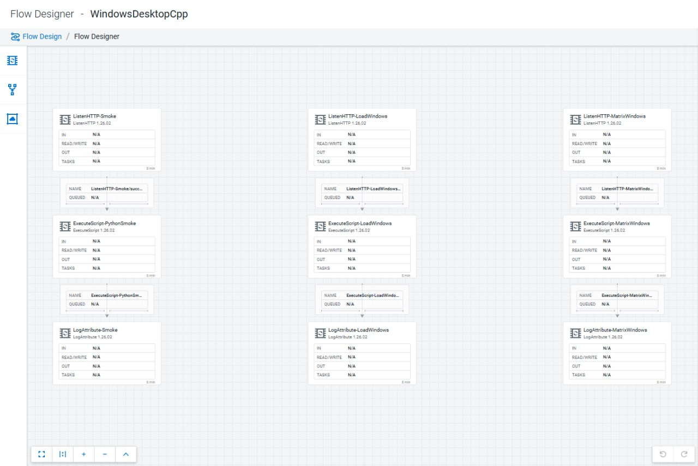
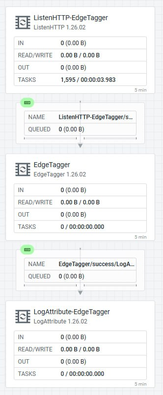

# Chapter 16: How to AI with MiNiFi

The companion to Chapter 15 ("How to AI with NiFi and Python") runs Python inference inside NiFi
on a Kubernetes cluster with room to spare. This chapter is the opposite end of the wire: a MiNiFi
agent on a small edge box — a Beelink mini PC, a Windows desktop, a Jetson, a bare Kubernetes pod
— that has no business hosting a model but still needs to do AI work. The agent almost never runs
the model itself. It routes, transforms, enrolls, and ships results. This chapter runs against
EFM `2.3.1.0-2` and MiNiFi C++ `1.26.02`; the StarlinkAI case study uses the MiNiFi Java agent
`2.24.08.0-19`.

> **⚠️ This is the "using" chapter, not the "installing" chapter.** Staging agent binaries, the
> five-leaf EFM directory layout, the Windows MSI Python black hole, and the missing Java NARs all
> belong to Ch2 (EFM Binaries). Read that chapter first if your `Deploy Agent` button still returns
> `400`. This chapter assumes agents are online and asks the next question: what do you make them
> do.

All five Lemonade endpoints — chat, embeddings, reranking, speech, and transcription — round-trip
real data end-to-end through the MiNiFi Java router on `:8090`. Transcription is the one that needs
real work: `HandleHttpRequest` splits a multipart POST into one FlowFile per form field, and those
fragments must be reassembled before `InvokeHTTP` or Lemonade `400`s the invalid body. The
reassembly branch sits behind a `RouteOnAttribute-HasFragments` fork — see
[Transcription: multipart reassembly](#transcription-multipart-reassembly) below.

---

## The four AI-at-edge options

The edge AI menu is not one approach. Each has a different footprint and a different fit:

| Option | What the agent does | When to use it |
|---|---|---|
| **Route to a nearby inference server** | Accepts HTTP, forwards to local LLM, returns the real answer | Agent is tiny; GPU box is nearby (this chapter's primary case study) |
| **`ExecuteScript` (Python)** | Runs inline Python script on every FlowFile | Fast iteration, single-processor enrichment |
| **Custom Python processors** | Executes an authored processor type that ships with the agent | Reusable, stable edge logic that deserves its own palette entry |
| **On-device model execution** | Runs TensorRT / llama.cpp inside the flow | Edge device has a real GPU (Jetson, discrete GPU box) |

The rest of this chapter covers the first three in depth. On-device model execution (TensorRT on
the Jetson, `RunLlamaCppInference` in the C++ manifest) is the subject of Ch19 (EFM + NVIDIA Jetson
use case).

---

## Route to a nearby inference server

### The StarlinkAI router — the canonical shape

The most useful edge AI shape is a three-processor MiNiFi **Java** flow that fronts a local
inference server. The agent is tiny; the GPU box next to it holds the model. My working example is
the StarlinkAI router: a MiNiFi Java agent on a Beelink SER9 (`TunaStarlink`) that takes HTTP
requests and forwards them to a Lemonade Server (AMD's OpenAI-compatible inference server,
`llamacpp:vulkan` backend on a Radeon 780M iGPU, port `13305`):

```text
HandleHttpRequest-Lemonade  (port 8090, any path)
  → InvokeHTTP-Lemonade     (POST http://localhost:13305${http.request.uri})
  → HandleHttpResponse-Lemonade  (returns Lemonade's real answer synchronously)
```

No custom code. No per-endpoint branching. The `InvokeHTTP` URL is a pure pass-through — whatever
path the client hits, that path is forwarded to Lemonade — so one flow fronts all five Lemonade
services instead of one `ListenHTTP`/`InvokeHTTP` pair per service. The agent doesn't know what a
model is; it accepts a POST, forwards it, and hands the real response straight back. The value is
the flow, the enrollment, and the transport, not the inference.


### Why MiNiFi Java, not C++

MiNiFi C++'s `ListenHTTP` has no synchronous request/response pair — the caller always gets an
empty `200` ack and the real answer must come back out-of-band over Kafka keyed on a client-supplied
`request_id`. `ListenHTTP` also silently drops multipart POSTs (transcription) at its buffer-full
check (a `MINIFICPP-2243`-shaped bug). MiNiFi **Java** ships `HandleHttpRequest`/
`HandleHttpResponse` — a real synchronous response, no Kafka detour. This is the decisive
difference for an HTTP-fronted inference proxy.

### Processor settings that matter

**`HandleHttpRequest-Lemonade`**

| Property | Value |
|---|---|
| Listening Port | `8090` |
| HTTP Context Map | `StandardHttpContextMap` (shared controller service) |
| Allowed Paths | unset — accepts any path, distinguished downstream by `${http.request.uri}` |

**`InvokeHTTP-Lemonade`**

| Property | Value |
|---|---|
| HTTP URL | `http://localhost:13305${http.request.uri}` |
| HTTP Method | `POST` |
| Request Content-Type | `${mime.type}` — forwards the client's content type, JSON and single-part binary pass through unchanged |
| Request Body Enabled | `true` |
| Socket Read Timeout | `10 mins` |
| Socket Write Timeout | `10 mins` |
| Connection Timeout | `30 secs` |

The 10-minute read/write timeouts are load-bearing: LLM inference routinely takes 10–25s+; the
framework default (`15 secs`) fails every real call with a silent `SocketTimeoutException`
auto-terminating on `Failure` — the client just sits until `StandardHttpContextMap`'s own 60s
expiration gives up with a generic 503. Match this to your slowest endpoint, not the framework
default.

**`HandleHttpResponse-Lemonade`**

| Property | Value |
|---|---|
| HTTP Status Code | `${invokehttp.status.code:replaceEmpty('502')}` |
| HTTP Context Map | same shared `StandardHttpContextMap` |

Set `HTTP Status Code` to the expression above (not a hardcoded `"200"`) so the caller sees real
upstream status: the `invokehttp.status.code` attribute carries the actual HTTP response code on
`Response`, `Retry`, and `No Retry` relationships; `Failure` (no upstream response at all) carries
no attribute, so `replaceEmpty('502')` gives the caller a real `502` instead of a silent hang.

**Connection wiring (flowVersion 23 shape):**

```text
HandleHttpRequest[success] → InvokeHTTP[success/Response] → HandleHttpResponse
InvokeHTTP[Retry]          → HandleHttpResponse   (also → LogAttribute-Error)
InvokeHTTP[No Retry]       → HandleHttpResponse   (also → LogAttribute-Error)
InvokeHTTP[Failure]        → HandleHttpResponse   (also → LogAttribute-Error)
InvokeHTTP[Original]       → LogAttribute-Error only
                              (NOT to HandleHttpResponse — wiring Original in too
                               delivers a second FlowFile to the same HTTP context
                               and double-responds)
```

### Endpoint status

| Service | Path | Confirmed |
|---|---|---|
| Chat | `/api/v1/chat/completions` | Yes — real client, real content, real synchronous answer (`200`, ~12–37s) |
| Embeddings | `/api/v1/embeddings` | Yes — real 200, real embedding vector (`Qwen3-Embedding-0.6B-GGUF`), ~0.2s |
| Reranking | `/api/v1/reranking` | Yes — real 200, real relevance scores, correctly ranked on-topic document highest, ~2.5s |
| Speech (TTS) | `/api/v1/audio/speech` | Yes — real 200, real Kokoro MP3 (valid ID3/MPEG, 78KB), ~7s |
| Transcription | `/api/v1/audio/transcriptions` | **Yes** — real 200, real transcript (needs the multipart reassembly branch below) |

### Transcription: multipart reassembly

`HandleHttpRequest` splits a multipart request into one FlowFile per form field and forwards each
fragment independently to `InvokeHTTP`. Each fragment carries the *original* multipart
`Content-Type` header but only that one field's raw bytes — never valid multipart, so Lemonade
correctly rejected it with `400 Bad request`. This is exactly what a pure pass-through router can't
handle, and it's the one endpoint that needs real work rather than path forwarding.

The attributes `HandleHttpRequest` sets per fragment:

| Attribute | `model` fragment | `file` fragment |
|---|---|---|
| `http.context.identifier` | `016f4c23-...` | same value — correlation key |
| `http.multipart.fragments.sequence.number` | `1` | `2` (1-indexed) |
| `http.multipart.fragments.total.number` | `2` | `2` |
| `http.multipart.name` | `model` | `file` |
| `http.multipart.filename` | *(absent)* | `test-audio.wav` |
| `http.headers.multipart.Content-Disposition` | `form-data; name="model"` | `form-data; name="file"; filename="test-audio.wav"` |

The fix is a reassembly chain ahead of `InvokeHTTP`: `UpdateAttribute` (map `fragment.*` keys from
the `http.multipart.*` attributes), `RouteOnAttribute` (fork by `http.multipart.content.type`
presence), two `ReplaceText` processors (prepend the MIME part header, with and without the
`Content-Type:` line), `MergeContent` (Defragment strategy, `fragment.index` **0-indexed** —
`sequence.number` minus 1), `UpdateAttribute` (set the reassembled `Content-Type` with the new
boundary), then `InvokeHTTP`. The whole reassembly chain sits behind a
`RouteOnAttribute-HasFragments` fork ahead of the shared `InvokeHTTP` — multipart requests take the
reassembly branch, everything else passes straight through unchanged.

Two gotchas are worth knowing before you build this:

- **`ReplaceText` prepends `Replacement Value`, not `Text to Prepend`** (on `minifi-standard-nar
  2.24.08.0-19` with `Replacement Strategy = Prepend`). The boundary/header text sitting in the
  intuitively-correct `Text to Prepend` field did nothing; every part came out starting with the
  literal default `$1` and the body was missing its opening boundary. Move the header text into
  `Replacement Value`.
- **MiNiFi's `InvokeHTTP` does not swap FlowFile content for the HTTP response body on a non-2xx** —
  the `Response` relationship keeps the original *outgoing* request bytes. This is router-wide, not
  specific to this branch. It also lets you read the exact bytes MiNiFi is sending Lemonade, which
  is how the `$1` bug above surfaces.

A direct probe to Lemonade on `:13305` with the identical multipart POST returns a real `200` and
real transcript — the request and model are fine; only the MiNiFi pass-through leg needs the
reassembly step.

### Setting up the StarlinkAI router from scratch

**1. Tailscale**

```powershell
winget install tailscale.tailscale
tailscale up
```

`tailscale up` opens an interactive browser auth — run by hand and join the same tailnet as the
other array machines.

**2. Lemonade Server**

```powershell
winget install --id AMD.LemonadeServer --silent --accept-package-agreements --accept-source-agreements
lemonade backends install llamacpp:vulkan
```

Pull and confirm models:

```powershell
lemonade pull Qwen3-4B-GGUF              # chat
lemonade pull Qwen3-Embedding-0.6B-GGUF  # embeddings
lemonade pull jina-reranker-v1-tiny-en-GGUF  # reranking
lemonade pull Whisper-Large-v3-Turbo     # transcription
lemonade pull kokoro-v1                  # TTS (install as kokoro:cpu if no discrete GPU)
```

Confirm Vulkan GPU offload is active once a model is loaded — `GET /api/v1/health` should return
`"device": "gpu"`. Confirm explicitly; the server silently falls back to CPU if Vulkan init fails.

**3. JDK + MiNiFi Java agent**

```powershell
winget install Microsoft.OpenJDK.21
$env:JAVA_HOME = 'C:\Program Files\Microsoft\jdk-21.0.12.8-hotspot'
$env:Path = "$env:JAVA_HOME\bin;" + $env:Path
```

Deploy via the EFM agent-deployer script, targeting the Java agent type and a dedicated class
(`StarlinkAIJava` — kept separate from any C++ class so the two never share a canvas):

```powershell
Invoke-WebRequest -Uri 'http://<EFM_HOST>:10090/efm/api/agent-deployer/script' -Method Post -Body @{
  agentClass   = 'StarlinkAIJava'
  agentType    = 'java'
  agentVersion = '2.24.08.0-19'
  osArch       = 'windows'
  baseUrl      = 'http://<EFM_HOST>:10090/efm/api'
  hbPeriod     = '5000'
} -OutFile deploy.ps1
.\deploy.ps1
```

The agent lands at `~\minifi-java\minifi-2.24.08.0-19\` and runs as a plain background process via
`bin\run-minifi.bat`. The `StarlinkAIJava` class picks up the Java manifest automatically on first
heartbeat — no manual class-manifest re-pointing needed for a fresh class.

**4. Build the flow via the EFM Designer API**

There is no whole-flow PUT. `PUT /efm/api/designer/flows/{flowId}` returns `405`. Build component
by component:

```bash
# Create each processor
POST /efm/api/designer/flows/{flowId}/process-groups/{pgId}/processors
# Wire each connection
POST /efm/api/designer/flows/{flowId}/connections
# Validate before going live
GET  /efm/api/designer/flows/{flowId}/validate
# Publish to the agent class
POST /efm/api/designer/flows/{flowId}/publish
```

`GET .../validate` must return `"validationErrors": []` before publish. Two things it catches that
are easy to miss: new processors don't get `autoTerminatedRelationships` set automatically (an
`EvaluateJsonPath` needs `failure` and `unmatched` terminated explicitly, or publish returns `409`),
and a single invalid or orphaned processor anywhere on the canvas blocks `/publish`.

**Test the live router:**

```powershell
# Chat (PowerShell curl.exe — use --data @file.json, not inline -d '{...}')
curl.exe -X POST http://localhost:8090/api/v1/chat/completions `
  -H 'Content-Type: application/json' `
  --data '@chat_body.json'
```

---

## ExecuteScript — inline Python on the agent

`ExecuteScript` is the fastest way to run arbitrary Python at the edge. Wire it inline, set
`Script Engine: python`, and paste a body that implements `onTrigger`:

```text
ListenHTTP :18080 /contentListener
  → ExecuteScript (Script Engine: python)
  → LogAttribute (Log Payload = true)
```

```python
def onTrigger(context, session):
    flow_file = session.get()
    if flow_file:
        session.putAttribute(flow_file, "python.smoke", "edge-executescript-ok")
        session.transfer(flow_file, REL_SUCCESS)
```

POST a payload and the attribute appears on `LogAttribute` — proof the extension loaded and
executed. The property that makes `ExecuteScript` useful for iteration: a running C++ agent
**re-reads the script from disk on every trigger**. Edit the script, POST again, the new logic
runs — no restart, no republish.

In EFM Designer flows the C++ FQCN is `org.apache.nifi.minifi.processors.ExecuteScript` — note
`minifi` in the path. It is not the Java NiFi
`org.apache.nifi.processors.standard.ExecuteScript`.



### `ExecuteScript` availability

`ExecuteScript` is **not in any stock Cloudera binary** — not the C++ image, not the CEM Java
tarball, not the default Windows MSI feature set. The tell is `Could not instantiate:
PythonScriptExecutor` repeating every 30s in `minifi-app.log`, or an EFM Designer "not a valid
Processor type" rejection.

How to get the engine onto each runtime:

| Runtime | Path | Python engine? |
|---|---|---|
| C++ Kubernetes pod | Extra-extensions injection (`MINIFI_EXTRA_EXTENSIONS_COMMA_SEPARATED`) | Yes — confirmed on arm64 K8s pods and Jetson |
| C++ source build | Include Python extension at build time | Yes |
| Java CEM tarball | Drop the Python NAR into `lib/` | **No** — CEM `2.24.08.0-19` NAR gives Groovy/Clojure only, no Python |
| Windows MSI | `ADDLOCAL=ALL` during install | Yes (C++ MSI only) |

Python `ExecuteScript` at the edge means a **C++ agent**, not the Java agent. In this lab the
engine is settled and running on the C++ K8s pods and on the Jetson via extra-extensions injection.
The C++ FQCN paths are confirmed; the Java NAR path gives you `ExecuteScript` but not a Python
engine. See Ch5 (ExecuteScript Availability) for the full build-by-build breakdown.

### Getting scripts onto the agent

Two mechanisms:

**EFM Resource Manager API** — the tracked, restart-durable path:

```bash
# Upload the script file
POST /efm/api/resource-manager/resources/file
# Assign it to the agent class
PUT /efm/api/agent-class-resource-manager/{agentClass}/save
# Body must be exactly:
{"resourceIdsToBeAssigned":[...],"resourceIdsToBeUnassigned":[...]}
# A bare array is silently swallowed — the shape above is required
```

This path needs the `efm-resources` PVC, or the uploaded bytes die with the pod while the DB row
survives pointing at nothing.

**Raw `kubectl cp`** onto the agent's script path — takes effect on the next trigger, bypasses EFM
tracking, does not survive a pod restart. Correct for fast iteration; not the production path.

### Windows Session 0 caveat

An `ExecuteScript` that shells out to launch a GUI window runs green — `200`, attributes set, the
target process even spawns — but the window never appears. A default `LocalSystem` Windows service
lives in Session 0 with no interactive desktop. Run the agent in process-mode (Session 1) for
anything that must show up on screen.

---

## Custom Python processors — author a new edge processor type

When the logic is worth keeping, write it as a real processor. A custom Python processor is a new
*type*: it appears in the agent's manifest under its own name, with its own properties and
relationships, and wires into a flow like any stock processor.

On the C++ agent, subclass the pre-shipped `nifiapi` framework:

```python
from nifiapi.flowfiletransform import FlowFileTransform, FlowFileTransformResult

class EdgeTagger(FlowFileTransform):
    class ProcessorDetails:
        version = "0.0.1"
        description = "Tags a FlowFile with an edge attribute and passes it through."

    def transform(self, context, flowfile):
        return FlowFileTransformResult(
            relationship="success",
            attributes={"edge.tag": "field-test"},
        )
```

Drop the `.py` into the agent's configured processor directory (`nifi.python.processor.dir`,
default `${MINIFI_HOME}/minifi-python/`, authored processors go in the sibling
`nifi_python_processors/` package) and restart. The agent's `PythonCreator` scans the directory
once at boot and registers the type under its own FQCN:
`org.apache.nifi.minifi.processors.nifi_python_processors.EdgeTagger` appears in
`GET /efm/api/agent-manifests/{id}` with the exact text from `ProcessorDetails.description` in the
`typeDescription` field — confirmation the authored `describe()` ran, not a placeholder.

From there it wires into an EFM Designer flow (`ListenHTTP → EdgeTagger → LogAttribute`) exactly
like a stock processor — no special-casing to reference a custom type — and publishes with zero
validation errors.



> **⚠️ A custom processor is not a hot patch.** `PythonCreator` scans at boot; a `.py` dropped in
> or edited after the agent is running is not picked up until the agent restarts. This is the sharp
> difference from `ExecuteScript`, which re-reads every trigger. If your iteration loop is "tweak
> and re-POST," use `ExecuteScript`. If you're shipping stable capability, author a processor and
> accept the restart.

### Delivery paths for custom processors

Two paths, same as scripts:

- **Baked into the image / copied by hand** — for a fixed agent. Correct for development and
  single-box deployments.
- **EFM Resource asset-directory sync** — push the `.py` as a resource into the agent's asset
  directory over the C2 asset-sync command. No image rebuild, no manual copy: on the arm64 K8s C++
  agent, `EdgeTagger` delivered as a resource syncs in ~5s, its `.state` digest matches, and it
  registers as a first-class type with the flow running clean.

The C++ agent's Java-processor parallel framework (`python/api/nifiapi/`, `python/framework/`) is
structurally present but not exercised end-to-end here.

### `ExecuteScript` vs custom processor — pick one

| | `ExecuteScript` (Python engine) | Custom Python processor |
|---|---|---|
| What it is | One generic processor; paste a script body | A new processor type you author in Python |
| Identity in the flow | Always shows as `ExecuteScript` | Shows under its own name |
| Reload | Re-reads script every trigger — hot-edit, no restart | PythonCreator scans at boot — needs agent restart |
| Best for | Fast iteration, per-box one-offs | Reusable, stable edge capability |

Conflating these two is the most common mistake. They are different processors with different reload
behavior.

---

## EFM Designer write contract

Everything above is published to agents through EFM, and the Designer API has one contract that
will waste your afternoon if you assume the obvious.

**There is no whole-flow PUT.** `PUT /efm/api/designer/flows/{flowId}` returns `405 Request method
'PUT' is not supported`. Build flows one component at a time:

```bash
POST /efm/api/designer/flows/{flowId}/process-groups/{pgId}/processors
POST /efm/api/designer/flows/{flowId}/connections
GET  /efm/api/designer/flows/{flowId}/validate
POST /efm/api/designer/flows/{flowId}/publish
```

The Designer validates against the agent class → manifest mapping, not against whatever agent
happens to be online. Put a Java agent on a class whose flow was authored for C++ and the Designer
rejects the processors because the FQCNs differ (`org.apache.nifi.minifi.processors.ListenHTTP` vs
the Java equivalent). When you add NARs or extensions to a running agent, its new processors stay
invisible to the Designer until you re-point the class mapping to the agent's new
`agentManifestId`. Keep mixed runtimes as parallel classes — `WindowsDesktopCpp` separate from
`WindowsDesktop`, `KubernetesPodJava` separate from `KubernetesPod` — so a Java agent never lands
on a C++ canvas.

---

## Traps

These are the ones that drop data silently rather than erroring:

- **`ListenHTTP` `Batch Size`/`Buffer Size` default to `5/5`.** A single request never fills the
  buffer and is dropped with `buffer is NOT full 1/5`. Set both to `1` (MINIFICPP-2243 off-by-one).
  This is the first thing to check when an edge flow "does nothing."
- **`InvokeHTTP`'s `HTTP Method` silently stays `GET`.** Even when you meant `POST`. Every Lemonade
  call was a bodyless GET until set explicitly.
- **`Socket Read Timeout` defaults to `15 secs`.** LLM inference takes 10–25s+. Silent
  `SocketTimeoutException`, nothing returned, caller hangs until the HTTP context map's 60s
  expiration gives up.
- **Kafka bootstrap: external NodePort vs in-cluster port.** From outside the cluster (an edge
  agent over Tailscale) it's the NodePort (`:31623` here), not the internal `:9092`. On Strimzi,
  per-broker `advertisedHost` must be the reachable hostname or brokers hand clients a raw LAN IP
  they can't route to.
- **`Retry` is not `Failure`.** Auto-terminating `InvokeHTTP`'s `Retry` relationship silently drops
  every transient 5xx/429. Self-loop `Retry` with a bounded `FlowFile Expiration` and route
  `Failure` to a log processor.
- **Never GET-then-PUT a processor with sensitive properties.** EFM/NiFi returns `********` on
  read; PUT it back and you write that literal over the real credential. Bind secrets to a Parameter
  Context or use a narrow-scope endpoint.
- **Live flow is truth.** Before editing a running agent's flow, pull what's actually there
  (`GET /efm/api/designer/flows/{id}`, or dump `config.yml`). The running canvas has drifted from
  your notes more often than not.

---

## What NOT to do

- **Don't wait on the `ListenHTTP` response for your model output when using C++.** MiNiFi C++ is
  fire-and-forget; the answer comes back on Kafka keyed by `request_id`, not in the HTTP reply. Use
  MiNiFi Java (`HandleHttpRequest`/`HandleHttpResponse`) for synchronous inference proxying.
- **Don't conflate `ExecuteScript` with a custom Python processor.** One hot-reloads every trigger;
  the other needs a restart. Reaching for the wrong one makes your iteration loop fight you.
- **Don't expect `ExecuteScript` to exist in a stock agent.** Getting the Python engine onto the
  agent is an install problem — see Ch2 and Ch5 first.
- **Don't drive a GUI from a `LocalSystem` service agent.** Session 0 has no interactive desktop.
- **Don't `PUT` a whole flow to the Designer.** There is no whole-flow PUT (`405`) — build
  component by component.
- **Don't publish onto a class whose manifest doesn't match the agent's runtime.** C++ FQCNs on a
  Java-mapped class get rejected.
- **Don't leave `ListenHTTP` at `5/5` or `InvokeHTTP` at `GET`.** The two defaults that drop or
  neuter more edge flows than anything else.

---

## Related chapters

- Ch5 — [ExecuteScript Availability](ch05-executescript-availability.md): the full build-by-build
  breakdown of which runtimes ship the Python engine.
- Ch14 — [The NiFi and AI Skill — EFM Portion](ch14-nifi-and-ai-skill-efm-portion.md): building
  these flows through the `nifi-and-ai` skill rather than by hand.
- Ch17 — [Edge-AI router case study](ch17-edge-ai-router.md): the deep-dive on the StarlinkAI router
  architecture, Tailscale integration, and the transcription reassembly branch.
- Ch19 — [EFM + NVIDIA Jetson use case](ch19-efm-and-nvidia-jetson.md): on-device model execution
  via TensorRT / llama.cpp.
