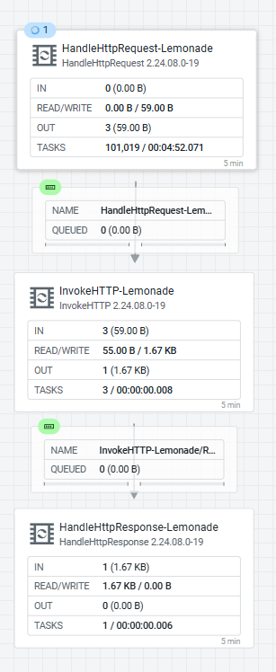

# Chapter 17: Edge-AI Router Case Study, StarlinkAI

Chapter 16 introduced the four AI-at-edge options and used the StarlinkAI router as its canonical "route to a nearby inference server" example. This chapter is the full build of that node. The hardware, why it runs the stack it does, how it joins the array, and every functional leg the single agent carries.

One `StarlinkAI` Java agent handles both the Lemonade inference router (five endpoints on port `:8090`) and the screen/matrix control endpoint (port `:8096`). Where Chapter 16 states the shape, this chapter is the build, including the two problems that needed engineering, the error routing and the multipart reassembly.

> **⚠️ Read Chapter 16 first for the generalized patterns.** The "why MiNiFi Java, not C++" reasoning, the EFM Designer write contract (no whole-flow PUT), and the edge traps are covered there and only summarized here. This chapter is the case study. Chapter 16 is the playbook.

Everything below runs against EFM `2.3.1.0-2` and the MiNiFi Java agent `2.24.08.0-19`.

---

## The Node and Its Role

StarlinkAI is the third inference node in the array (alongside the Windows desktop and the Mac), hostname `TunaStarlink`, a Beelink SER9 MAX (H260).

| | |
|---|---|
| CPU | AMD Ryzen 7 260, 8C/16T, 3.8 GHz base |
| GPU | Radeon 780M iGPU (RDNA3, 12 CUs), no NPU |
| RAM | 64 GB |
| Network | Starlink uplink. The Windows host also runs an OBS/OBSBOT Tiny 3 Twitch stream |

Its job in the array is to use the iGPU for local inference and expose it to every other array machine as an HTTP endpoint over Tailscale, fronted by an EFM/MiNiFi Java agent that does routing only. The agent never runs a model. It forwards to the inference server sitting next to it on `localhost`.

**Why Vulkan, not ROCm/vLLM.** This chip has no NPU, and AMD's ROCm does not support this iGPU. `llamacpp:vulkan` drives the standard GPU driver stack directly. No special driver package, no ROCm install, no NPU runtime. It is the path that offloads to this particular silicon.

**Why MiNiFi Java, not C++.** The decisive reason (detailed in Chapter 16) is that MiNiFi C++'s `ListenHTTP` has no synchronous request/response pair. The caller gets an empty ack and the answer must return out-of-band over Kafka keyed on a `request_id`, and it silently drops multipart POSTs at its buffer-full check. MiNiFi Java ships `HandleHttpRequest`/`HandleHttpResponse`, returning the response inline with no Kafka detour. For an HTTP-fronted inference proxy that is the whole ballgame.

---

## Architecture

```
Other array machines (over Tailscale)
        │
        ▼
Tailscale (Windows host) — stable tailnet IP for this box
        │
        ▼
EFM / MiNiFi Java agent  (StarlinkAI class, Windows-native process)
        │
        ├─── Lemonade inference router  (port :8090)
        │      - HandleHttpRequest-Lemonade   : single entry point, all 5
        │                                       endpoints distinguished by path
        │      - InvokeHTTP-Lemonade          : pure reverse-proxy pass-through —
        │                                       http://localhost:13305${http.request.uri}
        │      - HandleHttpResponse-Lemonade  : returns Lemonade's real answer
        │                                       synchronously
        │
        └─── Screen/matrix control  (port :8096, JSON body)
               - HandleHttpRequest-ScreenControl : accepts JSON with action/screen/
                                                   streamer fields
               - EvaluateJsonPath                : extracts action, screen, streamer
                                                   from the request body
               - ExecuteStreamCommand            : invokes starlinkai_screen_control.py
                                                   per request (no persistent listener)
               - HandleHttpResponse-ScreenControl: returns result synchronously
        │
        ▼
Lemonade Server  (Windows-native, localhost:13305)
  - iGPU inference via llamacpp:vulkan backend
  - OpenAI-compatible API: /v1/chat/completions, /v1/embeddings,
    /v1/reranking, /v1/audio/speech, /v1/audio/transcriptions
```

One agent, two endpoint groups, no Kafka, no `request_id` correlation. Callers get responses directly and synchronously on both legs. Everything in the serving path runs natively on Windows. No containers, no WSL2 (WSL2 on this box is only used for repo and doc access).



The deployed router in the EFM Flow Designer with monitoring active. Per-processor throughput (In / Read-Write / Out / Tasks) on the three-processor primary path, plus an error-observability branch off `InvokeHTTP`'s `Failure`/`Retry`/`No Retry`/`Original` relationships.

---

## Standing It Up

### 1. Tailscale (Windows Host)

```powershell
winget install tailscale.tailscale
tailscale up
```

`tailscale up` opens an interactive browser auth. Run it by hand and join the same tailnet as the rest of the array. This box gets a stable tailnet IP. The EFM host's tailnet IP is the `baseUrl` target in the deployer command below.

### 2. Lemonade Server (Windows Host)

```powershell
winget install --id AMD.LemonadeServer --silent --accept-package-agreements --accept-source-agreements
lemonade backends install llamacpp:vulkan
```

Five models loaded, one concurrent per category.

| Category | Model |
|---|---|
| Chat | `Qwen3-4B-GGUF` |
| Embeddings | `Qwen3-Embedding-0.6B-GGUF` |
| Reranking | `jina-reranker-v1-tiny-en-GGUF` |
| Transcription | `Whisper-Large-v3-Turbo` |
| TTS | `kokoro-v1` (`device: cpu`, the backend installed only as `kokoro:cpu`) |

Manage with `lemonade list` / `lemonade pull <model>`. Once a model is loaded, check that Vulkan GPU offload is active. `GET /api/v1/health` should return `"device": "gpu"`, not a silent CPU fallback.

### 3. JDK plus the MiNiFi Java Agent (Router Only)

```powershell
winget install Microsoft.OpenJDK.21
$env:JAVA_HOME = 'C:\Program Files\Microsoft\jdk-21.0.12.8-hotspot'
$env:Path = "$env:JAVA_HOME\bin;" + $env:Path
```

Deploy with the command EFM generates. On the Deploy Agent CLI screen (or via `POST /efm/api/agent-deployer/generateCommand` with `agentIdentifier` omitted) pick the `StarlinkAI` class, `agentType=java`, `agentVersion=2.24.08.0-19`, `osArch=windows`, and a `baseUrl` of `http://<EFM_HOST>:10090/efm/api` where `<EFM_HOST>` is the EFM host's tailnet IP. Run the generated command in a PowerShell on the box. Do not hand-build it and do not reuse an identifier from an earlier enrollment.

The agent lands at `C:\Users\tunas\efm-agent\StarlinkAI-java\minifi-2.24.08.0-19\` and runs as a plain background process via `bin\run-minifi.bat`. A fresh class picks up the Java manifest automatically on first heartbeat. No manual class-manifest re-pointing.

The agent persists across reboots via a Windows Scheduled Task named `StarlinkAI-MiNiFi-AutoStart` (trigger `AtLogOn`, user `tunas`), not a Windows service install. The task runs `run-minifi.bat` at logon, matching the shape of the existing stream-launcher tasks on the same host.

---

## The Router Flow

Built via the EFM Designer's per-component API (`POST .../processors`, `POST .../connections`, `GET .../validate`, `POST .../publish`; there is no whole-flow `PUT`, and Chapter 16 covers the contract). The three processors that carry the traffic.

**`HandleHttpRequest-Lemonade`**

| Property | Value |
|---|---|
| Listening Port | `8090` |
| HTTP Context Map | `StandardHttpContextMap` (shared controller service) |
| Allowed Paths | unset. Accepts any path, distinguished downstream by `${http.request.uri}` |

**`InvokeHTTP-Lemonade`**

| Property | Value |
|---|---|
| HTTP URL | `http://localhost:13305${http.request.uri}`, pure pass-through, no per-endpoint branching |
| HTTP Method | `POST` |
| Request Content-Type | `${mime.type}`. Forwards the client's content type. JSON and single-part binary bodies pass through unchanged |
| Request Body Enabled | `true` |
| Socket Read Timeout / Socket Write Timeout | `10 mins` |
| Connection Timeout | `30 secs` |

> **⚠️ The 10-minute read/write timeout is load-bearing.** LLM inference routinely takes 10 to 25 seconds and more. The framework default (`15 secs`) fails every call with a `SocketTimeoutException` that auto-terminates on `Failure` with nothing routed back, and the client sits until `StandardHttpContextMap`'s own 60s expiration gives up with a generic 503. Match this to the slowest endpoint on the box, not the framework default.

**`HandleHttpResponse-Lemonade`**

| Property | Value |
|---|---|
| HTTP Status Code | `${invokehttp.status.code:replaceEmpty('502')}` |
| HTTP Context Map | same shared `StandardHttpContextMap` |

### Error Routing

A flow that wires only `InvokeHTTP[success/Response] → HandleHttpResponse` never answers anything that is not a clean 2xx (a 404, a 500, a connection failure), and the caller hangs for the full 60s context-map expiration. Wire every outcome relationship back to the response.

```text
HandleHttpRequest[success] → InvokeHTTP[success/Response] → HandleHttpResponse
InvokeHTTP[Retry]          → HandleHttpResponse   (also → LogAttribute-Error)
InvokeHTTP[No Retry]       → HandleHttpResponse   (also → LogAttribute-Error)
InvokeHTTP[Failure]        → HandleHttpResponse   (also → LogAttribute-Error)
InvokeHTTP[Original]       → LogAttribute-Error only
                             (NOT to HandleHttpResponse — wiring Original in too
                              delivers a second FlowFile to the same HTTP context
                              and double-responds)
```

`HandleHttpResponse-Lemonade`'s status code is `${invokehttp.status.code:replaceEmpty('502')}` rather than a hardcoded `"200"`, so the caller sees the upstream status on every outcome. 2xx via `Response`, the 4xx/5xx via `Retry`/`No Retry`, or `502` via `Failure` when no upstream response came back at all (that relationship carries no `invokehttp.status.code` attribute). `Original`, the pass-through duplicate that always fires alongside whichever outcome relationship fires, stays deliberately unconnected to `HandleHttpResponse`. Wiring it in would double-respond to the same HTTP context.

With this wiring a GET-turned-POST health probe (`curl http://localhost:8090/api/v1/health`) returns a `404` in well under a second, not a 60s hang.

---

## Endpoints

All five Lemonade services on one port and one flow. The path the client POSTs to is forwarded verbatim to Lemonade.

| Service | Path | Response |
|---|---|---|
| Chat | `/api/v1/chat/completions` | `200`, synchronous answer, about 12 to 37s by response length |
| Embeddings | `/api/v1/embeddings` | `200`, embedding vector (`Qwen3-Embedding-0.6B-GGUF`), about 0.2s |
| Reranking | `/api/v1/reranking` | `200`, relevance scores with the on-topic document ranked highest, about 2.5s |
| Speech (TTS) | `/api/v1/audio/speech` | `200`, Kokoro MP3 (ID3/MPEG, about 78 KB), about 7s |
| Transcription | `/api/v1/audio/transcriptions` | `200`, transcript. Needs the reassembly branch below |

```powershell
# Chat — use --data @file.json, not inline -d '{...}': PowerShell/curl.exe has silently
# stripped quotes out of inline JSON on this box.
curl.exe -X POST http://localhost:8090/api/v1/chat/completions `
  -H 'Content-Type: application/json' `
  --data '@chat_body.json'
```

---

## Screen and Matrix Control (Port :8096)

Screen and matrix control on this node predates the Lemonade router. Twitch-chat-driven commands load streams onto the two monitors and launch the matrix kiosk. On the unified Java agent it runs as the same `HandleHttpRequest → EvaluateJsonPath → ExecuteStreamCommand → HandleHttpResponse` pattern the Windows desktop node uses. One endpoint on `:8096` accepts a JSON body with `action`, `screen`, and `streamer` fields, and `ExecuteStreamCommand` invokes `starlinkai_screen_control.py` (deployed to `C:\minifi-manual\`, a uniform 3-argument dispatch) directly per request. No persistent listener process. Central NiFi's `TwitchChatBot` `InvokeHTTP` processors (`InvokeStarlinkScreen3`/`InvokeStarlinkScreen4`) point at this endpoint.

| Processor | Key config |
|---|---|
| `HandleHttpRequest-ScreenControl` | Listening Port `8096`, POST only |
| `EvaluateJsonPath` | Extracts `action`, `screen`, and `streamer` from the JSON request body |
| `ExecuteStreamCommand` | Invokes `starlinkai_screen_control.py` directly per request. No persistent listener |
| `HandleHttpResponse-ScreenControl` | Returns result synchronously |

The `:8096` endpoint shares the same `StarlinkAI` class canvas as the Lemonade router leg. One MiNiFi process on the host, two endpoint groups, all EFM-managed.

---

## The Transcription Multipart Reassembly

Four of the five endpoints are pure pass-through. Same three processors, same code path, only the URL differs. Transcription is the holdout, and it is the reason this node earned its own chapter.

**The problem.** `HandleHttpRequest` splits a multipart request into one FlowFile per form field (`http.multipart.fragments.total.number: 2` in `minifi-app.log`, one fragment for `model`, one for `file`). Each fragment is then forwarded to `InvokeHTTP` independently, as its own request, still carrying the original multipart `Content-Type` header (`multipart/form-data; boundary=...`) but a body that is only that one fragment's raw bytes, never valid multipart. Lemonade rejects it. `invokehttp.response.body: {"error":{"message":"Bad request","type":"bad_request"}}`. The identical multipart POST sent straight to Lemonade on `:13305` returns `200` and a transcript, so the request and the model are fine. The pass-through leg is what breaks.

**The per-fragment attributes** `HandleHttpRequest` sets (from `minifi-app.log` for a `curl.exe -F model=... -F file=...` request).

| Attribute | `model` fragment | `file` fragment |
|---|---|---|
| `http.context.identifier` | `016f4c23-…` | same value. The correlation key across fragments of one request |
| `http.multipart.fragments.sequence.number` | `1` | `2` (1-indexed) |
| `http.multipart.fragments.total.number` | `2` | `2` |
| `http.multipart.name` | `model` | `file` |
| `http.multipart.filename` | *(absent)* | `test-audio.wav` |
| `http.multipart.content.type` | *(absent. Note the dot, not a hyphen)* | `audio/wav` |
| `http.headers.multipart.Content-Disposition` | `form-data; name="model"` | `form-data; name="file"; filename="test-audio.wav"` |
| `http.headers.multipart.Content-Type` | *(absent)* | `audio/wav` |

`http.headers.multipart.Content-Disposition` / `.Content-Type` carry the original raw per-part header text. Reuse them directly. Hand-reconstructing the header from `http.multipart.name`/`.filename` runs into a conditional-filename expression-language problem that this sidesteps entirely.

**The reassembly chain.** Build it ahead of `InvokeHTTP` on a separate port (`:8095`) first, then wire it into the live flow.

| Processor | Key config |
|---|---|
| `HandleHttpRequest-TranscriptionTest` | Listening Port `8095`, POST only |
| `UpdateAttribute-FragmentKeys` | `fragment.identifier`=`${http.context.identifier}`, `fragment.count`=`${http.multipart.fragments.total.number}`, `fragment.index`=`${http.multipart.fragments.sequence.number:minus(1)}` (0-indexed. `MergeContent` Defragment requires `fragment.index` in `0 … count-1`, one off from the 1-indexed `sequence.number`) |
| `RouteOnAttribute-HasContentType` | `hasType` = `${'http.multipart.content.type':isEmpty():not()}` |
| `ReplaceText-PrependPartHeaderWithType` | Prepend. Header text goes in `Replacement Value`, not `Text to Prepend` (gotcha below). `--ClaudeStarlinkBoundary7f3a2b91\r\nContent-Disposition: ${'http.headers.multipart.Content-Disposition'}\r\nContent-Type: ${'http.headers.multipart.Content-Type'}\r\n\r\n` |
| `ReplaceText-PrependPartHeaderNoType` | same, in `Replacement Value`, without the `Content-Type:` line |
| `MergeContent-Multipart` | Merge Strategy `Defragment`, Delimiter Strategy `Text`, Demarcator `\r\n`, Footer `\r\n--ClaudeStarlinkBoundary7f3a2b91--\r\n`, `original` auto-terminated |
| `UpdateAttribute-SetMultipartContentType` | `Content-Type` = `multipart/form-data; boundary=ClaudeStarlinkBoundary7f3a2b91` |
| `InvokeHTTP-TranscriptionTest` | same as prod (10-min timeouts) except `Request Content-Type` = `${Content-Type}`, not `${mime.type}` |
| `HandleHttpResponse-TranscriptionTest` | `HTTP Status Code` = `${invokehttp.status.code:replaceEmpty('502')}` |

`Delimiter Strategy: Text` lets `MergeContent`'s Demarcator/Footer be literal property values (the `Filename` mode reads a file on disk, not needed here).

> **⚠️ Two gotchas to know before you build this.**
>
> 1. `ReplaceText` prepends `Replacement Value`, not `Text to Prepend` (on this `minifi-standard-nar 2.24.08.0-19` build with `Replacement Strategy = Prepend`). Put the boundary/header text in `Text to Prepend` and leave `Replacement Value` at its literal default `$1`, and the rebuilt body comes out missing its opening boundary with every part starting with a literal `$1`. The text goes in `Replacement Value` on both `ReplaceText` processors.
> 2. MiNiFi's `InvokeHTTP` does not replace FlowFile content with the HTTP response body on a non-2xx. The `Response` relationship's content stays the original outgoing request bytes. This is router-wide, not branch-specific, and it never surfaces while only the success path is exercised. The useful side effect is that it lets you read the exact bytes MiNiFi sent to Lemonade, which is how gotcha 1 shows itself.

A `curl` against `:8095` with a 1s tone WAV returns `200`, `{"text":" .\n"}`, a Whisper response (the tone is not speech, so minimal text is expected; the round trip is the point). The repo's original `test-audio.wav` is an 18-byte placeholder (`RIFF….WAVEtest`). Generate a 1s tone to test.

**Wiring it into the live flow.** A `RouteOnAttribute-HasFragments` gate (`hasFragments` = `${http.multipart.fragments.total.number:isEmpty():not()}`) sits between `HandleHttpRequest-Lemonade` and `InvokeHTTP-Lemonade`. Multipart requests fork into the reassembly branch. Everything else (`unmatched`, which is chat, embeddings, reranking, and speech, none of which carry multipart fragment attributes) continues straight to `InvokeHTTP-Lemonade`, unchanged. No new response-side wiring is needed. Both `HandleHttpResponse` processors share the same `StandardHttpContextMap`, and NiFi correlates the reply to the original caller via `http.context.identifier`, not by which `HandleHttpResponse` instance fires, so a request that arrives on `:8090` is answered correctly even when it routes through the `:8095` branch's response processor.

On the live `:8090` flow.

```powershell
curl.exe -X POST http://localhost:8090/api/v1/audio/transcriptions `
  -F "model=Whisper-Large-v3-Turbo" -F "file=@test-audio.wav"
# → 200, {"text":" .\n"}
```

Re-test chat, embeddings, reranking, and speech after adding the gate. Inserting a `RouteOnAttribute` ahead of the shared `InvokeHTTP` is a wiring change to their path even though their configs do not change. All five Lemonade endpoints round-trip through `:8090`.

---

## Related Chapters

- [How to AI with MiNiFi](ch16-how-to-ai-with-minifi.md) (Ch16): the generalized edge-AI playbook this case study instantiates. The four options, why MiNiFi Java over C++, and the EFM Designer write contract.
- [EFM Binaries](ch02-efm-binaries.md) (Ch2): staging the agent binaries and the deployer the setup steps rely on.
- [EFM + NVIDIA Jetson use case](ch19-efm-and-nvidia-jetson.md) (Ch19): the on-device model-execution counterpart to this route-to-a-server case study.
