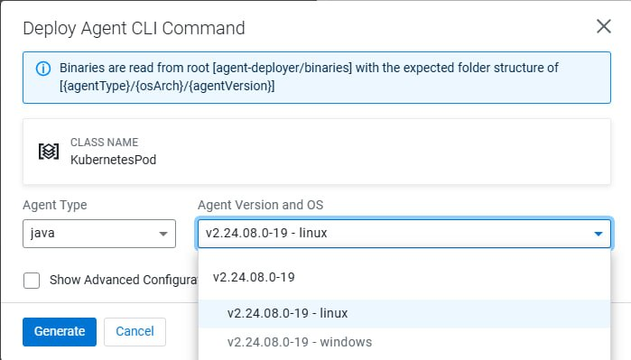
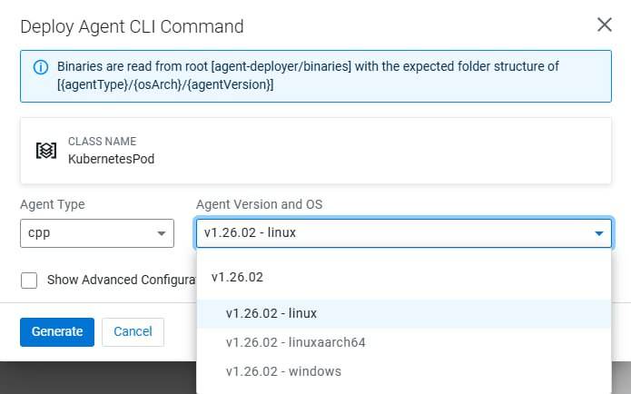

# Chapter 19: EFM + NVIDIA Jetson use case

This chapter walks through enrolling a Jetson Orin Nano (device `NvidiaNano`, hostname `tunastreet`, aarch64) as a MiNiFi C++ agent under EFM, delivering a TensorRT inference script as an agent resource, publishing an edge flow, and confirming the full `ListenHTTP → ExecuteScript → PublishKafka` chain end to end on real hardware. Everything here is field-captured on the actual board.

> **⚠️ Device-class assignment note.** The `NvidiaNano` agent class used throughout this chapter is the current assignment. The device-class roster may shift over time, so do not treat `NvidiaNano` as a permanent class name — check the current class assignment before building dependent flows or tooling.

## Prerequisites

This chapter builds directly on:

- EFM persisted on Kubernetes — see [Chapter 1](ch01-efm-on-kubernetes.md)
- MiNiFi C++ binaries installed into EFM's `agent-deployer/binaries` tree — see [Chapter 2](ch02-efm-binaries.md)
- The CSO stack (NiFi, Kafka/Strimzi, Flink, Prometheus/Grafana) running in minikube under `cld-streaming`

After installing binaries, restart EFM before proceeding:

```bash
kubectl rollout restart deployment/efm -n cld-streaming
kubectl wait --for=condition=ready pod -l app=efm -n cld-streaming --timeout=120s
```

EFM takes several minutes to re-roll. Confirm startup via logs, not guesswork:

```bash
kubectl logs -n cld-streaming -l app=efm --tail=50 | grep -Ei 'started|listen|efm/ui'
```

Field-captured on WindowsDesktop (the host running the live EFM pod) — real startup banner:

```
2026-07-30T14:11:49.749Z  INFO ... com.cloudera.cem.efm.C2Application       : Starting C2Application v2.3.1.0-2 using Java 21.0.4 with PID 25
2026-07-30T14:14:25.920Z  INFO ... o.e.jetty.server.AbstractConnector       : Started ServerConnector@1651130b{HTTP/1.1, (http/1.1)}{0.0.0.0:10090}
2026-07-30T14:14:26.523Z  INFO ... com.cloudera.cem.efm.C2Application       : Started C2Application in 165.571 seconds (process running for 171.454)
2026-07-30T14:14:26.825Z  INFO ... com.cloudera.cem.efm.C2Application       : The Edge Flow Manager has started. Services available at the following URLs:
2026-07-30T14:14:26.826Z  INFO ... com.cloudera.cem.efm.C2Application       : >>> Access User Interface: http://0.0.0.0:10090/efm/ui
```

On a long-lived pod `--tail=50` won't reach back this far — use `--tail=1000` rather than restarting EFM.

## Reaching EFM — two URLs, not interchangeable

`minikube tunnel` gives the stable local URL: `http://127.0.0.1:10090/efm/ui`. Use that from the host itself and in every command in this chapter.

The Jetson is a separate box on the LAN and cannot reach the host's `127.0.0.1`. To enroll an agent from the Jetson, EFM must be exposed on the host's LAN IP (`gaming-pc-lan-ip`). On Windows, `minikube service` gives a random NodePort and drops you at the bare host — append `/efm/ui/` to the browser URL yourself. Rule: tunnel for the stable local URL, host LAN IP for the off-box Jetson. The agent-deployer curl commands below use whichever base URL matches where the agent runs.

After EFM is up, create a class to reach the **Deploy Agent CLI** screen. The binary version dropdowns read from `agent-deployer/binaries/{agentType}/{osArch}/{agentVersion}` — the `linuxaarch64` C++ build is what the Jetson enrolls against.





## Windows networking: mirrored mode vs NAT mode

Before exposing EFM to the LAN, know which WSL2 networking mode is active (PowerShell):

```powershell
wsl hostname -I
```

- First IP matches your Windows LAN IP → **mirrored mode**
- First IP is a `172.x.x.x` address → **NAT mode**

### Mirrored mode (current WindowsDesktop setup)

WSL2 shares the Windows host IP directly. Any port bound on `0.0.0.0` inside WSL is reachable from the LAN at `gaming-pc-lan-ip:<port>` — no portproxy needed.

> **⚠️ Do not add portproxy rules in mirrored mode.** Stale portproxy entries pointing to old `172.x` WSL IPs intercept traffic and cause silent connection failures even when a TCP test succeeds. Check for and remove any stale entries:

```powershell
netsh interface portproxy show all
netsh interface portproxy delete v4tov4 listenport=9092 listenaddress=0.0.0.0
netsh interface portproxy delete v4tov4 listenport=10090 listenaddress=0.0.0.0
```

Add Windows Firewall inbound rules once (PowerShell as Administrator):

```powershell
New-NetFirewallRule -DisplayName "WSL EFM 10090" -Direction Inbound -Protocol TCP -LocalPort 10090 -Action Allow
New-NetFirewallRule -DisplayName "WSL Kafka Brokers External" -Direction Inbound -Protocol TCP -LocalPort 31623,31850,31935,30336 -Action Allow
```

### NAT mode (older WSL2 setups)

In NAT mode, portproxy rules are required. Replace `172.26.201.5` with your current WSL2 IP (`ip addr show eth0` in WSL):

```powershell
netsh interface portproxy add v4tov4 listenport=10090 listenaddress=0.0.0.0 connectport=10090 connectaddress=172.26.201.5
netsh interface portproxy add v4tov4 listenport=9092 listenaddress=0.0.0.0 connectport=9092 connectaddress=172.26.201.5
```

The WSL2 IP changes on every reboot in NAT mode — update portproxy entries any time the Jetson loses connectivity.

## Kafka external access for the Jetson

`kafka-eval.yaml` has only `internal` listeners. Off-box agents (the Jetson) can't reach Kafka brokers using internal cluster DNS. Apply `kafka-nodeport.yaml`, which adds an external NodePort listener with `advertisedHost` overrides pointing to `gaming-pc-lan-ip`:

```bash
kubectl apply -f ClouderaStreamingOperators/kafka-nodeport.yaml -n cld-streaming
kubectl wait kafka/my-cluster --for=condition=Ready --timeout=120s -n cld-streaming
```

Get the assigned NodePorts:

```bash
kubectl get svc -n cld-streaming | grep "my-cluster-combined\|external-bootstrap"
```

Expected output (ports vary per deployment):

```
my-cluster-combined-0                 NodePort  ...  9094:31850/TCP
my-cluster-combined-1                 NodePort  ...  9094:31935/TCP
my-cluster-combined-2                 NodePort  ...  9094:30336/TCP
my-cluster-kafka-external-bootstrap   NodePort  ...  9094:31623/TCP
```

Confirm the advertised bootstrap address:

```bash
kubectl get kafka my-cluster -n cld-streaming -o jsonpath='{.status.listeners[?(@.name=="external")].bootstrapServers}{"\n"}'
# Should return: gaming-pc-lan-ip:31623
```

The NodePorts live on the Minikube node (`192.168.49.2`), not directly on `gaming-pc-lan-ip`. These port-forwards bridge them — re-run after every WSL/Windows restart:

```bash
kubectl port-forward --address 0.0.0.0 svc/my-cluster-kafka-external-bootstrap 31623:9094 -n cld-streaming > /tmp/pf-kafka-bootstrap.log 2>&1 &
kubectl port-forward --address 0.0.0.0 svc/my-cluster-combined-0 31850:9094 -n cld-streaming > /tmp/pf-kafka-0.log 2>&1 &
kubectl port-forward --address 0.0.0.0 svc/my-cluster-combined-1 31935:9094 -n cld-streaming > /tmp/pf-kafka-1.log 2>&1 &
kubectl port-forward --address 0.0.0.0 svc/my-cluster-combined-2 30336:9094 -n cld-streaming > /tmp/pf-kafka-2.log 2>&1 &
```

Verify all four are listening:

```bash
ss -tlnp | grep -E "31623|31850|31935|30336"
```

Set MiNiFi `bootstrap.servers` on the Jetson to `gaming-pc-lan-ip:31623`. No `/etc/hosts` entries or portproxy rules needed.

## Enrolling a KubernetesPod agent first (optional smoke test)

Before touching the Jetson, it's worth proving EFM agent enrollment works using an in-cluster pod on `linux/amd64`. This is faster to iterate — no real hardware, no LAN routing — and if enrollment fails here it's an EFM or binary problem, not a Jetson-specific one.

Pull the base image into minikube:

```bash
eval $(minikube docker-env)
docker pull --platform linux/amd64 ubuntu:22.04
```

Create `minifi-agent-pod.yaml`. The `baseUrl` uses the EFM internal FQDN — this agent is local to the minikube cluster:

```yaml
apiVersion: v1
kind: Pod
metadata:
  name: minifi-agent-k8s
  namespace: cld-streaming
spec:
  containers:
  - name: minifi
    image: ubuntu:22.04
    imagePullPolicy: IfNotPresent
    command: ["/bin/bash", "-c"]
    args:
    - |
      apt-get update && apt-get install -y curl tar python3 python3-pip python3-venv
      ln -s /usr/bin/python3 /usr/bin/python || true
      curl -L \
       -d agentClass=KubernetesPod \
       -d agentIdentifier=e99e45f5-70f5-4847-af76-4f620b764aa9 \
       -d agentType=cpp \
       -d agentVersion=1.26.02 \
       -d autoConfigureSecurity=false \
       -d baseUrl=http%3A%2F%2Fefm.cld-streaming.svc%3A10090%2Fefm%2Fapi \
       -d hbPeriod=5000 \
       -d osArch=linux \
       -d serviceName=minifi \
       -d serviceUser=root \
       -d trustSelfSignedCertificates=false \
       http://efm.cld-streaming.svc:10090/efm/api/agent-deployer/script | bash -
      tail -f /dev/null
```

Apply and watch:

```bash
kubectl apply -f minifi-agent-pod.yaml
kubectl wait --for=condition=ready pod minifi-agent-k8s -n cld-streaming --timeout=60s
kubectl logs minifi-agent-k8s -n cld-streaming -f
kubectl exec -it minifi-agent-k8s -n cld-streaming -- tail -f /nifi-minifi-cpp-1.26.02/logs/minifi-app.log
```

Field-captured on WindowsDesktop from the live pod — the C++ build only logs *failed* C2 heartbeats, not successful ones, so there's no "registered!" line. What the log shows is the agent retrying every 5s while EFM was mid-startup, then going quiet once EFM came up — consistent with the heartbeat succeeding silently. The live-connection proof is the EFM dashboard:


The `KubernetesPod` class shows **Good Health** with `minifi-agent-k8s-gaming` enrolled and reporting.

## Enrolling the Jetson Orin Nano

Generate a unique agent identifier and fetch the agent CLI command for `linuxaarch64`. Replace `<YOUR_EFM_HOST_IP>` with your actual lab machine LAN IP:

```bash
curl -L \
 -d agentClass=NvidiaNano \
 -d agentIdentifier=$(cat /proc/sys/kernel/random/uuid) \
 -d agentType=cpp \
 -d agentVersion=1.26.02 \
 -d autoConfigureSecurity=false \
 -d baseUrl=http%3A%2F%2F127.0.0.1%3A46663%2Fefm%2Fapi \
 -d hbPeriod=5000 \
 -d osArch=linuxaarch64 \
 -d serviceName=minifi \
 -d serviceUser=minifi \
 -d trustSelfSignedCertificates=false \
 http://<YOUR_EFM_HOST_IP>:10090/efm/api/agent-deployer/script | bash -
```

The script contacts EFM, downloads the linux-arm64 binary and extensions, extracts and configures MiNiFi C++, and starts the agent as a background process.

Tail the log on the Jetson:

```bash
tail -f minifi-1.26.02/logs/minifi-app.log
```

The agent appears in EFM → **Monitor** → **Agents** under class `NvidiaNano` within a few minutes:


The `NvidiaNano` class shows **Good Health** with the Jetson Orin Nano's C++ agent enrolled and reporting. The `NvidiaNano` class is field-confirmed operational.

> **⚠️ Device-class reminder.** As noted above, the `NvidiaNano` class name may change if the device-class roster shifts. Update any automation or flow references at that point.

## Restarting MiNiFi on the Jetson

`sudo systemctl restart minifi` is the only reliable path. It requires an interactive password — no `NOPASSWD` sudoers entry exists on this device.

```bash
sudo systemctl restart minifi
sudo systemctl status minifi
```

`minifi.sh restart`/`start`/`stop` are **not** a sudo-free alternative — the script's Linux path calls `systemctl restart minifi.service` internally. Killing the process directly is also unreliable: this build's `Restart=on-failure` only auto-restarts on a specific C2-triggered exit code (`RestartForceExitStatus=3`), not on an externally sent `SIGTERM`. A `kill` leaves the agent `inactive` with no watchdog respawn until you run `systemctl start` manually. Treat `sudo systemctl restart minifi` as the single dependable option and don't rely on process-kill as an unattended fallback.

After reboot, MiNiFi auto-starts if the service was registered at install time.

## The TensorRT inference script

`gpu_nifi_tensorRT-3.py` is the `ExecuteScript` payload. EFM delivers it to the agent's `assets/` directory; the full flow depends on it. Source: `files/gpu_nifi_tensorRT-3.py`.

```python
import tensorrt as trt
import json

class ReadContentCallback:
    def __init__(self):
        self.content = ""
    def process(self, input_stream):
        self.content = input_stream.read().decode('utf-8')
        return len(self.content)

class WriteContentCallback:
    def __init__(self, data):
        self.data = data
    def process(self, output_stream):
        encoded_data = self.data.encode('utf-8')
        output_stream.write(encoded_data)
        return len(encoded_data)  # CRITICAL: MiNiFi C++ requires this integer return

def onTrigger(context, session):
    flow_file = session.get()
    if flow_file:
        try:
            reader = ReadContentCallback()
            session.read(flow_file, reader)
            payload = json.loads(reader.content.strip()) if reader.content.strip() else {}

            logger = trt.Logger(trt.Logger.INFO)
            tensorrt_info = {
                "version": str(trt.__version__),
                "status": "Active"
            }

            if isinstance(payload, dict):
                payload['tensorrt'] = tensorrt_info
            elif isinstance(payload, list):
                for item in payload:
                    if isinstance(item, dict):
                        item['tensorrt'] = tensorrt_info

            session.write(flow_file, WriteContentCallback(json.dumps(payload)))
            session.putAttribute(flow_file, "python.tensorrt.execution", "Success")
            session.transfer(flow_file, REL_SUCCESS)
        except Exception as e:
            session.putAttribute(flow_file, "python.error", str(e))
            session.transfer(flow_file, REL_FAILURE)
```

## Importing the agent flow

Import and publish the flow to the `NvidiaNano` class via EFM's flow designer. Two flow variants are available:

**TensorRT flow — `ListenHTTP → ExecuteScript → PublishKafka`:**

- [NvidiaNano-TensorRT.json](../files/efm/NvidiaNano-TensorRT.json) — Operational
- [WindowsDesktop-TensorRT.json](../files/efm/WindowsDesktop-TensorRT.json) — Operational
- [KubernetesPod-TensorRT.json](../files/efm/KubernetesPod-TensorRT.json) — Operational

**TailLog flow — `TailFile → PublishKafka` (ships `minifi-app.log` entries to Kafka):**

- [NvidiaNano.json](../files/efm/NvidiaNano.json) — Operational
- [WindowsDesktop.json](../files/efm/WindowsDesktop.json) — Operational
- [KubernetesPod.json](../files/efm/KubernetesPod.json) — Operational

## Delivering resources to the agent

Agent Resources are managed from within EFM — upload files there, assign them to the agent class on the Resources tab, and they appear in the agent's `/assets/` directory.

> **⚠️ Execute bit not set on delivery.** EFM drops assigned resources into the agent's `assets/` directory without the execute bit. `ExecuteScript` cannot run `gpu_nifi_tensorRT-3.py` until you set it manually. Field-verified: the install dir is `nifi-minifi-cpp-1.26.02` and the assets folder is singular `asset/`:

```bash
chmod +x ~/nifi-minifi-cpp-1.26.02/asset/gpu_nifi_tensorRT-3.py
```

## Testing the Jetson flow end to end

With the flow published to the `NvidiaNano` class and the agent online:

**Step 1 — POST a JSON payload to the agent's ListenHTTP.** The processor listens on port `8080`, base path `contentListener`. From the Jetson itself or any LAN host that can reach it:

```bash
curl -X POST http://localhost:8080/contentListener \
  -H "Content-Type: application/json" \
  -d '{"sensor":"jetson-test","value":42}'
```

`ExecuteScript` runs the payload through TensorRT — `gpu_nifi_tensorRT-3.py` appends a `tensorrt` block (`version`, `status`) and sets `python.tensorrt.execution=Success`. `PublishKafka` ships it to the CSO Kafka broker.

**Step 2 — Confirm the enriched message landed in Kafka.** Consume the target topic from the CSO stack (bootstrap is the external NodePort):

```bash
kafka-console-consumer.sh --bootstrap-server gaming-pc-lan-ip:31623 \
  --topic agent-nvidia-tensorRT --from-beginning --max-messages 1
```

**Field-captured** — real end-to-end run: POSTed to the Jetson's `ListenHTTP`, consumed from `agent-nvidia-tensorRT`:

```json
{"sensor": "jetson-test", "value": 42, "tensorrt": {"version": "10.16.2.10", "status": "Active"}}
```

The `tensorrt` block was appended live on the Jetson's GPU by `gpu_nifi_tensorRT-3.py`. Full `ListenHTTP → ExecuteScript → PublishKafka` chain confirmed end to end on real aarch64 hardware.

## Prometheus observability for EFM and the Jetson agent

Two metrics layers extend the CSO Prometheus/Grafana stack that already watches NiFi/Kafka/Flink. The full three-layer story is [Chapter 21 (Metrics & Observability)](ch21-metrics-and-observability.md); this section is the Jetson-specific slice.

### Layer 1 — EFM server metrics (field-validated)

The actuator Prometheus endpoint is on the **`efm-ui`/`10090`** port under `/efm` — not `metrics/9092` as originally written in the source doc. `9092` accepts a TCP connection but returns an empty reply.

```yaml
apiVersion: monitoring.coreos.com/v1
kind: ServiceMonitor
metadata:
  name: efm
  namespace: cld-streaming
  labels:
    release: prometheus
spec:
  selector:
    matchLabels:
      app: efm
  endpoints:
  - port: efm-ui                      # NOT `metrics` — 9092 serves nothing
    path: /efm/actuator/prometheus
    interval: 15s
```

```bash
kubectl apply -f efm-service-monitor.yaml
```

The EFM image ships no `curl` — verify the endpoint via a host port-forward, not `kubectl exec`:

```bash
kubectl port-forward -n cld-streaming deploy/efm 10190:10090 &
curl -s http://localhost:10190/efm/actuator/prometheus | head
```

### Layer 2 — Jetson agent metrics (field-validated on NvidiaNano)

MiNiFi C++ has a native Prometheus publisher — no `ExecuteScript`, no sidecar — shipped as `libminifi-prometheus.so`. The correct property namespace is `nifi.metrics.publisher.*` (not `nifi.c2.enable.metrics`/`nifi.c2.metrics.publisher.*` — those don't exist in this build, confirmed against the binary and shipped config template).

Add a new file under `conf/minifi.properties.d/` — do not edit `minifi.properties` directly (its own header warns changes there are lost on upgrade, and the `.d/` convention is already in use: EFM writes its own `90_c2.properties` there on enrollment):

```properties
# conf/minifi.properties.d/95-metrics.properties
nifi.metrics.publisher.agent.identifier=<agent-uuid, matches nifi.c2.agent.identifier>
nifi.metrics.publisher.class=PrometheusMetricsPublisher
nifi.metrics.publisher.PrometheusMetricsPublisher.port=9936
nifi.metrics.publisher.metrics=QueueMetrics,RepositoryMetrics,DeviceInfoNode,FlowInformation
```

Confirmed live on the Jetson after restart:

```text
[...] [PrometheusExposerWrapper] [info] Started Prometheus metrics publisher on port 9936
$ ss -tlnp | grep 9936
LISTEN 0  200  0.0.0.0:9936  0.0.0.0:*  users:(("minifi",pid=203867,fd=18))
$ curl -s http://127.0.0.1:9936/metrics | wc -l
204
```

Binds `0.0.0.0` (confirmed via `ss`), so it is LAN-reachable in principle. Confirm the host firewall allows `9936` inbound on this device's `ufw` before wiring the CSO Prometheus scrape side — don't add the rule reflexively until the scrape target is actually wanted. The CSO Prometheus scrape-target wiring and Grafana panel are covered in [Chapter 21 (Metrics & Observability)](ch21-metrics-and-observability.md).

> **⚠️ Restarting to apply metrics config.** `sudo systemctl restart minifi` is the only reliable path — see the restart section above. The same caveat applies here: `minifi.sh restart` calls systemctl internally; a direct `kill` leaves the agent inactive with no automatic respawn.

## What NOT to do

**Use `127.0.0.1` as the EFM base URL in the Jetson agent-deployer curl.** The Jetson can't reach the host's loopback. Use the host's LAN IP (`gaming-pc-lan-ip:10090`) for any agent that enrolls from off-box.

**Add portproxy rules in WSL2 mirrored mode.** Stale `172.x` portproxy entries silently intercept traffic. The symptom is a TCP test that succeeds but Kafka/EFM traffic that never arrives. Check `netsh interface portproxy show all` and remove stale entries before debugging anything else.

**Edit `minifi.properties` directly for metrics config.** The file warns that changes are lost on upgrade. The `.d/` drop-in directory is the right path — `95-metrics.properties` there survives agent updates.

**Kill the MiNiFi process expecting a watchdog restart.** This build's `Restart=on-failure` only triggers on a specific C2 exit code. A `SIGTERM` leaves the agent `inactive`. Use `systemctl restart minifi`.

**Set the execute bit on delivered resources before testing the flow.** EFM drops resources without `+x`. `ExecuteScript` silently fails to run the script if the bit is not set. `chmod +x` immediately after the resource appears in `asset/`.

## Appendix — reusable command forms

### Restart EFM after installing binaries

```bash
kubectl rollout restart deployment/efm -n cld-streaming
kubectl wait --for=condition=ready pod -l app=efm -n cld-streaming --timeout=120s
```

### Kafka external access (re-run after every WSL/Windows restart)

```bash
kubectl port-forward --address 0.0.0.0 svc/my-cluster-kafka-external-bootstrap 31623:9094 -n cld-streaming > /tmp/pf-kafka-bootstrap.log 2>&1 &
kubectl port-forward --address 0.0.0.0 svc/my-cluster-combined-0 31850:9094 -n cld-streaming > /tmp/pf-kafka-0.log 2>&1 &
kubectl port-forward --address 0.0.0.0 svc/my-cluster-combined-1 31935:9094 -n cld-streaming > /tmp/pf-kafka-1.log 2>&1 &
kubectl port-forward --address 0.0.0.0 svc/my-cluster-combined-2 30336:9094 -n cld-streaming > /tmp/pf-kafka-2.log 2>&1 &
ss -tlnp | grep -E "31623|31850|31935|30336"
```

### Enroll the Jetson agent (linuxaarch64)

```bash
curl -L \
 -d agentClass=NvidiaNano \
 -d agentIdentifier=$(cat /proc/sys/kernel/random/uuid) \
 -d agentType=cpp \
 -d agentVersion=1.26.02 \
 -d osArch=linuxaarch64 \
 -d serviceName=minifi \
 -d serviceUser=minifi \
 -d baseUrl=http%3A%2F%2Fgaming-pc-lan-ip%3A10090%2Fefm%2Fapi \
 http://gaming-pc-lan-ip:10090/efm/api/agent-deployer/script | bash -
```

### Restart MiNiFi on the Jetson

```bash
sudo systemctl restart minifi
sudo systemctl status minifi
```

## Related chapters

- Ch1 — [EFM on Kubernetes](ch01-efm-on-kubernetes.md): persisted EFM, the base this chapter builds on.
- Ch2 — [EFM Binaries](ch02-efm-binaries.md): installing the MiNiFi Java & C++ binaries into EFM.
- Ch21 — [Metrics & Observability](ch21-metrics-and-observability.md): the full three-layer EFM/agent Prometheus story; this chapter carries the Jetson slice.
- [MiNiFi Kubernetes Playground](https://github.com/cldr-steven-matison/MiNiFi-Kubernetes-Playground) — the MiNiFi test harness.
- EFM agent flows: [NvidiaNano-TensorRT.json](../files/efm/NvidiaNano-TensorRT.json), [WindowsDesktop-TensorRT.json](../files/efm/WindowsDesktop-TensorRT.json), [KubernetesPod-TensorRT.json](../files/efm/KubernetesPod-TensorRT.json)
- TailLog variants: [NvidiaNano.json](../files/efm/NvidiaNano.json), [WindowsDesktop.json](../files/efm/WindowsDesktop.json), [KubernetesPod.json](../files/efm/KubernetesPod.json)
- Edge inference script: [gpu_nifi_tensorRT-3.py](../files/gpu_nifi_tensorRT-3.py)
