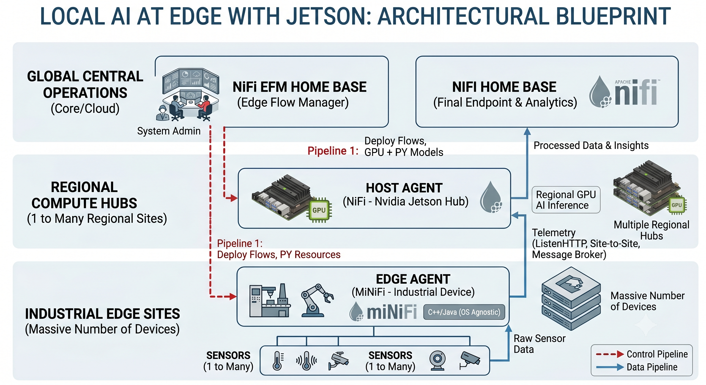
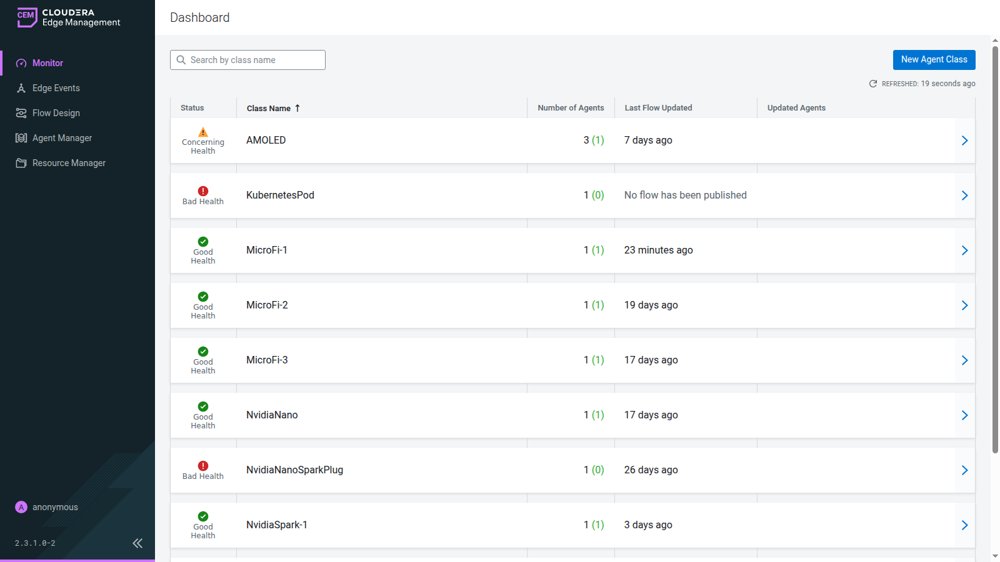
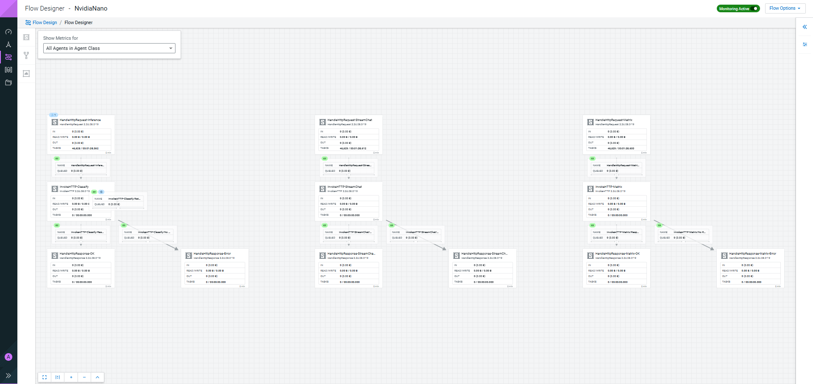
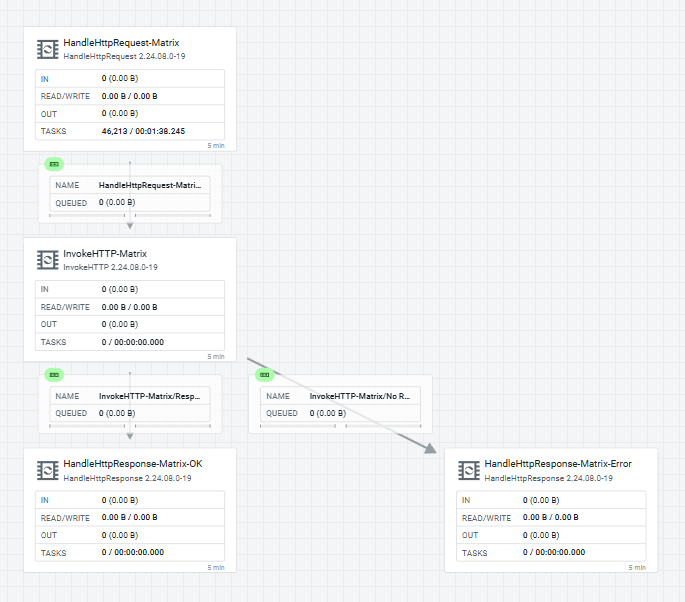
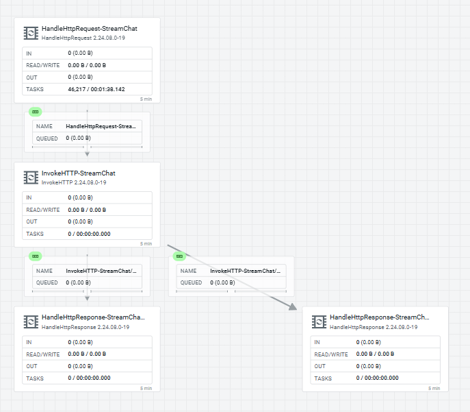
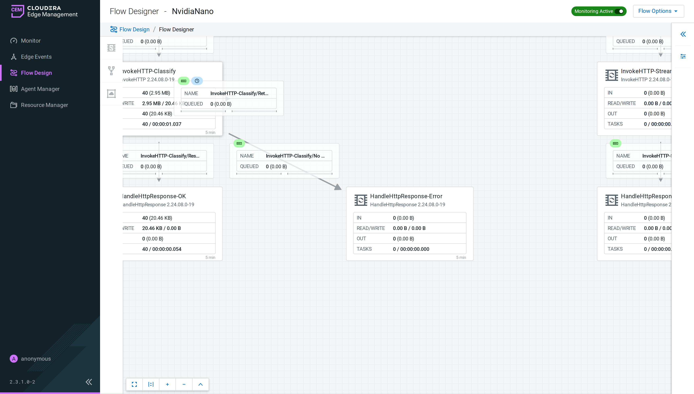

# Chapter 19: EFM + NVIDIA Jetson use case



This chapter covers the Jetson Orin Nano (device `NvidiaNano`, hostname `tunastreet`, aarch64) as an EFM-managed edge agent, from the host networking that lets it reach EFM and Kafka through to the two inference shapes it runs. The first shape is a MiNiFi C++ agent with a fire-and-forget `ListenHTTP → ExecuteScript → PublishKafka` TensorRT flow. The second is a MiNiFi Java agent with a three-leg `HandleHttpRequest → InvokeHTTP → HandleHttpResponse` synchronous inference flow, which is what the `NvidiaNano` class runs today. Both are captured on the board itself.

> **⚠️ Check the class before you build on it.** The `NvidiaNano` class name has carried both runtimes over its life, and the device-class roster shifts. Before building a flow or tooling that assumes a runtime per class name, read the live assignment (`GET /efm/api/agent-classes`, then the class's agents in Monitor → Agents) and treat that as truth.

## Prerequisites

This chapter builds directly on:

- EFM persisted on Kubernetes, [Chapter 1](ch01-efm-on-kubernetes.md)
- MiNiFi C++ binaries installed into EFM's `agent-deployer/binaries` tree, [Chapter 2](ch02-efm-binaries.md)
- The CSO stack (NiFi, Kafka/Strimzi, Flink, Prometheus/Grafana) running in minikube under `cld-streaming`

After installing binaries, restart EFM before proceeding:

```bash
kubectl rollout restart deployment/efm -n cld-streaming
kubectl wait --for=condition=ready pod -l app=efm -n cld-streaming --timeout=120s
```

EFM takes several minutes to re-roll. Read the startup off the logs, not the clock:

```bash
kubectl logs -n cld-streaming -l app=efm --tail=50 | grep -Ei 'started|listen|efm/ui'
```

The banner you are waiting for, from the live EFM pod:

```
2026-07-30T14:11:49.749Z  INFO ... com.cloudera.cem.efm.C2Application       : Starting C2Application v2.3.1.0-2 using Java 21.0.4 with PID 25
2026-07-30T14:14:25.920Z  INFO ... o.e.jetty.server.AbstractConnector       : Started ServerConnector@1651130b{HTTP/1.1, (http/1.1)}{0.0.0.0:10090}
2026-07-30T14:14:26.523Z  INFO ... com.cloudera.cem.efm.C2Application       : Started C2Application in 165.571 seconds (process running for 171.454)
2026-07-30T14:14:26.825Z  INFO ... com.cloudera.cem.efm.C2Application       : The Edge Flow Manager has started. Services available at the following URLs:
2026-07-30T14:14:26.826Z  INFO ... com.cloudera.cem.efm.C2Application       : >>> Access User Interface: http://0.0.0.0:10090/efm/ui
```

On a long-lived pod `--tail=50` will not reach back this far. Use `--tail=1000` and do not restart EFM to see it.

## Reaching EFM: Two URLs, Not Interchangeable

`minikube tunnel` gives the stable local URL, `http://127.0.0.1:10090/efm/ui`. Use that from the host itself and in every command in this chapter.

The Jetson is a separate box on the LAN and cannot reach the host's `127.0.0.1`. To enroll an agent from the Jetson, EFM must be exposed on the host's LAN IP (`gaming-pc-lan-ip`). On Windows, `minikube service` gives a random NodePort and drops you at the bare host. Append `/efm/ui/` to the browser URL yourself. The rule is tunnel for the stable local URL, host LAN IP for the off-box Jetson. The deployer command uses whichever base URL matches where the agent runs.

After EFM is up, create a class to reach the **Deploy Agent CLI** screen. The binary version dropdowns read from `agent-deployer/binaries/{agentType}/{osArch}/{agentVersion}`. The `linuxaarch64` C++ build is what the Jetson enrolls against.


## Windows Networking: Mirrored Mode vs NAT Mode

Before exposing EFM to the LAN, know which WSL2 networking mode is active (PowerShell):

```powershell
wsl hostname -I
```

- First IP matches your Windows LAN IP: **mirrored mode**
- First IP is a `172.x.x.x` address: **NAT mode**

### Mirrored Mode

WSL2 shares the Windows host IP directly. Any port bound on `0.0.0.0` inside WSL is reachable from the LAN at `gaming-pc-lan-ip:<port>`. No portproxy needed.

> **⚠️ Do not add portproxy rules in mirrored mode.** Stale portproxy entries pointing to old `172.x` WSL IPs intercept traffic and cause silent connection failures even when a TCP test succeeds. Check for and remove any stale entries:

```powershell
netsh interface portproxy show all
netsh interface portproxy delete v4tov4 listenport=9092 listenaddress=0.0.0.0
netsh interface portproxy delete v4tov4 listenport=10090 listenaddress=0.0.0.0
```

Add Windows Firewall inbound rules once (PowerShell as Administrator):

```powershell
New-NetFirewallRule -DisplayName "WSL EFM 10090" -Direction Inbound -Protocol TCP -LocalPort 10090 -Action Allow
New-NetFirewallRule -DisplayName "WSL Kafka Brokers External" -Direction Inbound -Protocol TCP -LocalPort 31623,31850,31935,30336 -Action Allow
```

### NAT Mode

In NAT mode, portproxy rules are required. Replace `172.26.201.5` with your current WSL2 IP (`ip addr show eth0` in WSL):

```powershell
netsh interface portproxy add v4tov4 listenport=10090 listenaddress=0.0.0.0 connectport=10090 connectaddress=172.26.201.5
netsh interface portproxy add v4tov4 listenport=9092 listenaddress=0.0.0.0 connectport=9092 connectaddress=172.26.201.5
```

The WSL2 IP changes on every reboot in NAT mode. Update portproxy entries any time the Jetson loses connectivity.

## Kafka External Access for the Jetson

`kafka-eval.yaml` has only `internal` listeners. Off-box agents (the Jetson) cannot reach Kafka brokers using internal cluster DNS. Apply `kafka-nodeport.yaml`, which adds an external NodePort listener with `advertisedHost` overrides pointing to `gaming-pc-lan-ip`:

```bash
kubectl apply -f ClouderaStreamingOperators/kafka-nodeport.yaml -n cld-streaming
kubectl wait kafka/my-cluster --for=condition=Ready --timeout=120s -n cld-streaming
```

Get the assigned NodePorts:

```bash
kubectl get svc -n cld-streaming | grep "my-cluster-combined\|external-bootstrap"
```

Expected output (ports vary per deployment):

```
my-cluster-combined-0                 NodePort  ...  9094:31850/TCP
my-cluster-combined-1                 NodePort  ...  9094:31935/TCP
my-cluster-combined-2                 NodePort  ...  9094:30336/TCP
my-cluster-kafka-external-bootstrap   NodePort  ...  9094:31623/TCP
```

Check the advertised bootstrap address:

```bash
kubectl get kafka my-cluster -n cld-streaming -o jsonpath='{.status.listeners[?(@.name=="external")].bootstrapServers}{"\n"}'
# Should return: gaming-pc-lan-ip:31623
```

The NodePorts live on the Minikube node (`192.168.49.2`), not directly on `gaming-pc-lan-ip`. These port-forwards bridge them. Re-run after every WSL/Windows restart:

```bash
kubectl port-forward --address 0.0.0.0 svc/my-cluster-kafka-external-bootstrap 31623:9094 -n cld-streaming > /tmp/pf-kafka-bootstrap.log 2>&1 &
kubectl port-forward --address 0.0.0.0 svc/my-cluster-combined-0 31850:9094 -n cld-streaming > /tmp/pf-kafka-0.log 2>&1 &
kubectl port-forward --address 0.0.0.0 svc/my-cluster-combined-1 31935:9094 -n cld-streaming > /tmp/pf-kafka-1.log 2>&1 &
kubectl port-forward --address 0.0.0.0 svc/my-cluster-combined-2 30336:9094 -n cld-streaming > /tmp/pf-kafka-2.log 2>&1 &
```

Make sure all four are listening:

```bash
ss -tlnp | grep -E "31623|31850|31935|30336"
```

Set MiNiFi `bootstrap.servers` on the Jetson to `gaming-pc-lan-ip:31623`. No `/etc/hosts` entries or portproxy rules needed.

## Enrolling a KubernetesPod Agent First (Optional Smoke Test)

Before touching the Jetson, enroll an in-cluster pod on `linux/amd64`. This is faster to iterate, with no hardware and no LAN routing, and if enrollment fails here it is an EFM or binary problem and not a Jetson one.

Pull the base image into minikube:

```bash
eval $(minikube docker-env)
docker pull --platform linux/amd64 ubuntu:22.04
```

Get the deployer command from EFM's **Deploy Agent CLI** screen for class `KubernetesPod`, type `cpp`, arch `linux`, with the `baseUrl` set to EFM's in-cluster FQDN (`http://efm.cld-streaming.svc:10090/efm/api`), since this agent is local to the minikube cluster. Never type the command out by hand and never reuse an `agentIdentifier` from an earlier pod. EFM mints the identifier, and a reused one collides two pods on one agent record ([Chapter 14](ch14-nifi-and-ai-skill-efm-portion.md) has the rule and the API behind it). Paste the generated command into `minifi-agent-pod.yaml` where the `curl` sits below:

```yaml
apiVersion: v1
kind: Pod
metadata:
  name: minifi-agent-k8s
  namespace: cld-streaming
spec:
  containers:
  - name: minifi
    image: ubuntu:22.04
    imagePullPolicy: IfNotPresent
    command: ["/bin/bash", "-c"]
    args:
    - |
      apt-get update && apt-get install -y curl tar python3 python3-pip python3-venv
      ln -s /usr/bin/python3 /usr/bin/python || true
      curl -L \
       -d agentClass=KubernetesPod \
       -d agentIdentifier=<the identifier EFM generated> \
       -d agentType=cpp \
       -d agentVersion=1.26.02 \
       -d autoConfigureSecurity=false \
       -d baseUrl=http%3A%2F%2Fefm.cld-streaming.svc%3A10090%2Fefm%2Fapi \
       -d hbPeriod=5000 \
       -d osArch=linux \
       -d serviceName=minifi \
       -d serviceUser=root \
       -d trustSelfSignedCertificates=false \
       http://efm.cld-streaming.svc:10090/efm/api/agent-deployer/script | bash -
      tail -f /dev/null
```

Apply and watch:

```bash
kubectl apply -f minifi-agent-pod.yaml
kubectl wait --for=condition=ready pod minifi-agent-k8s -n cld-streaming --timeout=60s
kubectl logs minifi-agent-k8s -n cld-streaming -f
kubectl exec -it minifi-agent-k8s -n cld-streaming -- tail -f /nifi-minifi-cpp-1.26.02/logs/minifi-app.log
```

The C++ build only logs failed C2 heartbeats, not successful ones, so there is no "registered!" line. What the log shows is the agent retrying every 5s while EFM is mid-startup, then going quiet once EFM comes up, which is the heartbeat succeeding silently. The live-connection proof is the EFM dashboard:


The `KubernetesPod` class shows **Good Health** with `minifi-agent-k8s-gaming` enrolled and reporting.

## Enrolling the Jetson Orin Nano

Generate the command on EFM's **Deploy Agent CLI** screen for class `NvidiaNano`, type `cpp`, arch `linuxaarch64`, with the `baseUrl` on the host's LAN IP (`http://gaming-pc-lan-ip:10090/efm/api`), and run it on the Jetson. The script contacts EFM, downloads the linux-arm64 binary and extensions, extracts and configures MiNiFi C++, and starts the agent as a background process.

Tail the log on the Jetson:

```bash
tail -f minifi-1.26.02/logs/minifi-app.log
```

The agent appears in EFM → **Monitor** → **Agents** under class `NvidiaNano` within a few minutes:


## Restarting MiNiFi on the Jetson

`sudo systemctl restart minifi` is the only reliable path. It requires an interactive password. No `NOPASSWD` sudoers entry exists on this device.

```bash
sudo systemctl restart minifi
sudo systemctl status minifi
```

`minifi.sh restart`/`start`/`stop` are **not** a sudo-free alternative. The script's Linux path calls `systemctl restart minifi.service` internally. Killing the process directly is also unreliable. This build's `Restart=on-failure` only auto-restarts on a specific C2-triggered exit code (`RestartForceExitStatus=3`), not on an externally sent `SIGTERM`. A `kill` leaves the agent `inactive` with no watchdog respawn until you run `systemctl start` manually. Treat `sudo systemctl restart minifi` as the single dependable option and do not rely on process-kill as an unattended fallback.

After reboot, MiNiFi auto-starts if the service was registered at install time.

## The TensorRT Inference Script

`gpu_nifi_tensorRT-3.py` is the `ExecuteScript` payload. EFM delivers it to the agent's `assets/` directory. The full flow depends on it. Source: `files/gpu_nifi_tensorRT-3.py`.

```python
import tensorrt as trt
import json

class ReadContentCallback:
    def __init__(self):
        self.content = ""
    def process(self, input_stream):
        self.content = input_stream.read().decode('utf-8')
        return len(self.content)

class WriteContentCallback:
    def __init__(self, data):
        self.data = data
    def process(self, output_stream):
        encoded_data = self.data.encode('utf-8')
        output_stream.write(encoded_data)
        return len(encoded_data)  # CRITICAL: MiNiFi C++ requires this integer return

def onTrigger(context, session):
    flow_file = session.get()
    if flow_file:
        try:
            reader = ReadContentCallback()
            session.read(flow_file, reader)
            payload = json.loads(reader.content.strip()) if reader.content.strip() else {}

            logger = trt.Logger(trt.Logger.INFO)
            tensorrt_info = {
                "version": str(trt.__version__),
                "status": "Active"
            }

            if isinstance(payload, dict):
                payload['tensorrt'] = tensorrt_info
            elif isinstance(payload, list):
                for item in payload:
                    if isinstance(item, dict):
                        item['tensorrt'] = tensorrt_info

            session.write(flow_file, WriteContentCallback(json.dumps(payload)))
            session.putAttribute(flow_file, "python.tensorrt.execution", "Success")
            session.transfer(flow_file, REL_SUCCESS)
        except Exception as e:
            session.putAttribute(flow_file, "python.error", str(e))
            session.transfer(flow_file, REL_FAILURE)
```

## Importing the Agent Flow

Import and publish the flow to the `NvidiaNano` class via EFM's flow designer. Two flow variants are available:

**TensorRT flow, `ListenHTTP → ExecuteScript → PublishKafka`:**

- [NvidiaNano-TensorRT.json](files/efm/NvidiaNano-TensorRT.json)
- [WindowsDesktop-TensorRT.json](files/efm/WindowsDesktop-TensorRT.json)
- [KubernetesPod-TensorRT.json](files/efm/KubernetesPod-TensorRT.json)

**TailLog flow, `TailFile → PublishKafka` (ships `minifi-app.log` entries to Kafka):**

- [NvidiaNano.json](files/efm/NvidiaNano.json)
- [WindowsDesktop.json](files/efm/WindowsDesktop.json)
- [KubernetesPod.json](files/efm/KubernetesPod.json)

## Delivering Resources to the Agent

Agent Resources are managed from within EFM. Upload files there, assign them to the agent class on the Resources tab, and they appear in the agent's `/assets/` directory.

> **⚠️ Execute bit not set on delivery.** EFM drops assigned resources into the agent's `assets/` directory without the execute bit. `ExecuteScript` cannot run `gpu_nifi_tensorRT-3.py` until you set it manually. On the board the install dir is `nifi-minifi-cpp-1.26.02` and the assets folder is singular `asset/`:

```bash
chmod +x ~/nifi-minifi-cpp-1.26.02/asset/gpu_nifi_tensorRT-3.py
```

## Testing the Jetson Flow End to End

With the flow published to the `NvidiaNano` class and the agent online:

**Step 1. POST a JSON payload to the agent's ListenHTTP.** The processor listens on port `8080`, base path `contentListener`. From the Jetson itself or any LAN host that can reach it:

```bash
curl -X POST http://localhost:8080/contentListener \
  -H "Content-Type: application/json" \
  -d '{"sensor":"jetson-test","value":42}'
```

`ExecuteScript` runs the payload through TensorRT. `gpu_nifi_tensorRT-3.py` appends a `tensorrt` block (`version`, `status`) and sets `python.tensorrt.execution=Success`. `PublishKafka` ships it to the CSO Kafka broker.

**Step 2. Read the enriched message back out of Kafka.** Consume the target topic from the CSO stack (bootstrap is the external NodePort):

```bash
kafka-console-consumer.sh --bootstrap-server gaming-pc-lan-ip:31623 \
  --topic agent-nvidia-tensorRT --from-beginning --max-messages 1
```

What comes back, after a POST to the Jetson's `ListenHTTP` and a read from `agent-nvidia-tensorRT`:

```json
{"sensor": "jetson-test", "value": 42, "tensorrt": {"version": "10.16.2.10", "status": "Active"}}
```

The `tensorrt` block was appended on the Jetson's GPU by `gpu_nifi_tensorRT-3.py`. That is the whole `ListenHTTP → ExecuteScript → PublishKafka` chain on aarch64 hardware.

## Synchronous Request/Response: the `NvidiaNano` HandleHttp Flow

The fire-and-forget `ListenHTTP → ExecuteScript → PublishKafka` pattern above is one valid inference shape. The caller sends a POST, gets an immediate `200 OK`, and the result lands in Kafka later for downstream consumers. That suits high-throughput async pipelines, where the inference itself is decoupled from the HTTP round trip.

The second shape, and the one the `NvidiaNano` class runs today, is a MiNiFi **Java** agent on the same Jetson hardware, dedicated to serving requests with the answer in the HTTP response body. You need this when the caller (a microcontroller or another edge device) expects to POST and get an answer back without polling Kafka or handling correlation IDs.

### Deploying the Java Agent

MiNiFi Java requires a JRE. The Jetson's default image includes none:

```bash
sudo apt install -y openjdk-21-jre-headless
cd ~/minifi-java-nano/minifi-2.24.08.0-19 && ./bin/minifi.sh start
```

With OpenJDK 21.0.11 installed, the agent starts in under 5 seconds and registers with EFM as a `NvidiaNano` class agent within the standard heartbeat cycle.



### Three Parallel HandleHttp Legs, Not One

The live flow is not a single inference endpoint. It is **three independent `HandleHttpRequest → InvokeHTTP → HandleHttpResponse` legs on the same agent**, each serving a different downstream target. `Inference` (image classification), `Matrix` (the matrix-screensaver launcher), and `StreamChat` (the stream-chat launcher). It is the same launch-trigger pattern used elsewhere in this array, exposed as synchronous HTTP in place of fire-and-forget.



Each leg has the identical four-processor shape, pointed at a different `InvokeHTTP` target:

```
HandleHttpRequest-Inference  (0,   0)    :8080, path /classify, HTTP Context Map
InvokeHTTP-Classify          (0,   300)  POST → http://127.0.0.1:5910/classify
HandleHttpResponse-OK        (0,   600)  200          ← success path
HandleHttpResponse-Error     (600, 600)  502          ← error branch
```

The `InvokeHTTP` processor routes successful responses (HTTP 200) to `HandleHttpResponse-OK` and anything else to `HandleHttpResponse-Error`. The `Retry` path self-loops with a 10-minute FlowFile expiration and is not auto-terminated, so in-flight requests do not block if the target daemon becomes unavailable mid-request. The numbers below are all against the **Inference** leg, the one the TensorRT work already exercises end to end. The Matrix and StreamChat legs share the identical structure.






### Timeout Configuration for Local Inference

The three `InvokeHTTP` timeouts are set deliberately, not left at framework defaults.

- **Connection**: 5 seconds
- **Socket Read**: 10 seconds
- **Socket Write**: 10 seconds

The framework default for all three is 15 seconds. When the inference daemon is local (127.0.0.1:5910) and answers in about 4 ms, a socket read timeout of 15 s means the caller hangs for 15 s on any network error, which is unacceptable for real-time scenarios. The tighter timeouts above report a failure to the caller in under 10 seconds.

### Round-Trip Performance

On the Jetson Orin Nano running the same MobileNetV2 FP16 inference daemon as the C++ agent flow:

```console
$ curl --data-binary @dog-640.jpg -H "Content-Type: application/octet-stream" \
       http://127.0.0.1:8080/classify
{"ok": true, "model": "mobilenetv2-12 (ImageNet-1k, FP16)", "source": "body",
 "predictions": [{"label": "Samoyed", "class_id": 258, "confidence": 0.723496}, ...],
 "preprocess_ms": 6.53, "inference_ms": 4.12}
HTTP 200
```

Latency over 20 identical requests:

| | p50 | p95 | min |
|---|---|---|---|
| through Java agent | 132 ms | 258 ms | 42 ms |
| daemon direct (loopback) | 14.9 ms | — | — |

MiNiFi Java adds roughly 117 ms of overhead per request, from FlowFile repository persistence, queue scheduling, and Jetty HTTP context handling. This is expected and acceptable for EFM-managed flows. Measure it before promising sub-100 ms latency to a client.

### Error Handling and Timeouts

When the inference daemon is unavailable or the input is malformed, the error path responds quickly and does not hang:

```console
$ curl --data-binary "definitely not an image" http://127.0.0.1:8080/classify
--- HTTP 502 in 0.028073s ---
```

The HTTP 502 (Bad Gateway) comes back within 28 milliseconds, so the caller never blocks waiting for a timeout. This matters for embedded devices with fixed request timeouts.

### LAN Reachability

The `HandleHttpRequest` processor binds to `*:8080` (all interfaces), not `127.0.0.1`, so any device on the LAN can reach it. Microcontrollers and other edge devices POST directly to `http://<jetson-ip>:8080/classify` without going through a centralized message broker.

### Round-Trip Verification: EFM Has No Provenance Browser, But the Numbers Reconcile

First, an expectation to set. **EFM has no NiFi-style provenance view.** There is no screen where I can open one FlowFile's lineage. "Provenance" appears in exactly one place in the whole 2.3.1.0-2 UI, Agent Manager → agent details → Repositories, a size gauge for the agent's provenance repository, and this Java agent reports that gauge as `Unknown`. I grepped the compiled UI bundle to make sure I was not missing a hidden screen. The only hits are that gauge and a `nifi-provenance-repository-nar` manifest entry.

What EFM does give me is per-processor round-trip accounting from the agent's heartbeats. In Flow Design, flip **Monitoring Active** on and pick the agent under **Show Metrics for**. Each processor card grows IN / READ/WRITE / OUT / TASKS rows over a rolling 5-minute window. One catch that cost me several passes: the metric rows are zoom-gated. At fit-to-view every card renders blank. Zoom in far enough and the rows appear.

Driving a 40-request batch through the Inference leg with the monitor live:



The same numbers come back without the UI. This is the endpoint the monitoring canvas polls:

```bash
curl -s "http://<efm-host>:10090/efm/api/designer/flows/<flowId>/process-group/status?agentId=<agentId>" \
  | jq '.statusSnapshot.processorStatus[] | select(.taskCount > 0)'
```

The byte accounting reconciles a batch end to end. A 10-request run with the 77,423-byte test image shows `bytesWritten: 774230` (10 × 77,423) on `HandleHttpRequest-Inference`, `bytesIn: 774230` / `bytesOut: 5237` on `InvokeHTTP-Classify` (10 × about 524 bytes of prediction JSON), and `bytesIn: 5237` on `HandleHttpResponse-OK`, with the error branch flat at zero. That is request-level ingress/egress provenance for the whole leg, exact to the byte, aggregated per window and not per FlowFile.

## Prometheus Observability for EFM and the Jetson Agent

Two metrics layers extend the CSO Prometheus/Grafana stack that already watches NiFi/Kafka/Flink. The full three-layer story is [Chapter 21 (Metrics & Observability)](ch21-metrics-and-observability.md). This section is the Jetson-specific slice.

### Layer 1: EFM Server Metrics

The actuator Prometheus endpoint is on the **`efm-ui`/`10090`** port under `/efm`, not `metrics/9092`. `9092` accepts a TCP connection but returns an empty reply.

```yaml
apiVersion: monitoring.coreos.com/v1
kind: ServiceMonitor
metadata:
  name: efm
  namespace: cld-streaming
  labels:
    release: prometheus
spec:
  selector:
    matchLabels:
      app: efm
  endpoints:
  - port: efm-ui                      # NOT `metrics` — 9092 serves nothing
    path: /efm/actuator/prometheus
    interval: 15s
```

```bash
kubectl apply -f efm-service-monitor.yaml
```

The EFM image ships no `curl`. Check the endpoint via a host port-forward, not `kubectl exec`:

```bash
kubectl port-forward -n cld-streaming deploy/efm 10190:10090 &
curl -s http://localhost:10190/efm/actuator/prometheus | head
```

### Layer 2: Jetson Agent Metrics

#### C++ Agent Path

MiNiFi C++ has a native Prometheus publisher, shipped as `libminifi-prometheus.so`. No `ExecuteScript`, no sidecar. The property namespace is `nifi.metrics.publisher.*`. `nifi.c2.enable.metrics` and `nifi.c2.metrics.publisher.*` do not exist in this build, in the binary or the shipped config template.

Add a new file under `conf/minifi.properties.d/`. Do not edit `minifi.properties` directly. Its own header warns changes there are lost on upgrade, and the `.d/` convention is already in use, since EFM writes its own `90_c2.properties` there on enrollment:

```properties
# conf/minifi.properties.d/95-metrics.properties
nifi.metrics.publisher.agent.identifier=<agent-uuid, matches nifi.c2.agent.identifier>
nifi.metrics.publisher.class=PrometheusMetricsPublisher
nifi.metrics.publisher.PrometheusMetricsPublisher.port=9936
nifi.metrics.publisher.metrics=QueueMetrics,RepositoryMetrics,DeviceInfoNode,FlowInformation
```

On the Jetson (C++ agent) after restart:

```text
[...] [PrometheusExposerWrapper] [info] Started Prometheus metrics publisher on port 9936
$ ss -tlnp | grep 9936
LISTEN 0  200  0.0.0.0:9936  0.0.0.0:*  users:(("minifi",pid=203867,fd=18))
$ curl -s http://127.0.0.1:9936/metrics | wc -l
204
```

It binds `0.0.0.0`, so it is LAN-reachable in principle. Check that the host firewall allows `9936` inbound on this device's `ufw` before wiring the CSO Prometheus scrape side. Do not add the rule reflexively until the scrape target is wanted. The CSO Prometheus scrape-target wiring and Grafana panel are covered in [Chapter 21 (Metrics & Observability)](ch21-metrics-and-observability.md).

> **⚠️ Restarting to apply metrics config.** `sudo systemctl restart minifi` is the only reliable path. See the restart section above. The same caveat applies here. `minifi.sh restart` calls systemctl internally, and a direct `kill` leaves the agent inactive with no automatic respawn.

#### Java Agent Metrics Path: the Flow Is the Exporter

The C++ path above (`libminifi-prometheus.so`, `nifi.metrics.publisher.*`, port 9936) applies only to the MiNiFi C++ runtime. The agent on this class today is MiNiFi Java, which has **no built-in metrics path at all on an EFM-managed headless agent**. [Chapter 21 (Metrics & Observability)](ch21-metrics-and-observability.md) documents the exhaustive proof. The embedded web API's Prometheus endpoint is blocked by the C2 protocol itself, and no Prometheus NAR ships in this build.

**So the flow itself becomes the exporter.** The same `HandleHttpRequest → … → HandleHttpResponse` synchronous pattern the class's three production legs already use gains a fourth leg that serves Prometheus exposition format on the same port the C++ publisher used:

```
HandleHttpRequest-Metrics      (port 9936, GET /metrics only, shared StandardHttpContextMap)
  ─(success)─→ ExecuteStreamCommand-ProcMetrics   (/bin/sh -c "echo <b64> | base64 -d | sh" —
                reads /proc/loadavg + /proc/meminfo, emits # TYPE-annotated gauges)
  ─(output stream)─→ HandleHttpResponse-Metrics-OK    (200)
  ─(nonzero status)─→ HandleHttpResponse-Metrics-Error (500)
```

Series exposed: `minifi_java_host_load1/5/15`, `minifi_java_host_mem_total_kb/mem_free_kb/mem_available_kb`. The base64 wrapper is the Chapter 21 `ExecuteStreamCommand` quoting workaround. Inline quoted `sh -c` scripts get mangled by its argument tokenizer.

The CSO-side wiring is the same as for the C++ publisher and carries over unchanged. A manual-`Endpoints` `Service` pointing at `192.168.1.197:9936` plus a `ServiceMonitor` (`job="nvidianano-minifi-metrics"`, 15s). One Prometheus-3 addition is required. The flow-level responder sends no `Content-Type` header, and Prometheus 3 rejects a blank one, so set `spec.fallbackScrapeProtocol: PrometheusText0.0.4` on the `ServiceMonitor`. End to end, `up{job="nvidianano-minifi-metrics"}=1` and all six `minifi_java_host_*` series are live in Prometheus, rendered on the **"MiNiFi Java - NvidiaNano"** Grafana dashboard (sidecar-loaded ConfigMap; JSON at [`files/nvidianano-minifi-java-dashboard.json`](files/nvidianano-minifi-java-dashboard.json), flow export at [`files/efm/NvidiaNanoJava.json`](files/efm/NvidiaNanoJava.json)).

This settles the firewall question too. The Jetson accepts the in-cluster scrape on `:9936` with no `ufw` change. Before the leg bound the port the scrape said "connection refused" (port closed, host reachable), and it flipped straight to a clean scrape once the leg was up.

## What NOT to Do

**Use `127.0.0.1` as the EFM base URL in the Jetson deployer command.** The Jetson cannot reach the host's loopback. Use the host's LAN IP (`gaming-pc-lan-ip:10090`) for any agent that enrolls from off-box.

**Hand-build the deployer command or reuse an `agentIdentifier`.** Generate it on EFM's Deploy Agent CLI screen (or `POST /efm/api/agent-deployer/generateCommand`) every time. A reused identifier collides two agents on one record and the class goes red.

**Add portproxy rules in WSL2 mirrored mode.** Stale `172.x` portproxy entries silently intercept traffic. The symptom is a TCP test that succeeds but Kafka/EFM traffic that never arrives. Check `netsh interface portproxy show all` and remove stale entries before debugging anything else.

**Edit `minifi.properties` directly for metrics config.** The file warns that changes are lost on upgrade. The `.d/` drop-in directory is the right path. `95-metrics.properties` there survives agent updates.

**Kill the MiNiFi process expecting a watchdog restart.** This build's `Restart=on-failure` only triggers on a specific C2 exit code. A `SIGTERM` leaves the agent `inactive`. Use `systemctl restart minifi`.

**Test the flow before setting the execute bit on delivered resources.** EFM drops resources without `+x`. `ExecuteScript` silently fails to run the script if the bit is not set. `chmod +x` immediately after the resource appears in `asset/`.

## Appendix: Reusable Command Forms

### Restart EFM After Installing Binaries

```bash
kubectl rollout restart deployment/efm -n cld-streaming
kubectl wait --for=condition=ready pod -l app=efm -n cld-streaming --timeout=120s
```

### Kafka External Access (Re-Run After Every WSL/Windows Restart)

```bash
kubectl port-forward --address 0.0.0.0 svc/my-cluster-kafka-external-bootstrap 31623:9094 -n cld-streaming > /tmp/pf-kafka-bootstrap.log 2>&1 &
kubectl port-forward --address 0.0.0.0 svc/my-cluster-combined-0 31850:9094 -n cld-streaming > /tmp/pf-kafka-0.log 2>&1 &
kubectl port-forward --address 0.0.0.0 svc/my-cluster-combined-1 31935:9094 -n cld-streaming > /tmp/pf-kafka-1.log 2>&1 &
kubectl port-forward --address 0.0.0.0 svc/my-cluster-combined-2 30336:9094 -n cld-streaming > /tmp/pf-kafka-2.log 2>&1 &
ss -tlnp | grep -E "31623|31850|31935|30336"
```

### Restart MiNiFi on the Jetson

```bash
sudo systemctl restart minifi
sudo systemctl status minifi
```

## Related Chapters

- [EFM on Kubernetes](ch01-efm-on-kubernetes.md) (Ch1): persisted EFM, the base this chapter builds on.
- [EFM Binaries](ch02-efm-binaries.md) (Ch2): installing the MiNiFi Java & C++ binaries into EFM.
- [Metrics & Observability](ch21-metrics-and-observability.md) (Ch21): the full three-layer EFM/agent Prometheus story. This chapter carries the Jetson slice.
- [MiNiFi Kubernetes Playground](https://github.com/cldr-steven-matison/MiNiFi-Kubernetes-Playground): the MiNiFi test harness.
- EFM agent flows: [NvidiaNano-TensorRT.json](files/efm/NvidiaNano-TensorRT.json), [WindowsDesktop-TensorRT.json](files/efm/WindowsDesktop-TensorRT.json), [KubernetesPod-TensorRT.json](files/efm/KubernetesPod-TensorRT.json)
- TailLog variants: [NvidiaNano.json](files/efm/NvidiaNano.json), [WindowsDesktop.json](files/efm/WindowsDesktop.json), [KubernetesPod.json](files/efm/KubernetesPod.json)
- Edge inference script: [gpu_nifi_tensorRT-3.py](files/gpu_nifi_tensorRT-3.py)
