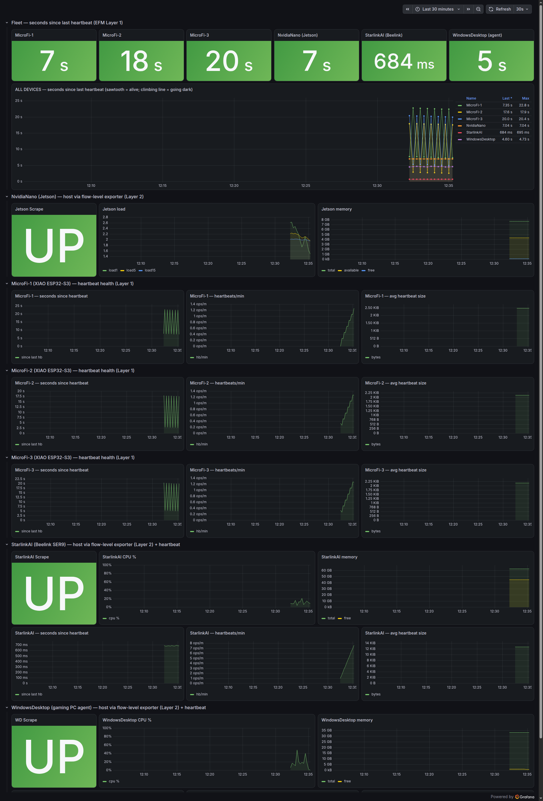
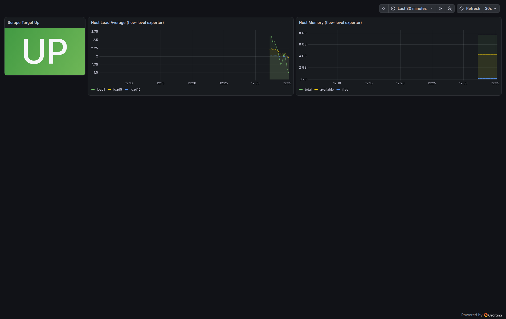

# Chapter 21: Metrics & Observability

Once a MiNiFi agent is running out at the edge, on a Jetson, a Windows box over Tailscale, or a Kubernetes pod with no persistent identity, the next question is how to see it. What is EFM's own health, what are the agents doing, and how do I get all of it onto the same Prometheus/Grafana stack I already run for NiFi, Kafka, Flink, and Schema Registry via the CSO operators?

There are three metrics layers, and Layer 2 covers both the C++ and Java agent variants. They are independent. You can wire up any one without the others.

1. Layer 1, EFM server metrics. EFM is a Spring Boot app and exposes an actuator Prometheus endpoint.
2. Layer 2, MiNiFi C++ agent metrics. The C++ agent has a native Prometheus publisher (system, processor, and repository metrics).
3. Layer 2 (Java), MiNiFi Java agent metrics. The built-in Prometheus endpoint is blocked at the platform level, but two working alternatives exist. A Site-to-Site metrics relay into NiFi, and the production path on the Jetson, a flow-level `HandleHttpRequest`/`HandleHttpResponse` exporter that serves Prometheus exposition format directly.
4. Layer 3, embedded and heartbeat metrics. The smallest agents (ESP32/XIAO class) fold storage and health counters into the C2 heartbeat instead. EFM drops the custom payload fields and re-exports nothing from the heartbeat body, so the panelable slice is the heartbeat-transport series. The storage counters need a device-egress path.

## The CSO Prometheus/Grafana Stack

All three layers target the existing observability stack. The `kube-prometheus-stack` Helm install that already scrapes CFM (NiFi), CSA (Flink), and CSM (Kafka/Strimzi) runs in the `cld-streaming` namespace. EFM and the edge agents become additional scrape targets on that same stack. The edge does not need its own monitoring silo.

On a host that runs EFM and NiFi without the rest of CSO, this stack has to be stood up separately. Kafka (CSM) and Flink (CSA) targets are optional there.

For contrast on the NiFi side, the old `PrometheusReportingTask` is gone in NiFi 2.x. Metrics now come from the built-in `/nifi-api/flow/metrics/prometheus` REST endpoint. EFM and MiNiFi are the edge-side complement to that datacenter endpoint.

## Layer 0, Prerequisites and Deploy

Keep every ServiceMonitor, Service/Endpoints object, and dashboard as versioned YAML and JSON rather than UI state. The monitoring CRDs and the scrape wiring survive the removal of the Prometheus/Grafana pods, so a lost stack comes back in two moves. The same `kube-prometheus-stack` helm install, then `kubectl apply` of the committed scrape wiring and the dashboard ConfigMaps. Every fleet target returns to `up=1` within minutes with no agent-side work.

Every layer below assumes EFM is deployed. On a CSO host that runs NiFi/Kafka/Flink but has never run EFM, stand it up from the `ClouderaStreamingOperators` repo. EFM is a Spring Boot app backed by Postgres. Skipping a prerequisite is how you get a pod in `CrashLoopBackOff` instead of a clean metrics endpoint.

### Verify Prerequisites Before Applying Anything

The persisted deployment (`efm-deployment-persisted.yaml`) references six objects by name. Confirm each exists in `cld-streaming` first.

```bash
ns=cld-streaming
# 1+2. DB-password and encryption-password secrets
kubectl get secret -n $ns efm-db-pass efm-encryption
# 3. efm.properties override (this is where metrics export gets turned on)
kubectl get cm -n $ns efm-config
# 4+5. Two PVCs: staged agent binaries + EFM resources
kubectl get pvc -n $ns efm-agent-binaries efm-resources
# 6. The efm Postgres database inside the shared ssb-postgresql pod
kubectl exec -n $ns deploy/ssb-postgresql -- psql -U postgres -lqt | grep efm
```

Two gotchas the manifest hides.

- `imagePullSecret: cloudera-registry` is referenced, but if the image is already cached in minikube (`minikube image ls | grep efm` shows `container.repo.cloudera.com/cloudera/efm:2.3.1.0-2`) the default `IfNotPresent` pull policy means the kubelet never contacts the registry. A missing pull secret is harmless here. On a host without the cached image, create the secret or `minikube image load` the tarball first.
- `EF_REGISTRY_URL=http://host.minikube.internal:18080` with `EF_REGISTRY_ENABLED=true` points at a NiFi Registry that may not exist on the host. EFM still starts and serves metrics without a reachable registry. It just logs connection retries. Set `EF_REGISTRY_ENABLED=false` if you want the log clean. It has no effect on the metrics path.

### Deploy

```bash
cd ~/Documents/GitHub/ClouderaStreamingOperators
# PVCs first (skip if already Bound from a prior run)
kubectl apply -f efm-pvc.yaml
# EFM Deployment + Service
kubectl apply -f efm-deployment-persisted.yaml
kubectl rollout status deployment/efm -n cld-streaming --timeout=5m
```

EFM's cold start is about 2 minutes (Jetty, Spring context, DB migration) on a fresh DB, and about 15 seconds when the DB is already migrated. Do not trust the pod `Running` state alone. Poll the health actuator until it returns `200`. The EFM image ships no `curl`, so port-forward and check from the host, not `kubectl exec`.

```bash
kubectl port-forward -n cld-streaming deploy/efm 10190:10090 &
curl -s -o /dev/null -w "%{http_code}\n" http://localhost:10190/efm/actuator/health   # want 200
```

### Why the Metrics Endpoint Already Works

The `efm-config` ConfigMap overrides `conf/efm.properties` and already carries the metrics block. You do not turn anything on at deploy time.

```properties
# Metrics Properties (from efm-config ConfigMap)
management.metrics.efm.enabled=true
management.prometheus.metrics.export.enabled=true
management.prometheus.metrics.export.descriptions=true
management.metrics.enable.efm.heartbeat=true
management.metrics.enable.efm.repo=true
management.metrics.efm.enableTag.agentClass=true
management.metrics.efm.enableTag.agentId=true
management.metrics.tags.application=efm
```

Without this ConfigMap mounted, the actuator is up but the Prometheus registry is not wired. The endpoint returns `404` and Layer 1 silently scrapes nothing.

### Deploy an Agent so There's Something to Measure

EFM's own metrics appear as soon as it is running, but the interesting agent-tagged series only appear once an agent is enrolled and heartbeating.

```bash
kubectl apply -f minifi-agent-pod.yaml
kubectl logs -f minifi-agent-k8s -n cld-streaming   # watch it wait for EFM, deploy, and enroll
```

Once it is heartbeating, `/efm/actuator/prometheus` gains `agentClass="KubernetesPod"`-tagged series, and Layer 2 (the agent's own `9936` publisher) becomes available on the pod.

## Layer 1, EFM Server Metrics

EFM's Kubernetes `Service` exposes two named ports, `efm-ui` on `10090` (the UI and API) and `metrics` on `9092`.

> **⚠️ The metrics do not come out of the `metrics` port.** The Service declares `metrics/9092`, and the obvious read is "scrape 9092." That is wrong. `9092` accepts a TCP connection but returns an empty reply, because EFM never starts a separate management server there (`management.server.port=9092` is not set in `efm.properties`). The actuator, including the Prometheus endpoint, is served on the main server port `10090` under the `/efm` servlet context path. The `metrics/9092` port is a Service-definition leftover, not a live endpoint.

Confirm which port serves before writing the `ServiceMonitor`.

```bash
kubectl port-forward -n cld-streaming deploy/efm 10190:10090 &
# Actuator index lists "prometheus" as a registered endpoint:
curl -s http://localhost:10190/efm/actuator | python3 -m json.tool | grep prometheus
# Returns real Prometheus text (~1429 lines on the K8s EFM pod, 1965 on WindowsDesktop):
curl -s http://localhost:10190/efm/actuator/prometheus | head
```

> **⚠️ Do not `kubectl exec ... -- curl` into the EFM pod.** The image has no `curl`. Port-forward `10090` to the host and curl locally.

Sample output, `efm_*` metrics tagged `application="efm"`.

```text
efm_tasks_scheduled_execution_active_seconds_max{application="efm",code_function="run",
  code_namespace="com.cloudera.cem.efm.monitor.core.MissingAgentMonitor",...} 0.0
```

Wire it into the Prometheus Operator with a `ServiceMonitor` that selects the EFM service and scrapes the `efm-ui` port. The `release: prometheus` label matches the `kube-prometheus-stack` convention the other CSO ServiceMonitors use.

```yaml
apiVersion: monitoring.coreos.com/v1
kind: ServiceMonitor
metadata:
  name: efm
  namespace: cld-streaming
  labels:
    release: prometheus
spec:
  selector:
    matchLabels:
      app: efm
  endpoints:
  - port: efm-ui                      # NOT `metrics` — 9092 serves nothing
    path: /efm/actuator/prometheus
    interval: 15s
```

```bash
kubectl apply -f efm-service-monitor.yaml
```

After applying, the target registers and goes green within about 90 seconds (Prometheus config reload plus first scrape).

```text
$ curl -s 'localhost:9490/api/v1/query?query=up{job="efm"}'
http://10.244.5.43:10090/efm/actuator/prometheus -> up
up{container="efm",endpoint="efm-ui",instance="10.244.5.43:10090",job="efm",
   namespace="cld-streaming",pod="efm-686c9c4758-mlvbw",service="efm"} = 1
```

If you want to use `metrics/9092` (cleaner separation from the UI), set `management.server.port=9092` in the `efm-config` ConfigMap and redeploy. Then `port: metrics` in the `ServiceMonitor` works. Until you do that, scrape `efm-ui`.

### The Heartbeat Series, Fleet Liveness for Free

The most useful thing in EFM's actuator output is the per-class heartbeat family. It gives fleet-wide liveness for every enrolled agent without touching a single device.

| Series | Expression | Meaning |
|---|---|---|
| `efm_heartbeat_lastSeenTime_seconds{agentClass, agentId, agentManifestId}` | `time() - max by (agentClass)(...)` | Seconds since last heartbeat, the core liveness expression |
| `efm_heartbeat_count_total{...}` | `sum by (agentClass)(rate(...[5m]))*60` | Heartbeats per minute |
| `efm_heartbeat_contentLength_sum/_count` | `rate(sum)/rate(count)` | Average heartbeat payload size |

Three semantics that will bite if unlearned.

- Label churn creates duplicate series. Every manifest change mints a new `agentManifestId` label value, so one physical device accumulates several series over its life. Always aggregate (`max by`, `sum by`). Never chart a raw series.
- Retired agents linger in the metric registry until an EFM pod restart, even after their `agent` row is deleted. The micrometer counters are in-memory. Filter by `agentClass`/`agentId` rather than waiting for the registry to clean itself.
- The `last_seen` column in EFM's Postgres is not this metric. The DB column updates only on material change. The actuator series updates on every heartbeat. For "is it alive right now," the metric wins.

### The Fleet Dashboard

Those series drive the **EFM Fleet - All Devices** Grafana dashboard ([`files/efm-fleet-dashboard.json`](files/efm-fleet-dashboard.json)). A seconds-since-heartbeat stat tile per device (green under 120s, yellow under 600s, red beyond), an all-device sawtooth graph (a healthy device saws between 0 and its heartbeat interval, a dying one just climbs), and a host row (scrape status, CPU, memory) for each device with a Layer-2 exporter (the Jetson, the Windows desktop, the StarlinkAI Beelink below, and the DGX Spark). Devices without an exporter get a Layer-1 row (sawtooth, heartbeats per minute, average heartbeat size) instead.

The board carries seven device tiles and four Layer-2 host rows. The DGX Spark row is the one that goes further: it pairs the flow-level exporter on `:9936` with a dedicated host exporter on `:9835`, so the same row reads agent health and box health side by side.

The capture below predates the DGX Spark row and shows the first six tiles.



The per-agent board, the Jetson's flow-level exporter feeding scrape status, host load, and memory.



Two deployment conventions on this stack.

- Dashboards deploy as sidecar ConfigMaps, not manual imports. Any ConfigMap labeled `grafana_dashboard=1` auto-loads and hot-reloads on `kubectl apply`. The JSON stays versioned in this repo's `files/` as the source of truth.
- The datasource UID trap. kube-prometheus-stack provisions its Prometheus datasource with the deterministic UID `PBFA97CFB590B2093`, not `prometheus`. A dashboard JSON hardcoding the wrong UID renders every panel "No data" while Prometheus itself is fine, and API-side sanity checks pass because they query Prometheus directly. Check the way panels query. `GET /api/datasources` for the UID, then run a panel expression through `/api/datasources/proxy/uid/<uid>/api/v1/query`.

## Layer 2, MiNiFi C++ Agent Metrics

MiNiFi C++ has a native Prometheus publisher. No `ExecuteScript`, no sidecar. It ships as a separate extension, `libminifi-prometheus.so`. Confirm it is present in the agent's `extensions/` directory before troubleshooting a "publisher never starts" symptom.

### The Property Names

> **⚠️ The `nifi.c2.*` metrics property names do not exist in MiNiFi C++ 1.26.02.** Those keys are never read by the binary. `strings` against `libminifi-prometheus.so` and the shipped `minifi.properties` template both show the keys the binary reads, commented out under a "Publish metrics to external consumers" header. The namespace is `nifi.metrics.publisher.*`.

Drop in a new file `conf/minifi.properties.d/95-metrics.properties`. Do not edit `minifi.properties` directly. The main file's own header warns it is overwritten on upgrade, and EFM writes its own `90_c2.properties` there on enrollment.

```properties
# conf/minifi.properties.d/95-metrics.properties
nifi.metrics.publisher.agent.identifier=<agent-uuid — matches nifi.c2.agent.identifier>
nifi.metrics.publisher.class=PrometheusMetricsPublisher
nifi.metrics.publisher.PrometheusMetricsPublisher.port=9936
nifi.metrics.publisher.metrics=QueueMetrics,RepositoryMetrics,DeviceInfoNode,FlowInformation
```

- The default port is `9936`, not `9092`. The binary accepts any free port, but `9092` collides by name with the common Kafka broker convention. The shipped template itself suggests `9936`. Prefer it unless there is a specific reason not to.
- `nifi.metrics.publisher.metrics` is a comma-separated list of metric-node classes, not a boolean toggle. `QueueMetrics` and `RepositoryMetrics` are always available. `DeviceInfoNode` and `FlowInformation` are the general per-agent and per-processor nodes. A class tied to a specific processor (for example `GetFileMetrics`) only emits if a processor of that type exists in the agent's flow. Check `config.yml` first, or it is silently a no-op.
- The setting only takes effect on a service restart, not a config-only reload.

### What a Working Publisher Looks Like (Jetson, systemd-managed)

After restarting the systemd-managed `minifi` service with the config above.

```text
[...] [PrometheusExposerWrapper] [info] Started Prometheus metrics publisher on port 9936
[...] [PrometheusMetricsPublisher] [info] Loading metric node 'flowInfo'
[...] [PrometheusMetricsPublisher] [info] Loading metric node 'deviceInfo'
[...] [PrometheusMetricsPublisher] [info] Loading metric node 'RepositoryMetrics'
[...] [PrometheusMetricsPublisher] [info] Loading metric node 'QueueMetrics'

$ ss -tlnp | grep 9936
LISTEN 0  200  0.0.0.0:9936  0.0.0.0:*  users:(("minifi",pid=203867,fd=18))

$ curl -s http://127.0.0.1:9936/metrics | wc -l
204
$ curl -s http://127.0.0.1:9936/metrics | grep minifi_is_running | head -3
minifi_is_running{metric_class="FlowInformation",component_name="FlowController",
  component_uuid="87ea1666-8b6f-11f1-bcfa-580205de1a71",
  agent_identifier="4ca82a0d-8e04-4ede-b59d-379de1495f2b"} 1
```

It binds `0.0.0.0`, so it is LAN-reachable. Series carry `agent_identifier`, `metric_class`, and per-connection and per-processor tags, exactly the shape a Grafana panel needs.

### The Windows C++ Agent Needs an Elevated Write

**Symptom.** Writing `95-metrics.properties` to `C:\WINDOWS\System32\nifi-minifi-cpp\conf\minifi.properties.d\` is denied.

**Diagnosis.** UAC Admin Approval Mode. An admin account is in `BUILTIN\Administrators`, but the live process token returns `IsInRole(Administrator) = False` (a filtered standard token). `Get-Acl` shows `BUILTIN\Administrators` has `FullControl` but `BUILTIN\Users` (the effective group on the filtered token) only has `ReadAndExecute`, which matches the denial.

**Fix.** An elevated write. `Start-Process powershell -Verb RunAs -Wait` pops the UAC consent prompt. The elevated script writes `95-metrics.properties` and runs `Restart-Service -Name "Apache NiFi MiNiFi" -Force` in the same elevated context. Then check.

```powershell
Get-Service "Apache NiFi MiNiFi"  # Status: Running
Get-NetTCPConnection -LocalPort 9936  # State: Listen
curl http://127.0.0.1:9936/metrics   # returns real minifi_* Prometheus text
```

The one-time UAC prompt is the entire blocker.

### Wiring C++ Agent Metrics into CSO Prometheus (Windows host)

The agent runs on the Windows host, not as a Kubernetes pod, so use the external-target pattern. A headless `Service` plus an `Endpoints` object pointing at the host IP, plus a `ServiceMonitor`.

```yaml
apiVersion: v1
kind: Service
metadata:
  name: windowsdesktopcpp-minifi-metrics
  namespace: cld-streaming
  labels:
    app: windowsdesktopcpp-minifi-metrics
spec:
  ports:
  - name: metrics
    port: 9936
    targetPort: 9936
  clusterIP: None
---
apiVersion: v1
kind: Endpoints
metadata:
  name: windowsdesktopcpp-minifi-metrics
  namespace: cld-streaming
subsets:
- addresses:
  - ip: 192.168.1.121     # WindowsDesktop LAN IP
  ports:
  - name: metrics
    port: 9936
---
apiVersion: monitoring.coreos.com/v1
kind: ServiceMonitor
metadata:
  name: windowsdesktopcpp-minifi-metrics
  namespace: cld-streaming
  labels:
    release: prometheus
spec:
  selector:
    matchLabels:
      app: windowsdesktopcpp-minifi-metrics
  endpoints:
  - port: metrics
    path: /metrics
    interval: 15s
```

Confirm the target via Prometheus's own `/api/v1/targets` (`health: "up"`) and a PromQL query returning per-connection series from the running flow. The job name is `windowsdesktopcpp-minifi-metrics`.

### Restarting the C++ Agent

Applying a `minifi.properties.d/*.properties` change requires restarting the `minifi` systemd service. Three paths that look equivalent are not.

- `sudo systemctl restart minifi` is the only path that reliably works on Linux. It requires an interactive sudo password on the Jetson. With no `NOPASSWD` sudoers entry, an automated session cannot supply that password non-interactively.
- `~/minifi-1.26.02/bin/minifi.sh restart` is not an independent alternative. Its `restart_service()` calls `systemctl restart minifi.service` on Linux and needs the same sudo privilege.
- Killing the process directly does not force a systemd respawn. The unit file sets `Restart=on-failure` with `RestartForceExitStatus=3`. That rule fires on a specific exit code used by the agent's own C2-triggered restart path, not on an external `SIGTERM`. A `SIGTERM` makes the process exit cleanly, `systemctl is-active` reports `inactive`, and the agent stays down until someone runs `sudo systemctl start minifi`.

### Networking, the Port Has to Be Reachable

The publisher binds `0.0.0.0`, but the host firewall has to allow the port (default `9936`) on the interface the scraper arrives on. On Windows targets a dedicated inbound allow rule for `9936` is mandatory. Defender defaults `BlockInbound` and drops silently. Both the Windows desktop and the StarlinkAI Beelink needed `netsh advfirewall firewall add rule ... localport=9936` (elevated) before the in-cluster scrape connected. The StarlinkAI scrape additionally travels over Tailscale, not the LAN (details in the Route 3 section below).

## Layer 2, MiNiFi Java Agent Metrics

> **⚠️ The built-in Prometheus endpoint cannot be enabled on an EFM/C2-managed headless Java agent.** This is a platform limit, not a config mistake. The agent's metrics still reach the operator NiFi over a Site-to-Site relay, or come straight off the agent as a flow-level exporter. Both the block and the two working paths are below.

On the C++ side, enabling Prometheus metrics is a three-line properties drop-in. On the Java side (MiNiFi Java `2.24.08.0-19`) there is no equivalent, for three reasons.

**There is no drop-in property.** `minifi.properties` has no `metric`, `prometheus`, or `reporting` properties at all, and no commented-out template to uncomment, unlike C++. `bootstrap.conf`'s only documented status reporter is `StatusLogger`, which writes to a file, not a metrics endpoint. The live `flow.json.gz` has `"reportingTasks":[]`, and no Prometheus-capable reporting-task NAR ships in `lib\` or `extensions\`. `nifi-site-to-site-reporting-nar` is the only one present, and that is S2S provenance reporting, not Prometheus.

**The embedded web API cannot be turned on.** NiFi 2.x's built-in `/nifi-api/flow/metrics/prometheus` REST endpoint requires the embedded Jetty web server to be running, and `nifi.web.http.port` is empty on a headless agent. Set `nifi.web.http.host=127.0.0.1` and `nifi.web.http.port=8998` directly in `conf/minifi.properties` and both are back to empty after the next restart, because EFM regenerates this agent's `minifi.properties` from its C2-stored config on every boot, regardless of which key changed. Push the same two keys through EFM's C2 `UPDATE_PROPERTIES` instead and the agent rejects them every time (`operation.state = FAILED` for both `nifi.web.http.host` and `nifi.web.http.port`). This is the same server-side C2 denylist behavior seen for `nifi.python.command`. Two notes on that push. `PUT /efm/api/agent-classes/<class>` returns `200` but does not persist the property update (an EFM bug, the row has to go into Postgres `property_updates` directly), and EFM needs a pod restart to reload its cache after.

**There is no separate Prometheus NAR to side-load.** In the `2.24.08.0-19` source, the only Prometheus code, `org.apache.nifi.prometheusutil.*` and `PrometheusMetricsWriter`, lives inside `nifi-web-api` itself, wired directly to the embedded Jetty server. `/nifi-api/flow/metrics/prometheus` is only reachable by enabling the embedded web API. What looks like two independent paths is the same path.

So on an EFM/C2-managed, headless MiNiFi Java `2.24.08.0-19` agent there is no supported channel to get NiFi 2.x's built-in Prometheus endpoint live. Direct file edit reverts on restart, the C2 protocol blocks the properties needed to turn the embedded web API on, and no alternative NAR-based metrics path ships in this build. The C++ Layer 2 pattern is the reference for what a MiNiFi Prometheus target looks like on this stack.

But no Prometheus endpoint is not no metrics.

### Route 1 and 2, Java metrics over a Site-to-Site relay

The metrics goal, getting the Java agent's operational state back to the same NiFi Prometheus/Grafana stack, is reachable by relaying records over secure Site-to-Site into an operator NiFi input port instead of opening a scrape endpoint on the agent.

**Route 1, EFM-managed, `PutRecord` to `SiteToSiteReportingRecordSink`.** A formal `ReportingTask` cannot be configured through EFM at all. Every `reporting-tasks` Designer endpoint returns 404, and the Designer's `flowContent` has no `reportingTasks` key. The equivalent that is Designer-manageable is a controller service from the same NAR, `org.apache.nifi.reporting.sink.SiteToSiteReportingRecordSink`, driven by a stock `PutRecord`. The working flow.

```
GenerateFlowFile (30 sec) → ExecuteStreamCommand (reads /proc/loadavg + /proc/meminfo → JSON)
   → PutRecord (Record Reader = JsonTreeReader, Record Sink = SiteToSiteReportingRecordSink)
```

A record transiting into the target NiFi's input port.

```json
{"agent_id":"minifi-java-agent","timestamp":1786057534,"load1":5.24,"load5":5.89,"load15":6.75,
 "mem_total_kb":32555448,"mem_free_kb":12219880,"mem_available_kb":22280236}
```

Two wiring notes that each cost a debug cycle.

- The RecordSink's SSL Context is explicit, not inherited. Unlike an agent's own S2S client (`nifi.minifi.flow.use.parent.ssl`), this controller service has its own `SSL Context Service` property. Leave it unset and the session is unauthenticated and rejected. Point it at a `StandardRestrictedSSLContextService` carrying the agent's client keystore plus CA truststore (PKCS12). The transport-protocol property key is `s2s-transport-protocol` (set `HTTP`), not a display name. EFM also rejects literal sensitive values. Keystore passwords must be a Parameter Context reference (`#{…}`).
- `ExecuteStreamCommand` mangles an inline quoted `sh -c` script, stripping the quote grouping so the JSON keys come out unquoted. Base64-encode the script and run `sh -c "echo <b64> | base64 -d | sh"` so no quotes reach its argument tokenizer.

**Route 2, unmanaged agent, the `SiteToSiteMetricsReportingTask`.** An agent whose config is authored directly (not EFM/C2-managed) can run the reporting task itself, bypassing the C2 denylist. It delivers the full JVM and NiFi internal metric set (`jvm.heap_used`, `loadAverage1min`, `FlowFilesQueued`, GC counters, thread states) into the same input port. That is richer than the managed RecordSink can produce, because a stock processor cannot read the agent's internal metric registry without the embedded web API.

This is a metrics relay, not Prometheus parity. The managed route carries host and OS metrics, and neither route exposes a scrape endpoint on the agent. Both push records into NiFi, which is where the CSO Prometheus stack already scrapes, so the edge metrics land on the same Grafana as everything else.

### Route 3, the flow itself as the Prometheus exporter (the production path)

The S2S relay assumes a Site-to-Site-enabled target NiFi, which the production instance does not have (S2S adoption is its own migration project). The route that shipped on the Jetson's Java agent needs no S2S, no new edge services, and no C2-blocked properties. A fourth `HandleHttpRequest` to `ExecuteStreamCommand` to `HandleHttpResponse` leg on the agent's existing flow serves `/metrics` on port 9936 (the same port the C++ publisher uses), emitting `# TYPE`-annotated gauges built from `/proc/loadavg` and `/proc/meminfo`. The agent is the scrape endpoint, which is what the built-in-endpoint block was preventing, implemented entirely as an EFM-designed, C2-pushed flow using the same synchronous HTTP pattern the agent's inference legs already run.

Cluster side, the C++-era external-target wiring carries over unchanged. A selector-less `Service` plus manual `Endpoints` pointing at `192.168.1.197:9936` plus a `ServiceMonitor` (`job="nvidianano-minifi-metrics"`, 15s interval). One Prometheus 3 requirement. The flow-level responder sends no `Content-Type` header and Prometheus 3 refuses a blank one (`non-compliant scrape target sending blank Content-Type`), so set `spec.fallbackScrapeProtocol: PrometheusText0.0.4` on the `ServiceMonitor`. The result is `up{job="nvidianano-minifi-metrics"}=1`, six `minifi_java_host_*` series in Prometheus, rendered on the sidecar-loaded **MiNiFi Java - NvidiaNano** Grafana dashboard. The full flow shape, series list, and files are in [Chapter 19](ch19-efm-and-nvidia-jetson.md), "Java Agent Metrics Path".

**The Windows variant.** Same fourth-leg shape on a Windows Java agent, with three Windows-specific substitutions.

- No `/proc`. The script runs via `powershell.exe -NoProfile -EncodedCommand <base64-UTF-16LE>`, the Windows equivalent of the `sh` base64 wrapper. The encoded form survives `ExecuteStreamCommand`'s `;` argument delimiter and quoting untouched. Metrics come from `Get-CimInstance Win32_OperatingSystem` (memory, already KB) and `Win32_Processor` `LoadPercentage` (CPU %).
- PowerShell emits CRLF, and Prometheus rejects it (`invalid metric type "gauge\r"`). Build the exposition text as one string and `[Console]::Out.Write(($lines -join "`n") + "`n")`. Never let default `Write-Output` line endings reach the wire. Ship the LF-join from the first version of any PowerShell-emitting exporter leg.
- Windows Defender Firewall silently drops the inbound scrape on the LAN IP even from the same physical host. An elevated `netsh advfirewall firewall add rule ... localport=9936` allow rule is mandatory. Before the rule the error signature is a connection failure. After the rule, any remaining error is the parser telling you about the payload. A WSL-side `curl` to the host's own LAN IP is not a valid reachability test in mirrored mode. It can keep failing after the in-cluster scrape works. Test via loopback locally and via Prometheus's own target status for the real path.

**The remote variant, StarlinkAI over Tailscale.** The same fourth-leg shape on the `StarlinkAI` class running on a Beelink, a Windows box that is not on the cluster's LAN path. Same `-EncodedCommand` CIM script as the Windows desktop. What is new is the network leg.

- The scrape target address is per-device, and only an in-cluster test decides it. From an in-cluster pod, the Beelink's LAN IP (`192.168.1.245:9936`) times out even with the firewall rule in place on all three profiles, while its Tailscale IP (`100.110.253.66:9936`) answers. That is the opposite of the Jetson and Windows desktop targets, which scrape over LAN. Run a `wget` from a busybox pod against every candidate address before writing the `Endpoints`. A successful test from the target host itself proves nothing about the cluster's path. The selector-less `Service`/`Endpoints` therefore point at the Tailscale IP, with the same `fallbackScrapeProtocol: PrometheusText0.0.4` on the `ServiceMonitor`.
- The CRLF trap recurs on every PowerShell exporter. Treat the LF-join as part of the pattern, not a one-off fix.

The result is `up{job="starlinkai-minifi-metrics"}=1` and the StarlinkAI host row (scrape status, CPU, memory) on the fleet dashboard. Flow export: [`files/efm/StarlinkAI.json`](files/efm/StarlinkAI.json).

## Layer 3, Embedded Heartbeat Metrics (XIAO/MicroFi)

The ESP32-class agent is too small to run a Prometheus server. Instead it puts its own health into the C2 heartbeat. LittleFS durable-storage counters with watermark-based eviction (`littleFsUsedBytes`, `littleFsCapacityBytes`, `littleFsFillPercent`, `evictionCount`, `failedWrites`, `storedRecords`) emitted under `status.microfi` in every heartbeat (`CONFIG_MICROFI_STORAGE_METRICS=y` is the firmware default), alongside `queueDepth`, `produced`, and `consumed` engine counters.

The plan was "EFM holds the agent state, Prometheus scrapes EFM." On EFM 2.3.1.0-2 that fails at two independent points.

- EFM drops the payload. `GET /efm/api/agents/{agentId}` for a live MicroFi agent returns the parsed heartbeat status (`uptime`, `repositories.flowFile`, `resourceConsumption`) and no `microfi` block at all. EFM deserializes the heartbeat into its own DTO and unknown fields vanish. "EFM tolerates unknown fields" means tolerated, not stored.
- The actuator never re-exports payload fields anyway. The full family list on `/efm/actuator/prometheus` carries per-agent `agentClass`/`agentId` labels only on the heartbeat-transport series. `efm_heartbeat_count_total`, `efm_heartbeat_lastSeenTime_seconds`, `efm_heartbeat_content_*` (payload size), `efm_heartbeat_time_seconds*` (processing latency). Nothing from inside the heartbeat body comes back out, for any agent class.

So the storage counters exist in exactly one place, on the wire between the device and EFM. No intermediary that polls EFM can recover them, and Prometheus has nothing to scrape. What Layer 3 gets on this stack is the heartbeat-transport series. The fleet dashboard's MicroFi-1/2/3 rows (seconds since heartbeat, heartbeats per minute, average heartbeat size) are built entirely from them, and average heartbeat size doubles as a coarse payload signal. A heartbeat carrying the storage block is measurably bigger than one without it.

Putting the storage counters themselves on a panel needs one of two changes. EFM re-exporting heartbeat payload fields (a vendor gap), or the device publishing metrics through its own egress path. MicroFi-3 already publishes Sparkplug B to Mosquitto, and the MQTT to NiFi to Prometheus road is already paved.

## What NOT to Do

**Do not assume EFM's `9092` and the agent's `9936` are the same thing.** One is the EFM pod's (non-functional) `metrics` port in `cld-streaming`. The other is the publisher port the MiNiFi C++ agent opens on the edge host. They are on different machines. The only way they conflict is if you pick the same number deliberately.

**Do not scrape the `metrics/9092` port on the EFM Service.** It is declared on the Service but serves an empty reply. EFM's actuator and `/prometheus` endpoint are on `efm-ui/10090` under `/efm`. Point the `ServiceMonitor` at `port: efm-ui`, or set `management.server.port=9092` in the `efm-config` ConfigMap and redeploy first.

**Do not `kubectl exec ... -- curl` into the EFM pod.** The image ships no `curl`. Port-forward `10090` to the host and curl locally to check health or the Prometheus endpoint.

**Do not apply the `ServiceMonitor` and call it done.** Confirm the target shows green and a value lands in Prometheus (`up{job="efm"}=1`) before trusting it. The port trap above silently yields an empty scrape if the wrong port is used.

**Do not design a metric to ride custom fields in the C2 heartbeat and expect it downstream.** EFM 2.3.1.0-2 deserializes heartbeats into a fixed DTO. Unknown payload fields are dropped, not stored, and the actuator re-exports nothing from the heartbeat body. A custom heartbeat metric is visible to nobody. If a device metric must reach Prometheus, give it an egress (a scrape endpoint or an MQTT/Kafka publish), not a heartbeat side-channel.

**Do not configure the MiNiFi C++ publisher with `nifi.c2.*` property names.** That namespace does not exist in MiNiFi C++ 1.26.02. The keys are `nifi.metrics.publisher.*`.

**Do not edit `minifi.properties` directly on C++ agents.** The file warns it is overwritten on upgrade, and EFM writes `90_c2.properties` into `conf/minifi.properties.d/` on enrollment. Use a new drop-in file like `95-metrics.properties` instead.

**Do not treat "kill the MiNiFi C++ process" as a safe unattended restart.** `Restart=on-failure` does not catch a plain `SIGTERM`, and the agent stays down. Use `sudo systemctl restart minifi`, which needs a human at the terminal when no passwordless sudo is configured.

**Do not try to enable the built-in Java Prometheus endpoint by editing the agent's `minifi.properties` directly.** EFM regenerates that file from its C2-stored config on every agent boot, so the edit reverts on the next restart. The C2 protocol itself also blocks `nifi.web.http.*` properties server-side. Use the Site-to-Site relay or the flow-level exporter above, not the built-in endpoint.
