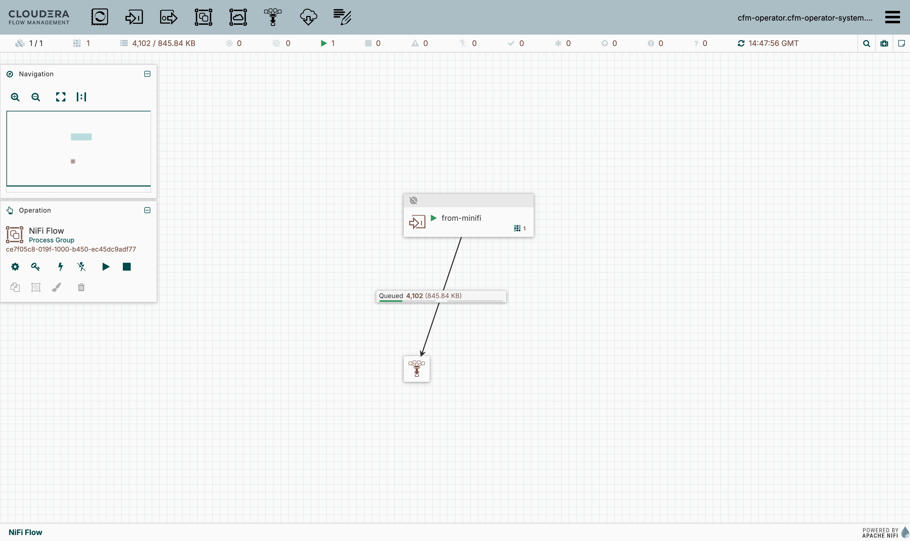
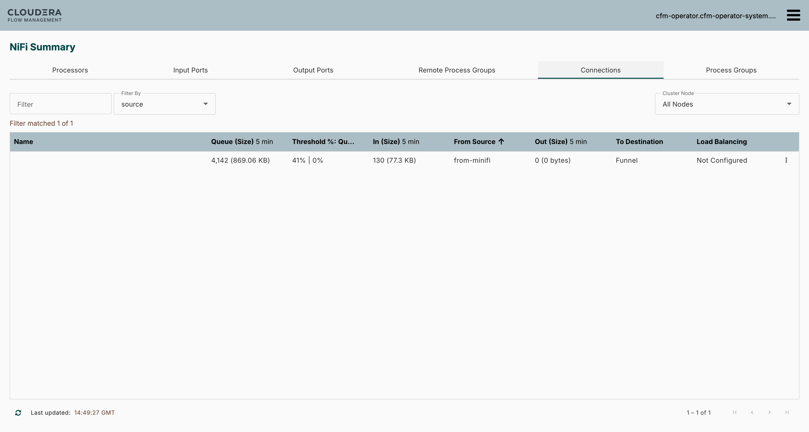
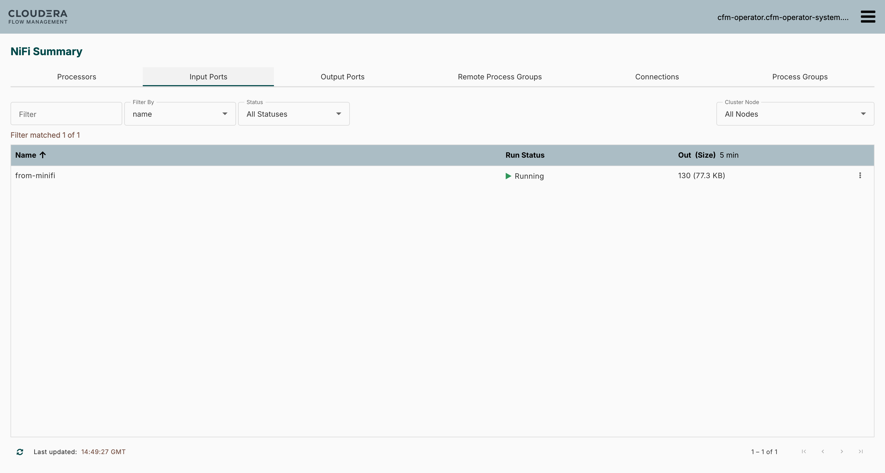

# Ch11 — MiNiFi Java → CFM-operator NiFi secure S2S: full build recipe + platform finding

Reproducible recipe for the **Java** S2S leg (issue #98), built live on a fresh `s2s-lab` minikube
profile 2026-08-04 (FTF3XR2065). This is the companion to [`minifi-site-to-site-lab.md`](../../../minifi-site-to-site-lab.md)
(the Ch10 C++ spine) — everything here reuses that proven NiFi-side setup; only the **source agent**
changes (Java instead of C++).

**Status: DONE — every layer proven live, including the final mTLS transit.** The transit was never a
`#41`-class platform limit; the real root cause was MiNiFi Java's `bootstrap.conf`→`minifi.properties`
regeneration wiping the S2S client SSL config (see "The blocker — and its actual root cause" below).
Fixed durably in `bootstrap.conf` and shipped as a custom unmanaged `minifi-java` image (resolves #35).

The manifests here are the pieces that were **not** committed after Ch10 and had to be reconstructed;
they now live in-repo so the next run is copy-paste. The two large declarative files that already
live in `~/` on the build host are referenced, not duplicated: `~/s2s-nifi.yaml` (the `userCertAuth`
NiFi CR) and `~/s2s-efm-deployment.yaml` (EFM Deployment + Service).

## Prerequisites on the build host (`~/`)

- `cld-streaming.txt` — the command cookbook with the Cloudera registry creds (`--docker-username/-password`).
- `license.txt`, `cluster-issuer.yaml`, `cfm-operator-3.0.0-b126.tgz`, `s2s-nifi.yaml`, `s2s-efm-deployment.yaml`, `efm-pvc.yaml`.
- `efm-binaries/staging/binaries/java/linux/2.24.08.0-19/minifi.tar.gz` — the Java agent binary the EFM deployer serves.

## Build order (all headless, no sudo)

```bash
# 1. Fresh disposable cluster (preserve the shared profile)
minikube stop
minikube start --profile s2s-lab --driver=docker --cpus 6 --memory 16384

# 2. cert-manager (operator issues NiFi node certs through it)
helm repo add jetstack https://charts.jetstack.io && helm repo update jetstack
helm install cert-manager jetstack/cert-manager -n cert-manager --create-namespace --version v1.16.3 --set installCRDs=true
kubectl create namespace cld-streaming
kubectl create namespace cfm-streaming

# 3. Registry pull secrets — BOTH registry hosts (the images split across them):
#    NiFi/operator images -> container.repository.cloudera.com ; EFM image -> container.repo.cloudera.com
srv=$(grep -oE '\-\-docker-server=[^ ]+' ~/cld-streaming.txt|head -1|cut -d= -f2-)
usr=$(grep -oE '\-\-docker-username=[^ ]+' ~/cld-streaming.txt|head -1|cut -d= -f2-)
pw=$(grep  -oE '\-\-docker-password=[^ ]+' ~/cld-streaming.txt|head -1|cut -d= -f2-)
for ns in cld-streaming cfm-streaming; do
  kubectl -n $ns create secret docker-registry cloudera-creds --docker-server="$srv" --docker-username="$usr" --docker-password="$pw"
done
kubectl -n cld-streaming create secret docker-registry cloudera-creds-repo --docker-server=container.repo.cloudera.com --docker-username="$usr" --docker-password="$pw"
kubectl -n cfm-streaming create secret generic cfm-operator-license --from-file=license.txt=~/license.txt
kubectl apply -f ~/cluster-issuer.yaml           # cfm-operator-ca-issuer(-signed) ClusterIssuers

# 4. CFM operator (local b126 chart, cfm-streaming)  — see ~/cld-streaming.txt lines 50-60 for the full --set block
helm install cfm-operator ~/cfm-operator-3.0.0-b126.tgz -n cfm-streaming \
  --set installCRDs=true \
  --set image.repository=container.repository.cloudera.com/cloudera/cfm-operator --set image.tag=3.0.0-b126 \
  --set "image.imagePullSecrets[0].name=cloudera-creds" --set "imagePullSecrets={cloudera-creds}" \
  --set "authProxy.image.repository=container.repository.cloudera.com/cloudera_thirdparty/hardened/kube-rbac-proxy" \
  --set "authProxy.image.tag=0.19.0-r3-202503182126" \
  --set licenseSecret=cfm-operator-license --set-file clouderaLicense.fileContent=~/license.txt

# 5. NiFi (userCertAuth, initialAdminIdentity = operator SAN cfm-operator.cfm-operator-system.svc)
kubectl apply -f ~/s2s-nifi.yaml                 # instance name "nifi" in cfm-streaming
kubectl apply -f nifi-web-svc.yaml               # <-- THE operator-reachability fix (see note)

# 6. EFM + postgres + staged Java binary
#    efm-db-pass/efm-encryption secrets are generated (openssl rand); postgres is a tiny postgres:14
kubectl -n cld-streaming create secret generic efm-db-pass      --from-literal=password=$(openssl rand -hex 16)
kubectl -n cld-streaming create secret generic efm-encryption   --from-literal=encryption.password=$(openssl rand -hex 24)
kubectl apply -f efm-postgres.yaml
kubectl apply -f ~/efm-pvc.yaml                  # PVC efm-agent-binaries
kubectl apply -f ~/s2s-efm-deployment.yaml
kubectl -n cld-streaming patch deploy efm --type=json \
  -p='[{"op":"add","path":"/spec/template/spec/imagePullSecrets/-","value":{"name":"cloudera-creds-repo"}}]'
# stage the Java agent binary into the PVC (deployer serves it):
POD=$(kubectl -n cld-streaming get pod -l app=efm -o jsonpath='{.items[0].metadata.name}')
kubectl -n cld-streaming cp ~/efm-binaries/staging/binaries/java $POD:/opt/efm/efm-2.3.1.0-2/agent-deployer/binaries/
```

### NiFi-side secure S2S (as the operator-admin cert; see the runbook for the full API dance)

- Enable S2S input: `kubectl -n cfm-streaming patch nifi nifi --type merge` with
  `configOverride.nifiProperties.upsert` = `{nifi.remote.input.host: nifi-web.cfm-streaming.svc.cluster.local,
  nifi.remote.input.secure: "true", nifi.remote.input.http.enabled: "true"}` (rolls the pod once).
- Create the `from-minifi` **Input Port** + a downstream **funnel** + connection, set the port RUNNING —
  via the NiFi REST API authenticated with the `nifi-cfm-operator-user-cert` secret (identity
  `cfm-operator.cfm-operator-system.svc`, full canvas rights on a clean seed). Grab the port UUID.
- Mint the peer cert (`certificate.generate` is a b126 no-op): [`minifi-s2s-cert.yaml`](minifi-s2s-cert.yaml)
  — cert-manager `Certificate`, **SAN = `minifi-s2s`** (identity maps by SAN, not DN).
- Authorize the peer: [`minifi-s2s-user.yaml`](minifi-s2s-user.yaml) — `User` CR granting `write` on
  `/data-transfer/input-ports/<from-minifi-uuid>` + `read` on `/site-to-site`. The operator reconciles
  the policies (the exact `POST /policies` the seeded admin can't hand-drive).

### Java agent + flow

- Deploy the agent: [`minifi-java-agent-pod.yaml`](minifi-java-agent-pod.yaml) — a plain `ubuntu:22.04`
  pod that `apt-get install`s `curl tar sudo passwd openjdk-21-jre-headless` (the Java deployer script
  requires `sudo`/`useradd`, unlike the C++ one) then curls the EFM deployer with `agentType=java`,
  `serviceUser=minifi`. It registers as class `MinikubeMacJava`.
- Build the flow via the **EFM Designer API** (contract in `skills/nifi-and-ai/references/minifi-efm.md`):
  `GET /designer/client-identifier`, `GET /designer/flows/summaries` (flow is created lazily on first
  heartbeat), `POST .../processors` (GenerateFlowFile), `POST .../remote-process-groups`
  (`targetUris=https://nifi-web.cfm-streaming.svc.cluster.local:8443`, `transportProtocol=HTTP`),
  `POST .../connections` (GenerateFlowFile `success` → destination `REMOTE_INPUT_PORT` id =
  the from-minifi UUID, groupId = the RPG id), `GET .../validate` → `[]`, `POST .../publish`.

## The operator-reachability fix (don't skip `nifi-web-svc.yaml`)

The operator calls NiFi at `https://nifi-web.cfm-streaming.svc.cluster.local:8443/nifi-api/...`. The
operator only creates the headless `nifi` service (6007/5000); **`nifi-web` (8443) must be created by
hand** or every User/initial-admin reconcile fails `no such host` and `users.xml` stays empty. That
host IS in the node-cert SAN, so TLS validates once the service exists.

## The blocker — and its actual root cause (corrected)

The RPG's first S2S call to NiFi failed `(certificate_unknown) PKIX path building failed: unable to
find valid certification path to requested target`. The failing stack is **client-side**
(`SSLHandshake.consume → PKIXValidator.engineValidate`): minifi couldn't build a trust path to
NiFi's *server* cert — i.e. the S2S client was validating against the **JVM default truststore
(`cacerts`)**, not minifi's, so it had never loaded the `cfm-operator-ca`. The keystore/truststore
files were correct all along (client `CN=minifi-s2s` signed by `cfm-operator-ca`; truststore holds
`cfm-operator-ca`; server `CN=nifi` signed by the same CA) — they simply weren't being applied to the
S2S/RPG SSL context.

Why: **MiNiFi Java regenerates `minifi.properties` from `bootstrap.conf` on every start.** The
EFM-deployer's `bootstrap.conf` ships with `nifi.minifi.security.*` **empty** and
`nifi.minifi.flow.use.parent.ssl=false`. Editing the *generated* `minifi.properties` (as earlier
attempts did) is wiped on the next restart. This is the bootstrap→properties regeneration, **not** a
`#41` C2 `UPDATE_PROPERTIES` denylist — that framing was a misdiagnosis.

**The durable fix** (proven live): set the client SSL config in **`bootstrap.conf`**, which *is* the
source of truth the regeneration reads:

```
nifi.minifi.security.keystore=/certs-ks/keystore.p12
nifi.minifi.security.keystoreType=PKCS12
nifi.minifi.security.keystorePasswd=changeit
nifi.minifi.security.keyPasswd=changeit
nifi.minifi.security.truststore=<install>/conf/truststore-ks.p12
nifi.minifi.security.truststoreType=PKCS12
nifi.minifi.security.truststorePasswd=changeit
nifi.minifi.flow.use.parent.ssl=true
```

Restarting minifi with that regenerated `minifi.properties` carrying `nifi.security.*` +
`use.parent.ssl=true`, the RPG immediately `Successfully refreshed Flow Contents` and streamed
FlowFiles over mTLS (`RemoteGroupPort[name=from-minifi] Successfully sent … to …/nifi-api`), NiFi-side
`flowFilesReceived` climbing — **zero PKIX errors**.

The catch for the EFM-deployer pattern: `bootstrap.conf` survives a *minifi-process* restart but is
rewritten fresh (empty SSL again) on a *pod* restart, because the deployer re-runs on cold boot.

## The resolution — a custom unmanaged `minifi-java` image (resolves #98 + #35)

Bake the fixed `bootstrap.conf` into an image and run it with no EFM deployer, so nothing rewrites it
on boot. Files in this dir: [`Dockerfile`](Dockerfile), [`bootstrap.conf`](bootstrap.conf) (fixed,
`c2.enable=false`), [`minifi-java-unmanaged.yaml`](minifi-java-unmanaged.yaml) (a plain Deployment).

Assemble the build context (the binary/cluster-specific pieces are referenced, not committed):

```bash
mkdir -p ~/s2s-java-image && cd ~/s2s-java-image
cp <this-dir>/Dockerfile <this-dir>/bootstrap.conf <this-dir>/minifi-java-unmanaged.yaml .
ln -f ~/efm-binaries/staging/binaries/java/linux/2.24.08.0-19/minifi.tar.gz minifi.tar.gz
# the flow + CA truststore come off the running agent (or any published copy):
A=$(kubectl -n cld-streaming get pod -l app=minifi-java-unmanaged -o jsonpath='{.items[0].metadata.name}')
for f in flow.json.raw flow.json.gz flow-identifier truststore-ks.p12; do
  kubectl cp cld-streaming/$A:/minifi-2.24.08.0-19/conf/$f ./$f
done
```

```bash
# build into the cluster's docker daemon (no registry push)
eval "$(minikube -p s2s-lab docker-env)"
docker build -t minifi-java-s2s:2.24.08.0-19 .
kubectl apply -f minifi-java-unmanaged.yaml           # mounts minifi-s2s-keystore at /certs-ks
```

Baked into the image: the fixed `bootstrap.conf`, the CA-only `truststore-ks.p12` (public, safe to
bake), and the flow. **`flow.json.raw` is authoritative in MiNiFi Java 2.x** — `flow.json.gz` is
derived from it; bake both plus `flow-identifier` or minifi regenerates an empty default flow and
recompresses over the `.gz` (symptom: `Starting 0 processors`). The client **keystore.p12** (private
key) is *not* baked — it is mounted at runtime from the `minifi-s2s-keystore` secret.

Verified from a **cold pod**, no EFM: `Starting 1 processors/ports/funnels` → `Started 1 Remote Group
Ports transmitting` → `Successfully refreshed Flow Contents` → `Successfully sent … (32 bytes) …
in 14 ms`, sent count climbing every 5 s, NiFi-side `flowFilesReceived` rising, **0 PKIX**. Because
every boot reads the baked `bootstrap.conf`, this is pod-restart durable — the property the
EFM-deployer path can't hold.

The C++ Ch10 agent never hit this: its boot script sets the client SSL props directly and C++ MiNiFi
doesn't regenerate config from `bootstrap.conf` the same way.

## Addendum (#41) — MiNiFi Java metrics over S2S: `SiteToSiteMetricsReportingTask`

Once the transport above works, the *same* secure channel relays the **agent's own metrics** to NiFi:
a `SiteToSiteMetricsReportingTask` in the agent flow POSTs metrics to the `from-minifi` input port over
the identical mTLS S2S path (no new port, no new authz — reuses the proven peer). This is the
[#41](https://github.com/cldr-steven-matison/DesktopShare/issues/41) transport leg (no Prometheus).

Two gotchas, each cost a rebuild:

1. **Reporting tasks do NOT inherit `nifi.minifi.flow.use.parent.ssl=true`** — that flag only wires
   RPGs. The reporting task's S2S client falls back to the JVM default truststore →
   `PKIX path building failed (certificate_unknown)` (the #98 symptom, but for reporting tasks). **Fix:**
   add an explicit `org.apache.nifi.ssl.StandardRestrictedSSLContextService` (bundle `org.apache.nifi` /
   `nifi-ssl-context-service-nar`) at the flow's **top-level `controllerServices`**, pointing at the
   mounted client keystore `/certs-ks/keystore.p12` + the baked CA truststore, and set the task's
   `SSL Context Service` to that CS's identifier.
2. **The transport property KEY is `s2s-transport-protocol`, not the display name `Transport Protocol`.**
   Using the display name fails validation: `'Transport Protocol' … is not a supported property or has
   no Validator`. (`Destination URL` / `Input Port Name` keys DO equal their display names — descriptor
   names are mixed, so check each with the NAR.)

Both the reporting task and the SSL CS are baked into `flow.json.raw` **and** `flow.json.gz` (consistent,
per the authoritative-`.raw` rule above); `nifi.minifi.sensitive.props.key=` is empty, so the keystore
passwords go in as plaintext. The JSON added to the flow:

```json
"controllerServices": [{
  "identifier": "<cs-uuid>", "instanceIdentifier": "<cs-uuid>", "name": "minifi-s2s-ssl",
  "type": "org.apache.nifi.ssl.StandardRestrictedSSLContextService",
  "bundle": {"group":"org.apache.nifi","artifact":"nifi-ssl-context-service-nar","version":"2.24.08.0-19"},
  "properties": {"Keystore Filename":"/certs-ks/keystore.p12","Keystore Password":"changeit","key-password":"changeit","Keystore Type":"PKCS12","Truststore Filename":"/minifi-2.24.08.0-19/conf/truststore-ks.p12","Truststore Password":"changeit","Truststore Type":"PKCS12"},
  "scheduledState": "ENABLED", "componentType": "CONTROLLER_SERVICE"
}],
"reportingTasks": [{
  "identifier": "<rt-uuid>", "name": "MetricsToNiFi-S2S",
  "type": "org.apache.nifi.reporting.SiteToSiteMetricsReportingTask",
  "bundle": {"group":"org.apache.nifi","artifact":"nifi-site-to-site-reporting-nar","version":"2.24.08.0-19"},
  "properties": {"Destination URL":"https://nifi-web.cfm-streaming.svc.cluster.local:8443","Input Port Name":"from-minifi","s2s-transport-protocol":"HTTP","SSL Context Service":"<cs-uuid>"},
  "schedulingPeriod": "30 sec", "schedulingStrategy": "TIMER_DRIVEN", "scheduledState": "RUNNING", "componentType": "REPORTING_TASK"
}]
```

Rebuild the image (tag `minifi-java-s2s:metrics-41`) and redeploy as above. **Build with `docker build`
against `eval "$(minikube -p s2s-lab docker-env)"` — not `minikube image build`**, which shipped the
214 MB `minifi.tar.gz` context as 0 bytes, so `ADD` didn't auto-extract → `exec bin/minifi.sh: no such
file` (exit 127).

**Verified live (transport leg).** Agent log: `SiteToSiteMetricsReportingTask … Successfully sent
metrics to destination … Transaction ID …` (S2S is a two-phase commit, so a committed Transaction ID =
NiFi-confirmed receipt); 0 PKIX; pod stable. NiFi side: `from-minifi → Funnel` receiving `130 (77.3 KB)`
per 5 min — the 32-byte `GenerateFlowFile` data can't account for the KB, so that's the metrics reports.
Reaching the UI to see this is the LoadBalancer + `minikube tunnel` recipe in
[`minifi-site-to-site-lab.md` §Reaching the UI](../../../minifi-site-to-site-lab.md#reaching-the-ui-mtls-no-password).







The reporting task itself is **agent-side** — it does *not* appear in NiFi's Controller Settings →
Reporting Tasks (that list is for NiFi's own tasks). The agent log is its authoritative evidence.

**Remaining for the #41 DoD:** a Prometheus scrape target + the metrics→Prometheus route (the #19 stack
was trimmed from `s2s-lab`).
